# The 10-80-10 Principle: The Optimal Balance for Human-AI Synergy

The AI-Era Advantage: 5x Your Output Quality & Quantity with the 10/80/10 Rule of Human-AI Co-Creation. 

  

 

---
## Introduction — Why the "Design of Co-Creation" Determines Everything

<!-- BODY: Introduction -->

### Structure of This Book

<!-- BODY: Structure of This Book -->

> **Introduction References**
> - Gallup. (2025). *AI in the Workplace: A Longitudinal Study*. Q4 2025. https://www.gallup.com/workplace/651871/ai-workplace.aspx
> - McKinsey Global Institute. (2023). *The Economic Potential of Generative AI*. https://www.mckinsey.com/capabilities/mckinsey-digital/our-insights/the-economic-potential-of-generative-ai-the-next-productivity-frontier

 

---

## Chapter 1 — Are You Merely "Using" AI?

### 1.1 People Who Ask a $200K Consultant to Check the Weather

<!-- BODY: 1.1 -->

### 1.2 Your Work Consists of Three Layers

<!-- BODY: 1.2 -->

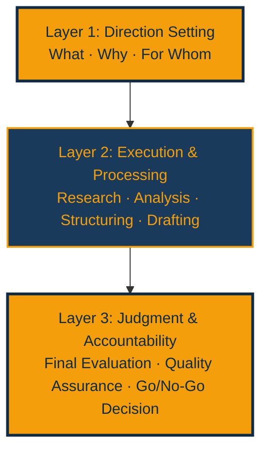

<!-- BODY: 1.2 continued -->

### 1.3 The Real Problem: The "Co-Creation Relationship" Between Humans and AI Has Not Been Designed

<!-- BODY: 1.3 -->

### 1.4 The Quality-Quantity Tradeoff Has Collapsed

<!-- BODY: 1.4 -->

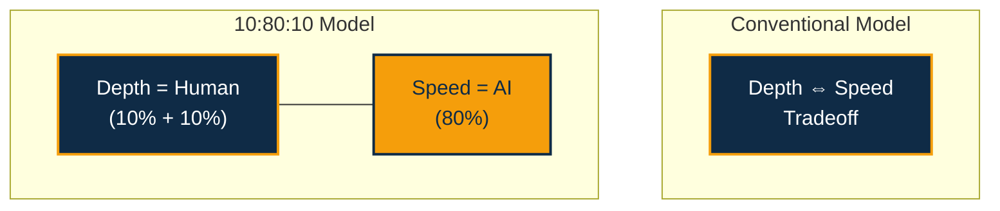

<!-- BODY: 1.4 continued -->

### 1.5 Why 5x?

<!-- BODY: 1.5 -->

### 1.6 "People Who Use AI" vs. "People Used by AI"

<!-- BODY: 1.6 -->

### 1.7 The 10:80:10 Principle Is a "Thinking OS"

<!-- BODY: 1.7 -->

> **Chapter 1 References**
> - Dell'Acqua, F., et al. (2023). "Navigating the Jagged Technological Frontier." *HBS Working Paper*, No. 24-013. https://www.hbs.edu/ris/Publication%20Files/24-013_d9b45b68-9e74-42d6-a1c6-c72fb70c7571.pdf
> - McKinsey Global Institute. (2023). *The Economic Potential of Generative AI*. https://www.mckinsey.com/capabilities/mckinsey-digital/our-insights/the-economic-potential-of-generative-ai-the-next-productivity-frontier
> - McKinsey. (2024). *The state of AI in early 2024*. https://www.mckinsey.com/capabilities/quantumblack/our-insights/the-state-of-ai
> - Boston Consulting Group. (2024). *From Potential to Profit with GenAI*. https://www.bcg.com/publications/2024/from-potential-to-profit-with-genai
> - Noy, S. & Zhang, W. (2023). "Experimental Evidence on the Productivity Effects of Generative AI." *Stanford SCALE*. https://www.science.org/doi/10.1126/science.adh2586
> - GitHub. (2024). "Quantifying GitHub Copilot's Impact in the Enterprise with Accenture." https://github.blog/news-insights/research/research-quantifying-github-copilots-impact-in-the-enterprise-with-accenture/
> - MIT Sloan Management Review. (2024). "AI and the Workforce." https://sloanreview.mit.edu/projects/artificial-intelligence-and-business-strategy/

 

---

## Chapter 2 — What Is the 10:80:10 Principle? The Full Structural Picture

### 2.1 Refining the Three-Layer Structure: Human Intent / AI Execution / Human Refinement

<!-- BODY: 2.1 -->

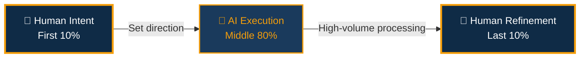

<!-- BODY: 2.1 continued -->

### 2.2 Why "10:80:10"? — Comparison with Other Ratios

<!-- BODY: 2.2 -->

```mermaid
graph TB
    subgraph "❌ 50:50:0"
        A1["Human 50%"] --- A2["AI 50%"]
        A3["No refinement"]
    end
    subgraph "❌ 0:100:0"
        B1["One prompt"] --- B2["AI 100%"]
        B3["AI slop"]
    end
    subgraph "❌ 30:40:30"
        C1["Human 60%"] --- C2["AI 40%"]
        C3["Insufficient ROI"]
    end
    subgraph "✅ 10:80:10"
        D1["Design 10%"] --- D2["AI 80%"]
        D2 --- D3["Refinement 10%"]
    end

    style A1 fill:#0f2b46,stroke:#666,color:#999,stroke-width:1px
    style A2 fill:#0f2b46,stroke:#666,color:#999,stroke-width:1px
    style A3 fill:#0f2b46,stroke:#666,color:#ff6b6b,stroke-width:1px
    style B1 fill:#0f2b46,stroke:#666,color:#999,stroke-width:1px
    style B2 fill:#0f2b46,stroke:#666,color:#999,stroke-width:1px
    style B3 fill:#0f2b46,stroke:#666,color:#ff6b6b,stroke-width:1px
    style C1 fill:#0f2b46,stroke:#666,color:#999,stroke-width:1px
    style C2 fill:#0f2b46,stroke:#666,color:#999,stroke-width:1px
    style C3 fill:#0f2b46,stroke:#666,color:#ff6b6b,stroke-width:1px
    style D1 fill:#f59e0b,stroke:#0f2b46,color:#0f2b46,stroke-width:3px
    style D2 fill:#1a3a5c,stroke:#f59e0b,color:#f59e0b,stroke-width:2px
    style D3 fill:#f59e0b,stroke:#0f2b46,color:#0f2b46,stroke-width:3px
```

<!-- BODY: 2.2 continued -->

### 2.3 The 10:80:10 Principle Through the Lens of Creativity Theory

<!-- BODY: 2.3 -->

### 2.4 Before/After: The Difference With and Without 10:80:10

<!-- BODY: 2.4 -->

### 2.5 The 10:80:10 Principle Through the Lens of Cognitive Science

<!-- BODY: 2.5 -->

### 2.6 The 10:80:10 Principle Through the Lens of Organizational Theory

<!-- BODY: 2.6 -->

> **Chapter 2 References**
> - Kahneman, D. (2011). *Thinking, Fast and Slow*. Farrar, Straus and Giroux. https://us.macmillan.com/books/9780374533557/thinkingfastandslow
> - Ericsson, K. A., et al. (1993). "The role of deliberate practice." *Psychological Review*, 100(3). https://doi.org/10.1037/0033-295X.100.3.363
> - Csikszentmihalyi, M. (1990). *Flow: The Psychology of Optimal Experience*. Harper & Row. https://www.harpercollins.com/products/flow-mihaly-csikszentmihalyi
> - Miller, G. A. (1956). "The magical number seven, plus or minus two." *Psychological Review*, 63(2). https://doi.org/10.1037/h0043158
> - Drucker, P. F. (1966). *The Effective Executive*. Harper & Row. https://www.harpercollins.com/products/the-effective-executive-peter-f-drucker
> - Mintzberg, H. (1979). *The Structuring of Organizations*. Prentice-Hall. https://www.pearson.com/en-us/subject-catalog/p/structuring-of-organizations-the/P200000005959
> - Christensen, C. M. (1997). *The Innovator's Dilemma*. Harvard Business Review Press. https://www.hbs.edu/faculty/Pages/item.aspx?num=46
> - Wallas, G. (1926). *The Art of Thought*. Jonathan Cape. https://archive.org/details/artofthought00wall
> - Amabile, T. M. (1996). *Creativity in Context*. Westview Press. https://www.hbs.edu/faculty/Pages/item.aspx?num=465
> - Epstein, D. (2019). *Range: Why Generalists Triumph in a Specialized World*. Riverhead Books. https://davidepstein.com/the-range/

 

---

## Chapter 3 — The First 10%: The Art of Designing Questions

### 3.1 Why the "Question" Determines Everything

<!-- BODY: 3.1 -->

### 3.2 The Five-Layer Structure of Questions

<!-- BODY: 3.2 -->

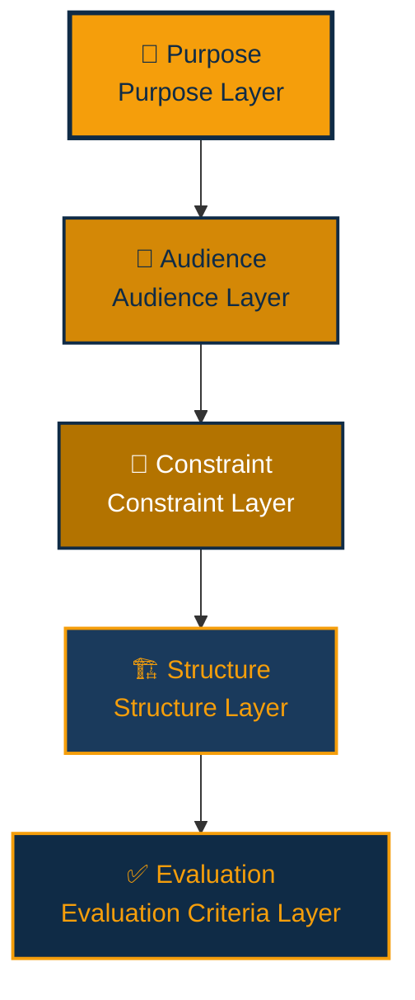

<!-- BODY: 3.2 continued -->

### 3.3 Three Traps That Prevent Good Question Design

<!-- BODY: 3.3 -->

### 3.4 In Practice: The First 10% in a New Business Proposal

<!-- BODY: 3.4 -->

### 3.5 Anti-Pattern Collection for Questions

<!-- BODY: 3.5 -->

### 3.6 Using AI to Assist Question Design

<!-- BODY: 3.6 -->

> **Chapter 3 References**
> - Boehm, B. W. (1981). *Software Engineering Economics*. Prentice-Hall. https://dl.acm.org/doi/book/10.5555/539404
> - Minto, B. (1987). *The Pyramid Principle*. Minto International. https://www.barbaraminto.com/

 

---

## Chapter 4 — The Middle 80%: Techniques for Collaborating with AI

### 4.1 The Essence of the 80%: AI as an Amplifier

<!-- BODY: 4.1 -->

### 4.2 Context Engineering

<!-- BODY: 4.2 -->

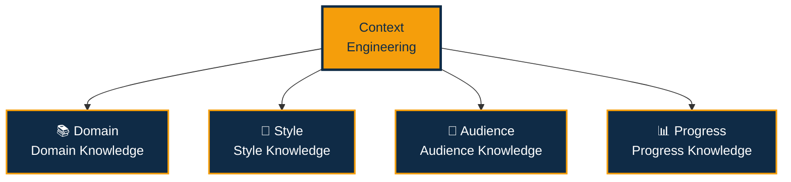

<!-- BODY: 4.2 continued -->

### 4.3 Designing Iteration

<!-- BODY: 4.3 -->

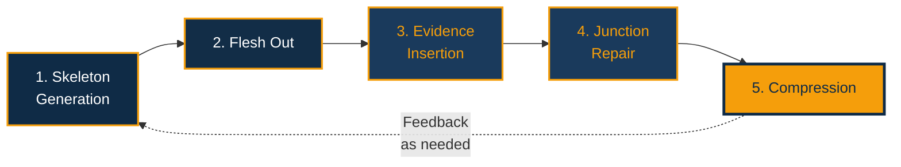

<!-- BODY: 4.3 continued -->

### 4.4 How to Surpass AI's Output

<!-- BODY: 4.4 -->

### 4.5 Hallucination: The Structural Risk of the 80% Phase

<!-- BODY: 4.5 -->

### 4.6 Before/After: Real Examples from the 80% Phase

<!-- BODY: 4.6 -->

> **Chapter 4 References**
> - Dell'Acqua, F., et al. (2023). "Navigating the Jagged Technological Frontier." *HBS Working Paper*, No. 24-013. https://www.hbs.edu/ris/Publication%20Files/24-013_d9b45b68-9e74-42d6-a1c6-c72fb70c7571.pdf
> - Brynjolfsson, E., Li, D., & Raymond, L. (2023). "Generative AI at Work." *NBER Working Paper*, No. 31161. https://www.nber.org/papers/w31161
> - Noy, S. & Zhang, W. (2023). "Experimental Evidence on the Productivity Effects of Generative AI." *Stanford SCALE*. https://www.science.org/doi/10.1126/science.adh2586
> - Stanford University HAI. (2024). *AI Index Report 2024*. https://aiindex.stanford.edu/report/

 

---

## Chapter 5 — The Last 10%: The Art of Refinement

### 5.1 Why the Last 10% Is the Hardest

<!-- BODY: 5.1 -->

### 5.2 Six Checkpoints for the Last 10%

<!-- BODY: 5.2 -->

### 5.3 The Art of Deletion

<!-- BODY: 5.3 -->

### 5.4 Before/After: Real Examples from the Last 10%

<!-- BODY: 5.4 -->

### 5.5 Time Management for the Refinement Phase

<!-- BODY: 5.5 -->

> **Chapter 5 References**
> - Wang, Z., et al. (2024). "AI-generated reviews and human oversight." *CHI 2024*. https://doi.org/10.1145/3613904.3642627
> - Microsoft Research. (2025). "The Impact of AI on Knowledge Worker Cognition." https://www.microsoft.com/en-us/research/publication/the-impact-of-ai-on-knowledge-worker-cognition/
> - Doshi, A. R. & Hauser, O. P. (2024). "Generative AI enhances individual creativity but reduces collective diversity." *Science Advances*, 10(28). https://www.science.org/doi/10.1126/sciadv.adn5290
> - Strunk, W. Jr. (1919). *The Elements of Style*. Harcourt. https://www.gutenberg.org/ebooks/37134
> - Saint-Exupéry, A. de. (1939). *Terre des hommes*. Reynal & Hitchcock. https://archive.org/details/windandsandstars0000sain

 

---

## Chapter 6 — Expanding the Application: To All Intellectual Production

### 6.1 Is the 10:80:10 Principle a Universal Law?

<!-- BODY: 6.1 -->

### 6.2 Software Development

<!-- BODY: 6.2 -->

### 6.3 Strategy Consulting

<!-- BODY: 6.3 -->

### 6.4 Marketing and Branding

<!-- BODY: 6.4 -->

### 6.5 Education and Training

<!-- BODY: 6.5 -->

### 6.6 Limitations of Application

<!-- BODY: 6.6 -->

### 6.7 Research and Analysis

<!-- BODY: 6.7 -->

### 6.8 Personal Knowledge Management

<!-- BODY: 6.8 -->

> **Chapter 6 References**
> - GitHub. (2024). "Quantifying GitHub Copilot's Impact in the Enterprise with Accenture." https://github.blog/news-insights/research/research-quantifying-github-copilots-impact-in-the-enterprise-with-accenture/
> - Forte, T. (2022). *Building a Second Brain*. Atria Books. https://www.buildingasecondbrain.com/

 

---

## Chapter 7 — Organizational Adoption: Implementing 10:80:10 as a Team

### 7.1 From Individual to Organization

<!-- BODY: 7.1 -->

### 7.2 The Structure of Intent Degradation

<!-- BODY: 7.2 -->

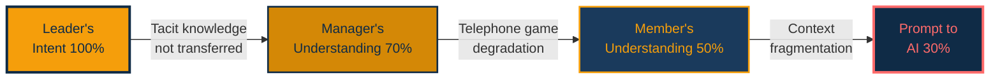

<!-- BODY: 7.2 continued -->

### 7.3 Three Principles for Organizational Implementation of the 10:80:10 Principle

<!-- BODY: 7.3 -->

### 7.4 Redefining Roles in Organizational 10:80:10

<!-- BODY: 7.4 -->

### 7.5 Barriers to Adoption and Countermeasures

<!-- BODY: 7.5 -->

### 7.6 Before/After: Organizational Application Case

<!-- BODY: 7.6 -->

### 7.7 Change Management: Embedding 10:80:10 in the Organization

<!-- BODY: 7.7 -->

### 7.8 ROI Measurement Framework

<!-- BODY: 7.8 -->

> **Chapter 7 References**
> - Polanyi, M. (1966). *The Tacit Dimension*. Routledge & Kegan Paul. https://press.uchicago.edu/ucp/books/book/chicago/T/bo6035368.html
> - Shannon, C. E., & Weaver, W. (1949). *The Mathematical Theory of Communication*. U of Illinois Press. https://press.uillinois.edu/books/?id=p072569
> - Kotter, J. P. (1996). *Leading Change*. Harvard Business Review Press. https://www.kotterinc.com/methodology/8-steps/
> - McKinsey. (2025). *Agents, robots, and us: Skill partnerships in the age of AI*. https://www.mckinsey.com/capabilities/mckinsey-digital/our-insights/agents-robots-and-us
> - World Economic Forum. (2025). *The Future of Jobs Report 2025*. https://www.weforum.org/publications/the-future-of-jobs-report-2025/

 

---

## Chapter 8 — Building Deep Expertise: The Prerequisite for 10:80:10

### 8.1 AI Does Not Turn Beginners into Professionals

<!-- BODY: 8.1 -->

### 8.2 From T-Shaped to π-Shaped

<!-- BODY: 8.2 -->

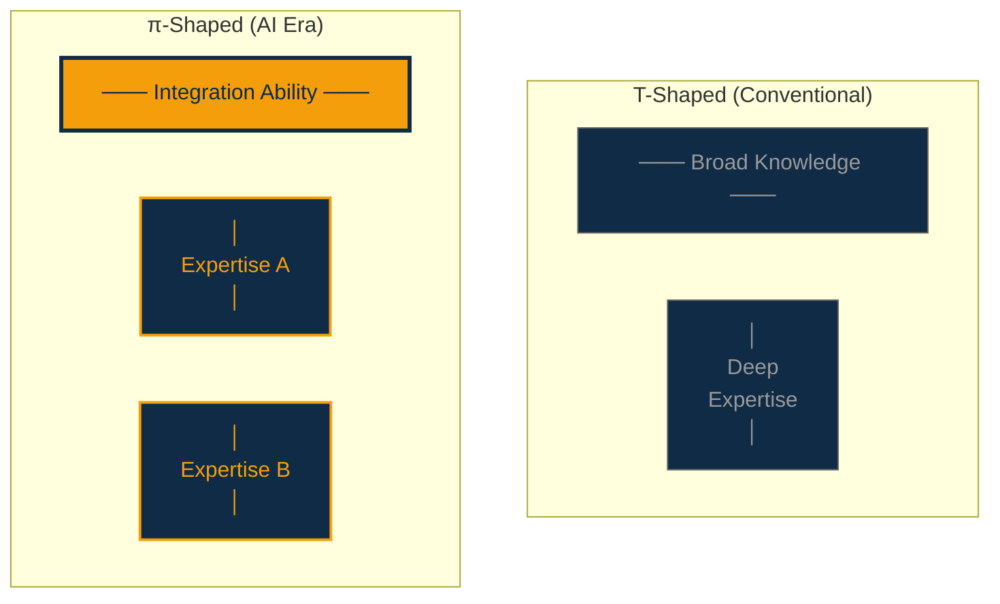

<!-- BODY: 8.2 continued -->

### 8.3 Using the 10:80:10 Principle to "Sharpen" Expertise

<!-- BODY: 8.3 -->

### 8.4 The 10:80:10 Principle for Learning

<!-- BODY: 8.4 -->

### 8.5 Cross-Domain Integration Ability

<!-- BODY: 8.5 -->

### 8.6 Before/After: Return on Investment in Expertise

<!-- BODY: 8.6 -->

### 8.7 The "Compound Interest" Effect of Expertise

<!-- BODY: 8.7 -->

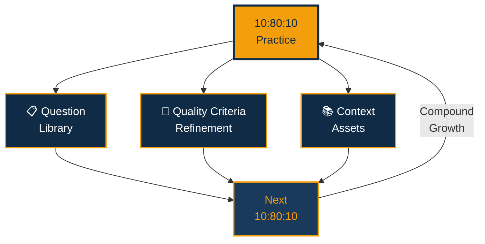

<!-- BODY: 8.7 continued -->

### 8.8 Expanding the Definition of "Depth"

<!-- BODY: 8.8 -->

### 8.9 The Half-Life of Expertise

<!-- BODY: 8.9 -->

> **Chapter 8 References**
> - Vaccaro, M., et al. (2024). "When combinations of humans and AI are useful." *Nature Human Behaviour*. https://www.nature.com/articles/s41562-024-02024-1
> - Mollick, E. (2026). "Discovering AI's jagged frontier: Updated findings." U of Pennsylvania. https://www.oneusefulthing.org/
> - Ericsson, K. A., et al. (1993). "The role of deliberate practice." *Psychological Review*, 100(3). https://doi.org/10.1037/0033-295X.100.3.363
> - Arbesman, S. (2012). *The Half-Life of Facts*. Current/Penguin. https://www.penguinrandomhouse.com/books/309587/the-half-life-of-facts-by-samuel-arbesman/
> - Johansson, F. (2004). *The Medici Effect*. Harvard Business Review Press. https://www.hbs.edu/faculty/Pages/item.aspx?num=16919
> - Feynman, R. P. (1985). *Surely You're Joking, Mr. Feynman!*. W. W. Norton. https://wwnorton.com/books/Surely-Youre-Joking-Mr-Feynman/

 

---

## Chapter 9 — Ethics and Responsibility: Boundaries of Human-AI Collaboration

### 9.1 Who Takes Responsibility?

<!-- BODY: 9.1 -->

### 9.2 The Principle of Transparency

<!-- BODY: 9.2 -->

### 9.3 Detecting and Correcting AI Bias

<!-- BODY: 9.3 -->

### 9.4 Copyright and Intellectual Property

<!-- BODY: 9.4 -->

### 9.5 The Risk of AI Dependency

<!-- BODY: 9.5 -->

### 9.6 Designing AI Governance

<!-- BODY: 9.6 -->

### 9.7 The Societal Impact of 10:80:10

<!-- BODY: 9.7 -->

### 9.8 Data Privacy in Practice

<!-- BODY: 9.8 -->

### 9.9 The Future of 10:80:10 and the Evolution of Ethics

<!-- BODY: 9.9 -->

> **Chapter 9 References**
> - Bainbridge, L. (1983). "Ironies of Automation." *Automatica*, 19(6). https://doi.org/10.1016/0005-1098(83)90046-8
> - European Union. (2024). *Regulation (EU) 2024/1689 — The AI Act*. https://eur-lex.europa.eu/eli/reg/2024/1689/oj
> - U.S. Copyright Office. (2023). "Copyright Registration Guidance: Works Containing Material Generated by AI." *Federal Register*, 88(51). https://www.federalregister.gov/documents/2023/03/16/2023-05321/copyright-registration-guidance-works-containing-material-generated-by-artificial-intelligence
> - PwC. (2025). *AI Jobs Barometer*. https://www.pwc.com/gx/en/issues/artificial-intelligence/job-barometer.html
> - World Economic Forum. (2025). *The Future of Jobs Report 2025*. https://www.weforum.org/publications/the-future-of-jobs-report-2025/

 

---

## Chapter 10 — Conclusion: Design Your Own 10:80:10

### 10.1 Summary of This Book

<!-- BODY: 10.1 -->

### 10.2 Start Your 10:80:10 Tomorrow

<!-- BODY: 10.2 -->

### 10.3 A Phased Adoption Roadmap

<!-- BODY: 10.3 -->

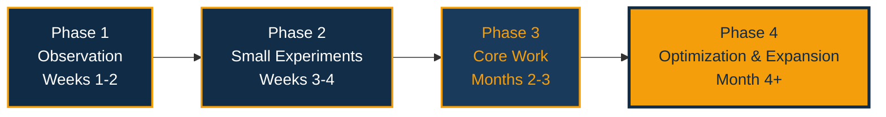

<!-- BODY: 10.3 continued -->

### 10.4 Self-Assessment for 10:80:10 Practitioners

<!-- BODY: 10.4 -->

### 10.5 Beyond 5x

<!-- BODY: 10.5 -->

### 10.6 Frequently Asked Questions

<!-- BODY: 10.6 -->

### 10.7 A Final Message

<!-- BODY: 10.7 -->

---

## About the Author

The author of this book is a cross-domain professional spanning Business, Technology, and Creative. He codified an original methodology called "Depth & Velocity" (D&V) and explores the future of intellectual production in the AI era from both practical and theoretical perspectives.

## License

This work is licensed under a [Creative Commons Attribution 4.0 International License (CC BY 4.0)](https://creativecommons.org/licenses/by/4.0/).

**You are free to:**
- **Share** — copy and redistribute the material in any medium or format
- **Adapt** — remix, transform, and build upon the material
- **For any purpose, even commercially**

**Under the following terms:**
- **Attribution** — You must give appropriate credit, provide a link to the license, and indicate if changes were made

---

*The 10-80-10 Principle*
*© 2026. Licensed under CC BY 4.0.*
