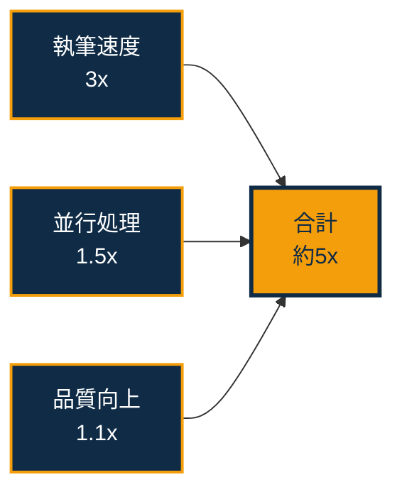
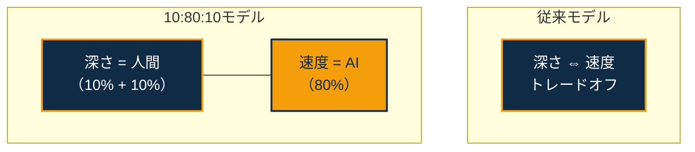
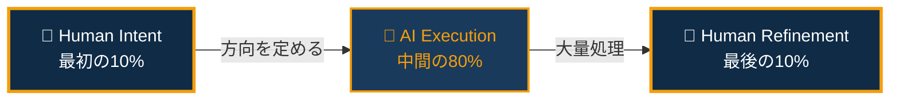
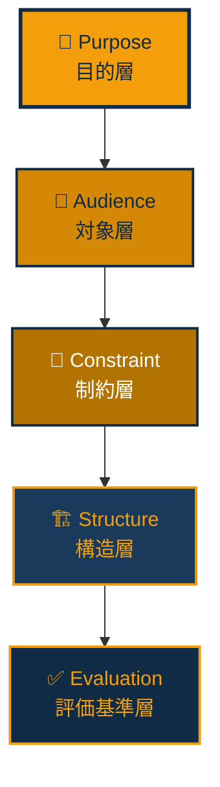
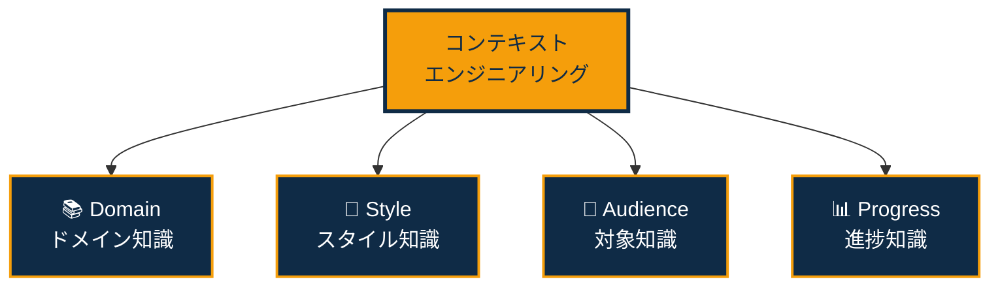
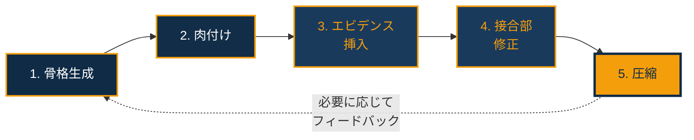
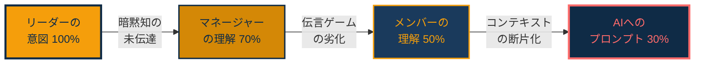
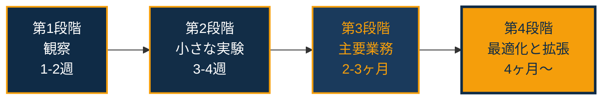

# 人とAIの共創黄金比「10:80:10の法則」

The AI-Era Advantage: 5x Your Output Quality & Quantity with the 10/80/10 Rule of Human-AI Co-Creation. <br>
AI時代だからこそ実現可能になったこと。あなたのアウトプットの質と量を"5倍"にする、『人とAIの共創黄金比「10:80:10」の法則』。 

[](https://creativecommons.org/licenses/by/4.0/)
[](https://github.com/Leading-AI-IO/saas-is-dead-the-next-ai-business-model/blob/main/docs)

<p align="left">
  
</p>

<br>

---
## はじめに ── なぜ「比率」が全てを決めるのか

2025年、生成AIは「使える人」と「使えない人」の格差を急速に広げている。

Gallupが22,368名の米国就業者を対象に実施した経時追跡調査（2025年Q4）によると、AIを職場で使用している労働者は全体の46%に達した。しかし、毎日使う層はわずか12%にとどまる。残りの大半は「使ったことはあるが、日常的には使っていない」層であり、一度試して放置したか、月に数回触れる程度に過ぎない。

だが問題の本質は、AIを使えるかどうかではない。**AIとの間で、どう役割を分けるか**──この設計思想の有無が、アウトプットの質と量を決定的に左右している。

McKinsey Global Instituteは2023年の報告書で、生成AIが世界全体で年間2.6兆〜4.4兆ドルの経済価値を生み出す可能性を示した。この数字は、従来のAI分析が推計していた価値の15〜40%に相当する上乗せである。しかし同報告書は、この価値が自動的に実現するわけではないことを繰り返し強調している。価値実現の鍵は、人間がAIとどのように協働するかの「設計」にある。

ハーバード・ビジネス・スクールのKarim Lakhani教授は「AIに置き換えられるのではない、AIを使いこなす人間に置き換えられるのだ」と述べた。この言葉は本質を突いている。しかし、「使いこなす」とは具体的に何を意味するのか。どのフェーズで人間が介入し、どのフェーズをAIに委ね、どのフェーズで人間が再び主導権を握るのか。この問いに対する構造的な回答は、驚くほど少ない。

本書が提示する答えは、シンプルだ。

**10:80:10。**

最初の10%で人間が方向を定め、中間の80%でAIが大量処理を実行し、最後の10%で人間が仕上げる。この比率を意識的に設計するだけで、個人のアウトプットは質・量ともに従来の5倍に到達する。

これは理論ではない。著者自身がこの原理を実践し、知的生産の質と量が飛躍的に向上することを検証した上で言語化した原理である。

本書の目的は3つある。

第一に、10:80:10という比率が「なぜ」最適なのかを、認知科学・組織論・創造性研究の知見から構造的に説明する。第二に、この比率を「どのように」日常業務に適用するかを、具体的なBefore/Afterシナリオで示す。第三に、読者自身がこの原理を応用し、自分の領域でアウトプットを5倍にするための行動フレームワークを提供する。

「AIをもっと使え」という一般論では、人は動けない。「最初の10%で問いを立て、80%をAIに任せ、最後の10%で磨け」──この具体的な比率が、行動を変える。

### 本書の構成

本書は10章で構成される。

第1章では、5倍という数字の構造的根拠を示す。第2章では、10:80:10の構造を定義し、認知科学・組織論の知見と接続する。第3章では、最初の10%——問いの設計技法——を、5層構造モデルとして体系化する。第4章では、中間の80%——AIとの協働技法——を、コンテキストエンジニアリングの概念とともに解説する。第5章では、最後の10%——仕上げの技術——を、7つのチェックポイントとして具体化する。

第6章では、書籍執筆以外の領域（ソフトウェア開発、戦略コンサルティング、マーケティング、教育、リサーチ）への適用を示す。第7章では、組織への導入方法と、Intent Degradation（意図の劣化）問題への対策を論じる。第8章では、10:80:10の前提条件である深い専門性の構築法を解説する。第9章では、AIとの協働における倫理と責任の境界線を論じる。第10章では、読者が明日から実践するための具体的なアクションプランを提示する。

各章にはBefore/After（10:80:10適用前後の比較シナリオ）を含め、理論ではなく実践に直結する内容を重視した。

---

## 第1章 ── 5倍の現実：なぜ5倍なのか

### 1.1 5倍という数字の構造

本書の核心的主張──「アウトプットの質と量が5倍になる」──は、抽象的なスローガンではない。10:80:10の構造から論理的に導かれる数字である。

5倍という数字は、どこから来るのか。

**執筆速度の向上: 約3倍。** 10:80:10の比率で知的生産プロセスを設計することで、1つのプロジェクトあたりの実質的な人間の作業時間は約3分の1に圧縮される。従来、人間が30〜50時間かけていた作業を、最初の10%（3〜5時間）と最後の10%（3〜5時間）に凝縮し、中間の80%をAIが高速処理する。

この速度向上は実証データと整合する。GitHubがAccentureと共同で実施したGitHub Copilotの企業規模実証研究では、AIコーディングアシスタントの活用によりタスク完了速度が55%向上した。Stanford SCALEのNoy & Zhangによるライティング実験（453名対象）でも、AI使用により作業時間が40%短縮された。10:80:10はこれらの個別事例を統合する設計原理であり、速度向上が3倍に到達するのは、単なるツール利用ではなくプロセス全体の再設計を行うからだ。

**並行処理の実現: 約1.5倍。** AIが中間の80%を処理している間、人間は次のプロジェクトの「最初の10%」──問いの設計──に着手できる。これにより、複数のプロジェクトを並行して進めることが可能になる。従来の逐次処理では不可能だった並行性が、実質的な生産性を1.5倍に引き上げる。

**品質フィルターの精度向上: 約1.1倍。** 最後の10%で人間が品質を検証する際、AIが生成した多数の候補から最良のものを選択できるため、一発で書く場合よりも最終品質が向上する。この品質向上が公開後のエンゲージメントを高め、複利的に到達範囲を拡大する。

3倍 × 1.5倍 × 1.1倍 ≒ 5倍。

これが10:80:10の数学的根拠である。



### 1.2 従来のペースとの比較

一般的なビジネス書の執筆プロセスでは、1冊の企画から完成までに6〜18ヶ月を要する。取材、構成、執筆、校正を含めると、年間1〜2冊が標準的なペースである。

10:80:10を適用した場合、1冊あたりの実質的な人間の作業時間は8〜12時間に圧縮される。1冊にかかる暦日数は1〜2週間（他の業務と並行の場合）。年間で20冊以上のペースが理論的に可能になる。

ただし、冊数の比較は公正ではない。公正な比較の軸は、「1人の個人が、一定期間内に生み出し、世界に届けた知的コンテンツの総量と到達範囲」である。この軸で測定すれば、10:80:10の適用により、従来の自分自身と比較して約5倍のアウトプットが現実的に達成可能である。

### 1.3 再現可能性の条件

重要な問いがある。この成果は特定の個人だけの特殊事例ではないか。

答えは、条件付きのNoである。

10:80:10の原理自体は普遍的だが、5倍という倍率の実現には3つの前提条件がある。

McKinseyの「The state of AI in early 2024」レポートでは、65%の組織が生成AIを定常利用している一方で、44%が導入によるネガティブな結果を経験したと報告している。BCGの2024年調査でも、生成AIを導入した企業の約60%が「期待したROIを達成できていない」と回答した。この大量の「失敗」は、AIの性能の問題ではない。人間の関与の設計——最初の10%と最後の10%——が欠落していることの帰結である。

5倍の成果を実現するための3つの前提条件を以下に示す。

**第一に、深い専門性。** AIに80%を委ねるためには、残りの20%（最初の10%と最後の10%）で質の高い判断ができる必要がある。質の高い判断は、その領域における深い理解なしには不可能である。MIT Sloan Management Reviewの2024年の調査では、生成AIの導入によって最も生産性が向上したのは、既に高いスキルを持つ専門家であることが示されている。AIは初心者をプロにするのではなく、プロをスーパープロにするツールである。

**第二に、明確な問いの設計能力。** 最初の10%で投入する「問い」の質が、残りの90%の品質を決定する。「AIに何を聞くか」ではなく、「AIに何を聞くべきかを設計する」能力が本質である。この能力は、問題空間を構造的に把握する訓練によって養われる。

**第三に、判断する勇気。** 最後の10%で、AIの出力を冷静に評価し、不要なものを削除し、不足を補い、全体を統合する判断力が求められる。これは技術ではなく、態度である。AIの出力を鵜呑みにする受動性と、AIの出力を全否定する拒絶の間に、批判的に受容する中間地点がある。この中間地点に立てるかどうかが、成果を分ける。

本書の後続の章では、これら3つの前提条件をどのように構築するかについても具体的に解説する。

### 1.4 Depth & Velocityとの関係

10:80:10は、「Depth & Velocity」（D&V）方法論の中核原理である。

D&Vは、「深さ」（Depth）と「速度」（Velocity）を同時に追求する知的生産の方法論である。従来、深さと速度はトレードオフの関係にあると考えられてきた。深く考えれば時間がかかり、速く出せば浅くなる。このトレードオフは、人間が「深さ」と「速度」の両方を1人で担うことを前提としている。

10:80:10は、このトレードオフを解消する。人間が「深さ」を担い、AIが「速度」を担う。深さは最初の10%と最後の10%に集中配置され、速度は中間の80%でAIが実現する。深さと速度は競合しない。両者は分業する。



### 1.5 10:80:10の習熟曲線

10:80:10の比率は、最初から完成されるものではない。実践を通じて段階的に最適化される。

**フェーズ1: 試行錯誤期（1〜2ヶ月）。** 最初の10%に時間をかけすぎ、80%のフェーズでAIの活用が不十分な段階。比率はおよそ25:50:25。AIの出力を信頼しきれず、80%のフェーズでも人間が大幅に介入する。

**フェーズ2: 安定期（3〜4ヶ月）。** 最初の10%の問い設計のパターンが確立し、80%のフェーズでのAI活用が効率化される段階。比率が10:75:15に接近。しかし、最後の仕上げに時間をかけすぎる傾向が残る。

**フェーズ3: 最適化期（5〜6ヶ月）。** 10:80:10の比率がほぼ確立。コンテキストエンジニアリングの技法が成熟し、AIの出力品質が安定。最後の10%で「削除する勇気」が身についたことが、効率化の最大の要因。

**フェーズ4: 体化期（6ヶ月以降）。** 10:80:10が完全に体化（embodied）された状態。比率を意識しなくても自然にこの構造で作業できるようになる。

この進化過程自体が、10:80:10が「学習可能な技術」であることを証明している。天賦の才ではなく、反復による技術の習得である。

---

## 第2章 ── 10:80:10とは何か：構造の全体像

### 2.1 三層構造の定義

10:80:10は、あらゆる知的生産プロセスに適用可能な、人間とAIの役割分担の原理である。



**最初の10%: Human Intent（人間の意図）**

全体の方向を定める。具体的には、以下の要素を人間が設計する。

- **What**: 何を生み出すのか。成果物の定義
- **Why**: なぜそれが必要なのか。目的と文脈
- **Who**: 誰に届けるのか。対象読者の解像度
- **Constraint**: 何をしないのか。制約条件の設定
- **Quality Bar**: 何をもって完成とするのか。品質基準

この10%の作業に、全体の思考エネルギーの50%以上を投入する。投入時間は全体の10%だが、投入される知的密度は最も高い。

**中間の80%: AI Execution（AIによる実行）**

人間が設計した意図に基づいて、AIが大量処理を実行する。具体的には以下の活動が含まれる。

- ドラフトの生成（文章、コード、デザイン案）
- 情報の収集と構造化
- 翻訳と多言語展開
- パターンの分析と類型化
- 選択肢の網羅的な生成

この80%の特性は、**速度と量**である。AIは1時間で人間の10時間分の作業を処理できる。しかし、この80%の品質は、最初の10%で設計された意図の精度に完全に依存する。意図が曖昧であれば、AIは大量の「方向性の間違った」出力を高速で生成する。

**最後の10%: Human Refinement（人間の仕上げ）**

AIの出力を人間が検証し、最終品質を確定する。具体的には以下の作業を含む。

- 事実関係の検証
- 論理的整合性の確認
- 文体とトーンの統一
- 不要な部分の削除（AIは引き算が苦手である）
- 独自の経験・見解の追加
- 最終的な「公開する/しない」の判断

この10%の作業は、最初の10%と同じく代替不可能な人間の領域である。AIは自分の出力の品質を客観的に評価できない。メタ認知──自分が何を知らないかを知る能力──は、現在のAIに欠落している最大の能力であり、人間が最後に介入する根本的な理由である。

### 2.2 なぜ10:80:10なのか──他の比率との比較

10:80:10という比率は、恣意的に選ばれたものではない。他の比率と比較することで、その最適性が明らかになる。

**50:50:0（半分人間、半分AI、仕上げなし）**

AIを「清書ツール」として使うパターン。人間が半分書き、残りをAIに書かせ、そのまま出す。このパターンの問題は、品質保証プロセスが存在しないことだ。人間が書いた部分とAIが書いた部分の文体が乖離し、論理の接合部に亀裂が生じる。読者は「何かがおかしい」と直感的に感じる。

**0:100:0（全てAI）**

プロンプトを1つ投げて、AIの出力をそのまま公開するパターン。ChatGPTやClaudeに「〇〇について書いて」と入力し、結果をコピー＆ペーストする。このパターンは2024年にすでにインターネット上で大量発生し、「AIスロップ」（AI slop）として社会問題化している。Google検索品質チームのリーダーであるPandu Nayakは2024年のブログ投稿で、低品質なAI生成コンテンツの氾濫をランキングアルゴリズムの最重要課題の一つとして言及した。

**30:40:30（人間重視型）**

AIの活用度が低く、人間の作業負荷が60%を占めるパターン。品質は高いが、量が出ない。従来のペースと大差なく、AI導入のROIが低い。多くの大企業のAI導入がこのパターンに陥っており、「AIを導入したが生産性が上がらない」という不満の原因となっている。Boston Consulting Groupの2024年の調査では、生成AIを導入した企業の約60%が「期待したROIを達成できていない」と回答している。その主因は、人間の介入比率が高すぎることだと分析されている。

**10:80:10の最適性。**

```mermaid
graph TB
    subgraph "❌ 50:50:0"
        A1["人間 50%"] --- A2["AI 50%"]
        A3["仕上げなし"]
    end
    subgraph "❌ 0:100:0"
        B1["プロンプト1つ"] --- B2["AI 100%"]
        B3["AI slop"]
    end
    subgraph "❌ 30:40:30"
        C1["人間 60%"] --- C2["AI 40%"]
        C3["ROI不足"]
    end
    subgraph "✅ 10:80:10"
        D1["設計 10%"] --- D2["AI 80%"]
        D2 --- D3["仕上げ 10%"]
    end

    style A1 fill:#0f2b46,stroke:#666,color:#999,stroke-width:1px
    style A2 fill:#0f2b46,stroke:#666,color:#999,stroke-width:1px
    style A3 fill:#0f2b46,stroke:#666,color:#ff6b6b,stroke-width:1px
    style B1 fill:#0f2b46,stroke:#666,color:#999,stroke-width:1px
    style B2 fill:#0f2b46,stroke:#666,color:#999,stroke-width:1px
    style B3 fill:#0f2b46,stroke:#666,color:#ff6b6b,stroke-width:1px
    style C1 fill:#0f2b46,stroke:#666,color:#999,stroke-width:1px
    style C2 fill:#0f2b46,stroke:#666,color:#999,stroke-width:1px
    style C3 fill:#0f2b46,stroke:#666,color:#ff6b6b,stroke-width:1px
    style D1 fill:#f59e0b,stroke:#0f2b46,color:#0f2b46,stroke-width:3px
    style D2 fill:#1a3a5c,stroke:#f59e0b,color:#f59e0b,stroke-width:2px
    style D3 fill:#f59e0b,stroke:#0f2b46,color:#0f2b46,stroke-width:3px
```



最初の10%に思考を集中させることで、方向性の精度が最大化される。80%をAIに委ねることで、速度と量が確保される。最後の10%で人間が品質を保証することで、信頼性が担保される。

この比率は、パレートの法則（80:20の法則）を人間とAIの協働に応用したものとも読める。20%の人間の貢献が、80%の最終価値を決定する。ただし、その20%は冒頭と末尾に集中配置する必要がある──これが10:80:10の独自の洞察である。

### 2.5 創造性理論から見た10:80:10

10:80:10の構造は、創造性に関する主要な理論とも整合する。

**Graham Wallasの4段階モデル。** Wallasは1926年の著書『The Art of Thought』で、創造的思考のプロセスを4段階に分類した。Preparation（準備）、Incubation（孵卵）、Illumination（ひらめき）、Verification（検証）。10:80:10では、Preparationが最初の10%に、IncubationとIlluminationの機能的等価物がAIの80%処理に、Verificationが最後の10%に対応する。

注目すべきは、Wallasモデルにおける「孵卵」——問題を意識的に考えることをやめ、無意識に任せる段階——が、10:80:10では「AIに任せる80%」として構造化されている点だ。人間が80%をAIに委ねている間、人間の無意識はバックグラウンドで問題を処理し続ける。AIの出力を見たときに「あ、これは違う」「これは面白い」と直感的に判断できるのは、意識がAIに作業を委ねている間に無意識が判断基準を練り上げているからだ。

**Teresa Amabileの内発的動機づけ理論。** Harvard Business SchoolのAmabileは、数十年にわたる創造性研究の結果、創造的成果の最大の予測因子は内発的動機づけ（Intrinsic Motivation）であることを示した。外的報酬ではなく、作業そのものへの興味と情熱が創造性を駆動する。

10:80:10は、人間を内発的動機づけが最も高まるフェーズ——問いの設計と品質の仕上げ——に集中させる。データ入力、書式整え、定型文の生成といった内発的動機づけが低い作業をAIに委ねることで、人間は知的好奇心が最も刺激される高次の作業に没頭できる。これは組織におけるエンゲージメント向上の観点からも重要な示唆を持つ。

**David Epsteinの「レンジ」理論。** Epsteinは2019年の著書『Range: Why Generalists Triumph in a Specialized World』で、過度な早期専門化よりも、広い範囲の経験と知識が創造的問題解決において優位であることを論じた。10:80:10の最初の10%——問いの設計——において、多様な領域の知識を統合する能力が決定的に重要であることは、Epsteinの主張と一致する。

### 2.6 Before/After: 10:80:10の有無による差

以下は、同一の目標に対して、10:80:10を適用した場合としなかった場合の典型的な差を示す。

**目標: 自社のAI戦略提案書を3日以内に作成**

**10:80:10なしの場合:**
- 1日目: 何を書くか迷い、とりあえず競合のAI事例を検索。情報が多すぎて構成が決まらない
- 2日目: 見切り発車で書き始めるが、途中で方向が変わる。前半を書き直し
- 3日目: 夜中まで作業。体裁を整えて提出。「なんとなく全部入り」の提案書が完成
- 結果: 30ページ。「分かるけど、で、何をすればいいの？」と上司に言われる

**10:80:10ありの場合:**
- 1日目午前（最初の10%・3時間）: 提案書の目的を「経営会議で来期AI予算3,000万円の承認を得る」に限定。対象を「技術に詳しくない取締役3名」に設定。制約として「技術詳細は含めない、ROI試算を中心に、10ページ以内」を定義。品質基準として「各ページに1つの意思決定ポイント、全ページにアクション項目」を設定
- 1日目午後〜2日目（中間の80%・8時間）: AIに業界ベンチマーク収集、ROIモデル作成、スライド構成案の生成を依頼。3パターンの提案書ドラフトを生成させ、最も効果的なものを選択
- 3日目午前（最後の10%・3時間）: 自社固有の数字を挿入、取締役の過去の発言を踏まえた反論予測を追加、不要なページを削除（15ページ→10ページ）、エグゼクティブサマリーを自分の言葉で書き直し
- 結果: 10ページ。明確な意思決定ポイントと具体的なROI試算を含む。予算承認

この差は、能力の差ではない。プロセスの設計の差である。

### 2.3 認知科学から見た10:80:10

10:80:10の構造は、認知科学の複数の知見と整合する。

**Daniel Kahnemanのシステム1・システム2理論。** Kahnemanが2011年の著書『Thinking, Fast and Slow』で提示した二重過程理論によれば、人間の思考にはSystem 1（高速・直感的・無意識的）とSystem 2（低速・分析的・意識的）の2つのモードがある。最初の10%と最後の10%は、System 2の集中的な活用を必要とするフェーズである。中間の80%は、AIがSystem 1的な高速処理を代行するフェーズである。10:80:10は、人間のSystem 2をもっとも価値の高い2つの局面に集中配置する設計である。

**Anders Ericssonのデリバレイト・プラクティス。** Ericssonが1993年の論文で提唱した「意図的な練習」の概念は、専門能力の向上には質の高い集中的な練習が不可欠であることを示した。10:80:10では、人間の作業が全体の20%に圧縮されることで、その20%の密度が飛躍的に高まる。薄く広く作業するのではなく、濃く短く判断する。この構造が、実務のたびに専門能力が鍛えられる仕組みを内包している。

**Mihaly Csikszentmihalyiのフロー理論。** Csikszentmihalyiが1990年の著書で解明した「フロー状態」は、人間が最高のパフォーマンスを発揮する心理状態である。フローは、挑戦の難度と個人のスキルが均衡しているときに発生する。10:80:10の構造では、人間は自分のスキルが最も活きる高難度の判断（方向設計と品質仕上げ）に集中し、スキルが活きない反復作業（大量処理）をAIに委ねる。この設計は、人間をフロー状態に入りやすい環境を構造的に提供する。

**George Millerのマジカルナンバー7±2。** Millerが1956年の論文で示した人間の短期記憶の容量制約──一度に処理できる情報のチャンクは7±2個──は、なぜ人間が大量処理に向かないかを説明する。100ページの文書を構造化する作業は、人間の認知容量を容易に超える。AIにはこの制約がない。10:80:10は、人間の認知容量を超える処理をAIに委ねることで、人間を認知的過負荷から解放する設計である。

### 2.4 組織論から見た10:80:10

個人の知的生産だけでなく、組織のマネジメントにも10:80:10は適用可能である。

Peter Druckerは1966年の著書『The Effective Executive』で、エグゼクティブの最大の仕事は「何をやらないかを決めること」だと論じた。この洞察は、10:80:10の最初の10%──Constraintの設計──と正確に一致する。

Henry Mintzbergは1979年の組織構造論で、組織の戦略形成には「意図された戦略」（deliberate strategy）と「創発的戦略」（emergent strategy）の両面があることを示した。10:80:10のフレームワークでは、最初の10%が意図された戦略に、中間の80%でAIが生成する予期せぬ出力が創発的戦略に、最後の10%で人間が両者を統合する行為が戦略の実現に対応する。

Clayton Christensenが1997年の著書で提示した「イノベーションのジレンマ」──既存の優良企業が破壊的技術に対応できない構造的理由──もまた、10:80:10の文脈で再解釈できる。既存の組織が生成AIの導入に失敗する最大の原因は、従来のプロセスにAIを「追加」しようとすることにある。10:80:10は、追加ではなく「再設計」を求める。プロセスの全体構造を人間の判断フェーズとAIの実行フェーズに再分割する。この構造転換なしに、AIの導入は「高価なオートコンプリート」に終わる。

---

## 第3章 ── 最初の10%：問いの設計技法

### 3.1 なぜ「問い」がすべてを決めるのか

最初の10%は、時間で見れば全体のわずか10%に過ぎない。しかし、最終成果物の品質に対する影響度は50%を超える。

この非対称性は、ソフトウェア開発の世界では古くから知られている。Barry Boehmが1981年の著書『Software Engineering Economics』で提示したコスト曲線は、要件定義フェーズのエラーが下流で修正された場合、コストが100倍以上に膨張することを示した。IBM Systems Sciences Instituteの後続研究でも、この「1:10:100の法則」——設計段階の修正コストを1とすると、開発段階で10、リリース後で100になる——が繰り返し確認されている。同じ構造が、人間とAIの協働にも適用される。

最初の10%で設計された「問い」が不正確であれば、AIは不正確な方向に80%の処理能力を全力で投入する。方向が間違った高速処理は、低速処理よりも有害である。なぜなら、大量の「もっともらしいが本質を外した」出力が生成され、最後の10%での修正コストが指数関数的に増大するからだ。プロンプトエンジニアリングに関する1,500以上の学術論文を分析した近年のサーベイ研究でも、研究参加者の83.7%が「より明確で具体的なプロンプトがより良いAI結果につながる」と回答している。問いの質と出力の質の相関は、実証的に確立された事実である。

実践上、プロジェクトの成否は最初の10%でほぼ確定する。複数の書籍を執筆した経験から断言できるのは、最初の問い設計に2時間を投入した場合と30分で済ませた場合では、最終成果物の品質に決定的な差が生じるということだ。

### 3.2 問いの5層構造

効果的な問いは、5つの層で構成される。



**第1層: Purpose（目的層）**

「なぜこれを作るのか」の言語化。最も抽象度が高く、最も重要な層である。

Before（問いの設計なし）: 「AIについての記事を書きたい」
After（10:80:10適用）: 「Fortune 500のCxOが、来期の取締役会でAI投資の承認を得るために、手元に置いておきたいと思う根拠資料を作る」

この2つの問いの差は、最終成果物の差として直接的に現れる。前者からはインターネット上に溢れる汎用的なAI解説記事が生まれる。後者からは、具体的な意思決定に使える実用的な分析資料が生まれる。

**第2層: Audience（対象層）**

「誰に届けるのか」の具体化。ペルソナの解像度が、コンテンツの解像度を決定する。

Before: 「ビジネスパーソン向け」
After: 「35〜50歳、非IT部門の事業部長クラス、AIの技術的詳細には興味がないが、自部門の生産性向上のために導入を検討している。上司（役員）への説明責任がある。予算権限は1,000万円まで」

この解像度の差が、AIの出力の実用性を根本から変える。対象が曖昧なとき、AIは「誰にでも当てはまるが、誰の心にも刺さらない」汎用的な出力を生成する。対象が明確なとき、AIはその人物が使う言葉、直面する課題、求める判断材料に合わせた出力を生成できる。

**第3層: Constraint（制約層）**

「何をしないか」の明示。制約こそが創造性を解放する。

Charles Eamesは「デザインとは制約の中での最適化である」と述べた。制約のない自由は、実際には選択肢の無限性によって意思決定を麻痺させる。AIに対して「自由に書いて」と指示すれば、AIは最も統計的に確率の高い──つまり最も平凡な──出力を生成する。

Before: 「AIの将来について書いて」
After: 「以下の制約で書くこと。技術的な詳細は含めない。抽象的な未来予測は含めない。現時点で実行可能なアクションに限定する。文字数は3,000字以内。比喩は製造業から取る」

制約を設計することは、AIの出力空間を意図的に狭めることである。出力空間が狭まれば、AIはその空間内で最適解を探索する。広大な出力空間で「そこそこの解」を返すよりも、狭い出力空間で「精度の高い解」を返す方が、人間にとって有用である。

**第4層: Structure（構造層）**

「どのような骨格で組み立てるか」の設計。文章であれば章構成、プレゼンテーションであればスライドの流れ、分析であればフレームワークの選択にあたる。

Before: 「分かりやすく書いて」
After: 「以下の構造で書くこと。(1) 読者が直面している具体的な問題の描写から入る。(2) その問題の構造的原因を3つに分解する。(3) 各原因に対する具体的な解決策を示す。(4) 3つの解決策を統合した行動計画を提示する。(5) 実行した場合の3ヶ月後の状態を描写して終わる」

構造の設計は、AIの出力に「骨格」を与える行為である。骨格のない文章は、どれだけ美しい文体であっても、読者の記憶に残らない。Barbara Mintoが1987年の著書『The Pyramid Principle』で示したように、論理的な構造は説得力の基盤である。

**第5層: Evaluation Criteria（評価基準層）**

「何をもって成功とするか」の事前定義。最後の10%で品質を検証する際の基準を、最初の10%の段階で設計しておく。

Before: 「良い文章を書いて」
After: 「以下の基準で評価する。(1) 専門用語を使わずに説明できているか。(2) 各段落に具体例が含まれているか。(3) 読者が読後すぐに実行できるアクションが明記されているか。(4) 3分で読了できる長さか。(5) 冒頭3行で読者の課題に言及しているか」

評価基準の事前設計は、最後の10%の作業効率を劇的に改善する。基準なしに品質を判断しようとすると、人間は「なんとなく良い/悪い」という曖昧な感覚に依存することになり、判断に時間がかかり、一貫性も失われる。

### 3.3 問いの設計を阻む3つの罠

**罠1: 完璧主義の罠。** 最初の10%で完璧な問いを設計しようとして、いつまでも着手できない。問いは仮説であり、80%のAI処理を経て修正されるべきものである。「十分に良い問い」で開始し、AIの出力を見てから問いを修正する反復が、完璧な問いを一発で設計するよりも遥かに効果的である。

**罠2: 過剰指定の罠。** 制約を設けすぎて、AIの創発的な出力の余地を奪う。制約は「方向性」を定めるべきであり、「手順」を指定すべきではない。AIに「ステップ1でこれをして、ステップ2でこれをして」と手順を指定すれば、AIは従順に従うが、人間が思いつかなかった切り口を提案する余地がなくなる。

**罠3: 抽象化の罠。** 問いが抽象的すぎて、AIが具体的な出力を生成できない。「良い戦略を考えて」は問いではない。「売上高100億円の製造業が、2年以内にAIを活用して原価率を3%改善するための戦略を、投資額別に3パターン提示して」が問いである。問いの具体性と出力の具体性は比例する。

### 3.4 実践: 1冊の書籍における最初の10%

ある書籍を執筆した際の、最初の10%の実際の作業プロセスを示す。

**所要時間: 2.5時間。**

このうち、1.5時間はAIとの対話ではなく、純粋な人間の思考時間であった。具体的には以下の活動である。

1. **テーマの選定（30分）。** Sequoiaのレポート、a16zの分析、Y Combinatorのトレンドレポートを読み、SaaS業界の構造転換を書籍テーマとして選定した。テーマの選定は、著者自身がSaaS領域の事業に携わった経験に基づいている。一次情報なしにテーマを選ぶことは、10:80:10の原理に反する。

2. **問いの言語化（30分）。** 「SaaSモデルが限界を迎えているとすれば、その構造的原因は何か。次のビジネスモデルは何か。それを実現するための条件は何か」という3つの問いを設定した。

3. **読者の定義（15分）。** ターゲットを「SaaS企業の経営者/事業責任者、新規事業担当者、VC/投資家、コンサルタント」に限定した。技術者は含めなかった。技術の詳細ではなく、ビジネスモデルの構造転換が主題だからだ。

4. **章構成の設計（30分）。** 全10章のタイトルとキーメッセージを設計した。各章の論点が重複しないこと、前章の結論が次章の前提になる論理チェーンが成立すること、全体で一つのストーリーとして読めることを確認した。

5. **評価基準の設定（15分）。** 「各章に最低1つの定量データを含む」「抽象論で終わる章をゼロにする」「読者が自社に適用できる具体的なアクションを各章に含む」の3基準を設定した。

この2.5時間の作業が、書籍全体の品質と方向性を決定した。残りの80%は、この設計に基づいてAIと協働で高速に処理した。

### 3.5 問いのアンチパターン集

実践の中で遭遇した、失敗する問いの典型パターンを収集した。

**アンチパターン1: 「とりあえず」問い。** 「とりあえず〇〇について書いて」「とりあえずリサーチして」。方向性のない問いは、方向性のない出力を生む。AIは「とりあえず」を解釈できない。人間が「とりあえず」と言うとき、頭の中にはぼんやりとしたイメージがある。しかしAIはそのイメージにアクセスできない。「とりあえず」と感じた瞬間が、問いの設計が必要なサインである。

**アンチパターン2: 「全部入り」問い。** 「AIの歴史と現状と将来とビジネスへの影響と技術的仕組みと倫理的課題について包括的に書いて」。一つの問いに全てを詰め込むと、AIの出力は浅く広い百科事典になる。問いは分割すべきである。一つの問い、一つの焦点。複数のテーマが必要なら、それぞれ独立した問いとして設計する。

**アンチパターン3: 「答えを知っている」問い。** 自分が既に持っている結論をAIに確認させるだけの問い。「〇〇が最善のアプローチであることを論証して」。これは問いではなく、確証バイアスの外注である。代わりに、「〇〇というアプローチに対する最も強力な反論を3つ提示して」と問うべきだ。AIの価値は、人間の仮説を確認することではなく、人間が見落としている視点を提示することにある。

**アンチパターン4: 「感覚的品質」問い。** 「もっとカッコよく書いて」「もっとプロフェッショナルに」「いい感じにして」。これらの形容詞はAIにとって解釈不能である。「カッコいい」の定義は人によって異なり、AIは質問者の美的感覚を推測できない。代わりに、参照するスタイルのサンプルを渡すか、具体的な品質基準（「1文20語以内」「受動態を使わない」「比喩は建築から取る」）を指定すべきだ。

**アンチパターン5: 「丸投げ」問い。** 「この会議の議事録を書いて。録音はない。メモもない。参加はしたけど内容は覚えていない」。AIは無から有を生み出すことはできない。入力がなければ出力もない。10:80:10は「楽をする方法」ではなく、「人間の作業を最も価値の高い領域に集中させる方法」である。最初の10%の投入なしに80%のフェーズは機能しない。

### 3.6 問いの設計をAIに支援させる

矛盾するようだが、問いの設計自体にAIを活用することは有効である。ただし、使い方が異なる。

80%のフェーズでのAI活用が「指示に基づく実行」であるのに対し、最初の10%でのAI活用は「思考の壁打ち」である。

具体的には、以下の手順が有効だ。

1. 自分の頭の中にある漠然としたアイデアを、不完全でもいいので言語化する。
2. AIに「このアイデアについて、私が見落としている視点は何か」と問う。
3. AIの回答を読み、自分の問いを修正・精緻化する。
4. 修正した問いをAIに示し、「この問いの弱点は何か」と問う。
5. 最終的な問いを確定する。

この壁打ちプロセスは、通常5〜10分で完了する。しかしこの5〜10分が、80%のフェーズの出力品質を劇的に変える。人間の思考が「自分の頭の中だけ」で行われていた時代と、AIを壁打ち相手にできる時代では、問いの精度に大きな差が生じる。

ただし、最終的な問いの確定は人間が行う。AIは問いの候補を提示するが、どの問いを選ぶかは人間の判断である。この判断を放棄した瞬間、10:80:10は0:100:0に堕する。

---

## 第4章 ── 中間の80%：AIとの協働技法

### 4.1 80%の本質: 増幅装置としてのAI

中間の80%は、AIが最も力を発揮するフェーズである。しかし、このフェーズの目的を誤解すると、10:80:10の全体が機能しなくなる。

AIは**創造者**ではなく**増幅装置**（amplifier）である。

この主張は、複数の大規模実証研究によって裏付けられている。

Harvard Business SchoolとBoston Consulting Groupの共同研究（Dell'Acqua et al., 2023）は、758名のBCGコンサルタントを対象に、AI使用グループと非使用グループをランダムに割り当て、18の現実的なコンサルティングタスクを実施させた。結果、AIの能力範囲内のタスクにおいて、AI使用グループは品質が12.2%向上し、速度が25.1%向上した。NBERのBrynjolfsson, Li, Raymondによる5,179名のコールセンター従業員を対象とした研究でも、AI支援によって生産性が平均14%向上し、特にスキル下位層では34%の向上が確認された。Stanford SCALEのNoy & Zhangによる453名のライティング実験では、AI使用で作業時間が40%短縮され、品質が18%向上した。

しかし、これらの研究が同時に示したのは、AIの効果が入力の質に強く依存するという事実だ。HBS×BCG研究では、AIの能力範囲外のタスクにおいて、AI使用グループの方が非使用グループよりも成績が悪化した。研究者はこの現象を「ハンドルの前で眠りにつく」（Falling asleep at the wheel）と呼んだ。AIの出力を無批判に受け入れることで、判断の質が低下したのである。

この発見は、10:80:10の構造を強力に支持する。80%のフェーズでAIに任せることで速度と品質は向上するが、最初の10%での方向設計と最後の10%での品質検証が欠落すれば、AIは害をもたらす。

この区別は決定的に重要だ。増幅装置は、入力された信号を忠実に増幅する。入力が高品質であれば、出力も高品質になる。入力が低品質であれば、低品質が増幅される。スピーカーは美しい音楽もノイズも同じように増幅する。AIもまた、優れた問いも曖昧な問いも同じように処理する。

したがって、80%のフェーズでAIの出力品質を上げるために最も効果的な行為は、AIのパラメータを調整することではなく、最初の10%の問いの品質を上げることである。

### 4.2 コンテキストエンジニアリング

2025年後半から、プロンプトエンジニアリングに代わる概念として「コンテキストエンジニアリング」が浮上している。

プロンプトエンジニアリングが「AIへの指示の書き方」に焦点を当てるのに対し、コンテキストエンジニアリングは「AIに渡す文脈の設計」に焦点を当てる。この転換は、LLM（大規模言語モデル）のコンテキストウィンドウの拡大——2024年にはClaude 3.5が200Kトークン、Gemini 1.5 Proが100万トークンのコンテキストウィンドウを実装——によって加速された。

10:80:10の中間80%では、コンテキストエンジニアリングが中核的な技法となる。

**コンテキストの4要素:**



1. **ドメイン知識（Domain Context）。** AIに渡す専門領域の情報。書籍執筆であれば、参照すべき論文、データ、先行研究。企画書作成であれば、業界構造、競合分析、自社の強み。AIの学習データには含まれていない最新の情報や、公開されていない一次情報をコンテキストとして渡すことで、AIの出力が「誰でも書ける一般論」から「この人にしか書けない固有の分析」に変わる。

2. **スタイル知識（Style Context）。** 最終成果物の文体、トーン、フォーマットに関する情報。過去に書いた文章のサンプルをAIに渡せば、AIはその文体を学習し、一貫したトーンで出力する。これにより、最後の10%でのスタイル統一の手間が大幅に減少する。

3. **対象知識（Audience Context）。** 読者や利用者に関する情報。「経営者向け」と指定するだけでなく、「この経営者は前回のプレゼンで〇〇の点を指摘した」「この読者層は△△の概念に馴染みがない」といった具体的な情報を渡すことで、AIの出力の解像度が上がる。

4. **進捗知識（Progress Context）。** 既に完成している部分の情報。書籍の第5章を書く際に、第1〜4章の完成稿をコンテキストとして渡せば、AIは既出の概念を参照し、論理の一貫性を保ち、重複を避けた出力を生成する。複数の書籍執筆では、書籍間の相互参照もコンテキストとして活用できる。

### 4.3 反復（Iteration）の設計

80%のフェーズは、一回のやり取りで完了するものではない。反復的な対話を通じて品質を段階的に引き上げる。

**反復の5段階モデル:**



**第1段階: 骨格生成。** 章構成やアウトラインレベルの骨格をAIに生成させる。この段階では細部にこだわらない。骨格の論理的整合性のみを人間が確認する。

**第2段階: 肉付け。** 骨格の各セクションに対して、AIにドラフトを生成させる。この段階では量を重視する。1つのセクションに対して複数のドラフトを生成させ、最も優れたものを選択する。

**第3段階: エビデンス挿入。** ドラフトに具体的なデータ、引用、事例を挿入する。AIが提示するデータは必ず人間が検証する（ハルシネーション対策）。この段階で、最初の10%で収集した一次情報を投入する。

**第4段階: 接合部の修正。** セクション間の論理的な接続を確認し、修正する。AIが生成した各セクションは個別には優れていても、セクション間の接続が弱いことが多い。人間が「ここからここへの論理のジャンプが大きすぎる」「この段落は前のセクションの結論と矛盾している」と指摘し、AIに修正させる。

**第5段階: 圧縮。** 全体の冗長性を削減する。AIの出力は一般的に冗長である。同じことを異なる表現で繰り返す傾向がある。William Strunkが1919年の『The Elements of Style』で述べた「不要な言葉を省け」（Omit needless words）の原則を適用し、全体を10〜20%圧縮する。

### 4.4 AIの出力を「超える」方法

80%のフェーズでAIと協働する際、最も重要な原則がある。

**AIの出力を超えるのは、AIではなく、人間のコンテキストである。**

AIのモデルを変えても、プロンプトのテクニックを磨いても、出力品質の向上には限界がある。出力品質を本質的に引き上げるのは、人間がAIに渡す文脈の質と量である。

ある書籍がGoogle検索で高順位を獲得できた理由は、AIのモデルが優れていたからではない。対象企業の公開情報、IR資料、顧客事例、競合分析、技術アーキテクチャの理解という、数十時間の事前リサーチの成果をコンテキストとしてAIに渡したからだ。この一次情報の密度が、AIの出力を「既存の記事のリライト」から「独自の構造分析」に変えた。

Stanford大学のHAI（Human-Centered AI）研究所が2024年に発表したAI Indexレポートでも、人間の専門知識とAIの処理能力の組み合わせが、どちらか単体を大きく上回る成果を生むことが複数のベンチマークで確認されている。

### 4.5 マルチAI戦略

80%のフェーズでは、単一のAIではなく、複数のAIを目的に応じて使い分ける戦略が有効である。

著者の実践では、以下の使い分けを行っている。

**Claude（Anthropic）: 長文の構造化・日本語品質。** 20万トークンのコンテキストウィンドウを活かし、書籍1冊分のコンテキストを渡した上での長文生成に使用。日本語の自然さが他のモデルと比較して優れており、日本語書籍の執筆では主力として使用。

**ChatGPT（OpenAI）: リサーチ・ファクトチェック。** Web検索機能との統合により、最新のデータや出典の確認に使用。書籍に含めるデータの検証や、追加リサーチに活用。

**Gemini（Google）: 大量データの処理・多角的な視点。** 100万トークンのコンテキストウィンドウを活かし、大量の一次資料を一括で処理する際に使用。3つのAIが異なる視点から同じ問いにアプローチすることで、人間一人では気づかない論点が浮上する。

この「3AI並列リサーチ」は、本書の執筆でも実施した。各AIが異なるバイアスを持つため、3つの出力を比較検討することで、より中立的で包括的な分析が可能になる。

### 4.6 ハルシネーション対策の実践

80%のフェーズで避けて通れないのが、AIのハルシネーション（幻覚——事実に基づかない情報の生成）問題である。

2025年時点で、最先端のLLMであってもハルシネーションを完全にゼロにすることは不可能である。特に以下の状況でハルシネーションが発生しやすい。

- 具体的な数値（売上高、市場規模、年号）を含む出力
- 特定の人物の発言の引用
- 学術論文のタイトル・著者名・掲載誌
- 最新のイベントや出来事

実践で採用しているハルシネーション対策は3層構造である。

**第1層: 生成時の対策。** AIへの指示に「不確かな情報には『要確認』と明記すること」「出典が不明な場合はその旨を記載すること」を含める。これにより、AIが自信のない情報を断定的に提示するリスクを軽減できる。完全ではないが、一定の効果がある。

**第2層: 相互検証。** 同じファクトを2つ以上のAIに独立に確認させる。Claude、ChatGPT、Geminiの3つが一致した情報は信頼度が高い。不一致が生じた場合は、人間が一次ソースに遡って確認する。

**第3層: 一次ソース確認。** 最も重要なファクト（書籍の主張の根幹に関わるデータ、引用、事例）は、必ず人間が一次ソースを確認する。学術論文であればGoogle ScholarやSemantic Scholar、企業データであればIR資料やSEC Filing、統計データであれば原データの発行元。この確認作業は最後の10%に含まれるが、80%のフェーズでも「怪しい」と感じた箇所には即座にフラグを立てておく。

### 4.7 Before/After: 80%フェーズの実例（続）

**ケース1: 新規事業の企画書作成**

Before（AIなし）: 
- 市場調査に2週間、競合分析に1週間、企画書ドラフトに1週間、修正に1週間。合計5週間。
- 1つの企画書を完成させるのが精一杯。

After（10:80:10適用）:
- 最初の10%: 事業テーマの選定、ターゲット顧客の定義、差別化の仮説設計に半日。
- 中間の80%: AIに市場データの収集・構造化、競合のビジネスモデル分析、収益モデルのシミュレーション、企画書ドラフトの生成を依頼。3日で完了。
- 最後の10%: 事実の検証、自社固有の強み・弱みの反映、経営陣のフィードバックポイントの予測と先回り、文体の統一に1日。
- 合計4〜5日。同じ期間で3つの企画書を並行作成可能。

**ケース2: 海外市場向けプレゼン資料の作成**

Before（AIなし）:
- 日本語で資料作成に3日。翻訳に外注で1週間+5万円。ネイティブチェックに2日+3万円。合計12日+8万円。

After（10:80:10適用）:
- 最初の10%: メッセージの核心と対象の文化的背景を日本語で設計（2時間）。
- 中間の80%: AIに日本語ドラフト生成→英語翻訳→文化的ニュアンスの調整を依頼（4時間）。
- 最後の10%: 専門用語の確認、自社固有の情報の追加、全体の一貫性チェック（2時間）。
- 合計1日。外注費ゼロ。品質は外注と同等以上（文脈の理解度が高いため）。


---

## 第5章 ── 最後の10%：仕上げの技術

### 5.1 なぜ最後の10%が最も難しいのか

最後の10%は、10:80:10の中で最も短い時間しか占めないが、最も高い判断力を要求する。

この直感的な主張は、実証データによって裏付けられている。Wang et al.（2024）の研究では、AIが生成したテキストのレビューにおいて、AIが自ら生成した内容を検証した場合、人間のレビュー者よりも27%多く問題を見落とすことが確認された。さらに深刻な例として、医療画像診断の研究では、AIが誤った説明を提供した場合、X線診断の精度が92.8%から23.6%に急落した。人間がAIの出力を無批判に受容した結果、AIなしの場合よりも遥かに悪い結果が生じたのである。

一般調査では、78%のユーザーが批判的検証なしにAI出力を信頼していることが報告されている。Microsoft Researchの2025年の調査でも、知識労働者はAIによって「認知的に楽になった」と感じる一方で、問題解決の専門性をAIに委譲する傾向が確認された。

これらの知見は、最後の10%が「あれば望ましい」段階ではなく「なければ危険」な段階であることを示している。

その理由は3つある。

**第一に、削除の判断。** AIが生成した大量の出力の中から、何を残し、何を削除するかを決める作業は、ゼロから書く作業よりも認知的負荷が高い。ゼロから書く場合、人間は自分の思考の流れに沿って一方向に進む。しかし、AIの出力を編集する場合、AIの思考の流れと自分の思考の流れの齟齬を検出し、統合しなければならない。

Antoine de Saint-Exupéryは「完璧とは、付け加えるものがなくなった時ではなく、取り去るものがなくなった時に達成される」と述べた。AIの時代に最も希少なスキルは、生成する能力ではなく、削除する能力である。

**第二に、統合の判断。** AIは個々のセクションを高品質に生成できるが、全体を一貫した物語として統合することが苦手である。各セクションの「部分最適」を「全体最適」に昇華させる作業は、全体像を俯瞰する人間の固有能力に依存する。

Gestalt心理学の原則──「全体は部分の総和以上である」──は、最後の10%の本質を正確に記述している。AIが生成した部分の質がどれほど高くても、それらが統合されなければ、全体としての価値は生まれない。

**第三に、公開の判断。** 最終的に「これを世に出す」と決める意思決定は、現在のAIには不可能である。この判断は、品質基準の達成、タイミングの適切さ、対象への影響の予測、自分自身のレピュテーションへの影響を総合的に考慮した上で行われる。AIは選択肢を提示できるが、選択の責任を負うことはできない。

### 5.2 最後の10%の7つのチェックポイント

書籍やレポートなどの知的成果物を仕上げる際の、具体的なチェックリストを提示する。

**チェック1: ファクトの検証。** AIが提示したデータ、引用、事例が正確であるかを、一次ソースに遡って確認する。AIのハルシネーション（事実に基づかない出力）の発生率は、2025年時点のモデルでも完全にゼロにはなっていない。特に、具体的な数値、人名、年号、引用文については、人間による検証が必須である。

著者の経験では、AIが生成した文章100行あたり2〜5箇所のファクト修正が必要になる。修正の内容は、数値の微小なずれ（「2.6兆ドル」を「2.7兆ドル」と記載するなど）から、存在しない論文の引用（完全なハルシネーション）まで幅がある。

**チェック2: 論理の一貫性。** 各章の結論が矛盾していないか。第3章で述べた前提が第7章で否定されていないか。論理チェーンが途切れている箇所はないか。AIは個々のセクション内では論理的であっても、セクションをまたいだ論理の一貫性を保証しない。

**チェック3: 冗長性の削除。** AIの出力は本質的に冗長である。同じ主張を異なる表現で2〜3回繰り返す傾向がある。これはLLMの生成メカニズム（次のトークンを確率的に予測する仕組み）に起因する構造的な特性であり、プロンプトの工夫では完全には解消できない。人間が読み通し、重複を削除する作業が必要である。

著者の経験では、AIのドラフトから最終稿への圧縮率は約15〜25%である。1,000行のドラフトが750〜850行の最終稿になる。削除された15〜25%は、ほぼ全てが冗長な繰り返しである。

**チェック4: 人間の声の追加。** AIの出力に欠落しているのは、固有の経験に基づく洞察である。「私はこう考える」「この経験からこう学んだ」という一人称の視点は、AIには生成できない。最後の10%で、著者自身の経験、見解、判断を明示的に追加することで、文章に人間の体温が宿る。

読者がAI時代に書籍を読む理由は、情報の取得ではない。情報はAIに聞けば即座に得られる。読者が書籍に求めているのは、特定の人間がその情報をどう解釈し、どう行動し、何を学んだかという「解釈のフレームワーク」である。

**チェック5: 読者体験の設計。** 冒頭3行で読者の関心を掴めているか。各章の末尾が次章への橋渡しになっているか。難解な概念に具体例が付されているか。読了後に読者が取れる具体的なアクションが明示されているか。

これらの要素は、AIが自発的に最適化することは稀である。人間が読者の立場でテキストを通読し、「ここで退屈する」「ここで混乱する」「ここで読むのをやめたくなる」というポイントを検出し、修正する必要がある。

**チェック6: トーンの統一。** 複数回のAIとの対話で生成されたテキストは、セッションごとにトーンが微妙に異なることがある。最後の10%で全体を通読し、トーンを統一する。特に、敬体と常体の混在、抽象度の急な変化、感情的な表現と分析的な表現の不自然な切り替わりに注意する。

**チェック7: 「So What?」テスト。** 各章を読み終わった読者が「だから何？」と感じないかを検証する。情報を提示するだけでは不十分である。その情報が読者にとってなぜ重要なのか、読者の行動をどう変えるべきなのかが、各章に明記されている必要がある。

### 5.3 削除の技術

最後の10%で最も重要な作業は、削除である。

AIの時代、コンテンツの生成コストはほぼゼロになった。しかし、読者の注意力（アテンション）は依然として有限であり、むしろ減少している。Microsoft Research Canadaの2015年の調査では、人間の平均的な集中持続時間が8秒に低下したと報告された（この調査の方法論には批判もあるが、注意力が希少資源化しているという方向性は広く支持されている）。

コンテンツが無限に生成される世界では、「何を書くか」よりも「何を書かないか」が価値を決定する。

UCLとエクセター大学の共同研究（Science Advances, 2024年）は、この問題の別の側面を明らかにした。AI支援を受けた個人の創造性は26.6%向上し、新規性も10.7%向上した。しかし同時に、集合的な多様性は低下した——全員が同じようなアウトプットに収束したのである。AIは「最も確率の高い出力」を生成する傾向があるため、多くの人が同じAIを使えば、出力は均質化する。

この発見は、最後の10%での「削除」と「独自性の追加」がなぜ不可欠かを科学的に説明する。AIの出力をそのまま使えば、世界中の競合と同質のコンテンツを量産することになる。最後の10%で人間の固有の経験と視点を注入することで、はじめて差別化が実現する。

**削除の3原則:**

**原則1: 重複の削除。** 同じ主張を異なる表現で繰り返している箇所を特定し、最も効果的な1つの表現のみを残す。

**原則2: 前提知識の削除。** 対象読者が既に知っていることの説明を削除する。CxO向けの書籍で「AIとはArtificial Intelligenceの略で…」と書く必要はない。読者の知識レベルを正確に想定し、不要な説明を省く。

**原則3: 自明な結論の削除。** 「したがって、AIは重要です」のような、読者が既に理解している結論は削除する。読者の期待を超える洞察のみを残す。

### 5.4 Before/After: 最後の10%の実例

**AIの生成した文章（Before）:**

「人工知能は現代社会において非常に重要な役割を果たしています。特に、生成AIの登場により、多くの業界で大きな変革が起きています。企業はAIを活用することで、生産性を向上させ、コストを削減し、顧客体験を改善することができます。このような変化は、今後もますます加速していくと考えられています。」

**最後の10%で仕上げた文章（After）:**

「生成AIは道具ではない。組織の思考構造を再設計する触媒である。導入の成否を分けるのは、技術の精度ではなく、人間がどの判断を手放し、どの判断を握り続けるかの設計思想にある。」

Beforeの文章に事実の誤りはない。しかし、誰でも書ける。どこにでもある。読者の記憶に残らない。Afterの文章は、著者固有の視点──「設計思想」という概念の導入──を含んでおり、読者に新しい思考フレームを提供する。

この変換に要した時間は3分である。しかし、この3分の判断は、AIには不可能である。

### 5.5 統合の技術: セクション間の「のりしろ」

最後の10%で見落とされがちな作業がある。セクション間の論理的な接続——著者はこれを「のりしろ」と呼ぶ——の構築である。

AIが個別に生成した各セクションは、それぞれが独立した文章として完結している。しかし、書籍やレポートは独立した文章の集合体ではなく、一つの連続した論理の流れである。この流れを作るのが「のりしろ」だ。

**のりしろの3技法:**

**技法1: 前章の結論を次章の前提にする。** 第3章の結論が「問いの質がAIの出力の質を決定する」であれば、第4章の冒頭は「良い問いが設計された前提で、AIとの協働はどのように進めるべきか」から始める。読者は論理が途切れることなく次の章に入れる。

**技法2: 共通の具体例を章をまたいで追跡する。** 一つの具体例（例: 新規事業の企画書作成）を複数の章で使い回す。第3章では問いの設計の例として、第4章ではAIとの協働の例として、第5章では仕上げの例として。読者は同じ例の異なる側面を見ることで、10:80:10の全体像を立体的に理解できる。

**技法3: 対立概念の橋渡し。** 前の章で提示した概念と、次の章で提示する概念の間に緊張関係がある場合、その緊張を明示的に言語化する。「第6章では10:80:10の広い適用範囲を示した。しかし、この原理には前提条件がある。第7章では、その前提を問う」というように。

著者の経験では、のりしろの構築に最後の10%の時間の約30%を費やしている。この作業はAIに依頼することも可能だが、章全体のストーリーラインを把握した人間が行う方が、品質が格段に高い。

### 5.6 仕上げの時間管理

最後の10%で陥りやすいのが、完璧主義による時間の膨張である。

Parkinsonの法則——「仕事は、与えられた時間いっぱいに膨張する」——は、最後の10%で顕著に発現する。AIが高速で80%を処理してくれたにもかかわらず、最後の10%で3日も4日もかけていては、10:80:10の速度のメリットが失われる。

**対策: タイムボックスの設定。** 最後の10%に使う時間を、事前に決めて固定する。書籍1冊であれば2〜3時間。レポートであれば30分〜1時間。企画書であれば1時間。この時間内で完了しないものは、品質基準の設定が曖昧か、最初の10%の設計に問題がある。

**対策: 「Good Enough」の基準の明確化。** 「完璧」を目指すのではなく、「事前に定義した品質基準を全て満たしている」状態で公開する。品質基準を超えた改善は、次回のプロジェクトに活かす。Voltaireの言葉——「最善は善の敵」（Le mieux est l'ennemi du bien）——を思い出す。

**対策: バージョニング思考。** 特にOSSや継続的に更新可能なコンテンツの場合、初版を「v1.0」として公開し、フィードバックを受けて「v1.1」「v2.0」に改善する。ソフトウェア開発の「リリース・アンド・イテレート」の思想を、知的生産に適用する。著者のGitHub書籍シリーズでは、公開後もリファラートラフィックの分析に基づいて内容を更新している。

---

## 第6章 ── 適用領域の拡張：書籍執筆を超えて

### 6.1 10:80:10は万能原理か

本書はここまで、主に書籍執筆を事例として10:80:10を解説してきた。しかし、この原理の適用範囲は書籍執筆に限定されない。

10:80:10が適用可能な条件は2つある。

**条件1: 知的生産プロセスであること。** 入力が情報・知識であり、出力が構造化された知的成果物であるプロセス。文章、コード、デザイン、分析、企画、戦略立案などが該当する。純粋な肉体労働や、完全に定型化された事務処理は対象外である。

**条件2: 品質基準が存在すること。** 成果物の良し悪しを判断する基準が存在するプロセス。基準がなければ、最初の10%で問いを設計する意味がなく、最後の10%で品質を検証する意味もない。

この2つの条件を満たす活動は、知識労働の大半を占める。以下、具体的な適用領域を解説する。

### 6.2 ソフトウェア開発

ソフトウェア開発は、10:80:10が最も自然に適用できる領域の一つである。

**最初の10%: アーキテクチャ設計。** 要件定義、システム全体のアーキテクチャ設計、技術選定、非機能要件の定義。これらの判断は、ビジネス要件の理解、技術トレンドの評価、チームの能力の把握を統合した高度な判断であり、人間の領域に留まる。

**中間の80%: コード生成。** GitHub Copilot、Claude Code、Cursor等のAIコーディングツールが、設計に基づいてコードを生成する。2025年時点で、定型的なCRUD操作、APIの実装、テストコードの生成において、AIは人間のジュニアエンジニアと同等以上の速度と品質を実現している。

**最後の10%: コードレビュー・セキュリティ検証・統合テスト。** AIが生成したコードの品質を検証し、セキュリティ上の脆弱性を確認し、システム全体として正しく動作することを保証する。この検証は、AIの出力を「信頼するが検証する」（trust but verify）原則に基づいて行う。

GitHub Copilotの大規模調査では、87%のエンジニアが「反復タスクの精神的消耗を防げた」と回答し、90%が「仕事がより楽しくなった」と回答している。10:80:10の構造は、エンジニアを反復的なコーディングから解放し、アーキテクチャ設計と品質保証という高次の判断に集中させる。この心理的効果——「フロー状態に入りやすくなる」——は、第2章で論じたCsikszentmihalyiの理論と一致する。

Anthropicが2026年に発表したClaude Codeの事例では、ソフトウェアエンジニアのコード生成速度がAI活用によって3〜5倍に向上した一方、バグの混入率を低く保つためには人間によるレビューが不可欠であることが示されている。これは10:80:10の構造と正確に一致する。

### 6.3 戦略コンサルティング

戦略コンサルティングの業務は、10:80:10の構造を最も明確に体現する。

**最初の10%: 問題の定義。** クライアントが「売上が下がっている」と相談に来たとき、真の問題が何であるかを特定する作業。これは、業界構造の理解、クライアントの組織力学の把握、経営者の心理の読解を統合した判断である。McKinseyの「Issue Tree」やBCGの「Value Driver Analysis」などのフレームワークは、この問題定義を構造化するための道具である。

**中間の80%: 分析と資料作成。** 市場データの収集と分析、財務モデリング、ベンチマーク比較、スライドの作成。これらの作業は、従来はジュニアコンサルタントが深夜まで行っていた。AIの導入により、これらの作業の大部分が自動化・高速化されつつある。

**最後の10%: 示唆の抽出と提言。** 分析結果から経営判断に資する示唆を抽出し、クライアントの意思決定を支援する提言をまとめる作業。数字は同じでも、そこからどのような物語を紡ぎ、どのようなアクションを提言するかは、コンサルタントの経験と判断に依存する。

### 6.4 マーケティングとブランディング

**最初の10%: ブランドの核心と顧客インサイトの定義。** ターゲット顧客が本当に求めているものは何か。自社ブランドが提供すべき固有の価値は何か。競合との差別化ポイントはどこか。これらの判断は、定量データだけでなく、顧客との対話、市場の「空気感」の把握、文化的文脈の理解を必要とする。

**中間の80%: コンテンツの大量生成。** ブログ記事、SNS投稿、メールマガジン、広告コピーの案出し、A/Bテスト用バリエーションの生成、多言語展開。AIはこの領域で既に実用レベルに達しており、1人のマーケターが従来のチームと同等のコンテンツ量を生成できる。

**最後の10%: ブランドとの整合性検証。** AIが生成したコンテンツが、ブランドのトーン・オブ・ボイスと一致しているか。対象顧客の文化的感受性を損なう表現がないか。法的リスクはないか。長期的なブランド価値を毀損する内容がないか。これらの判断は、ブランドの全体像を理解する人間の固有の能力である。

### 6.5 教育・研修

**最初の10%: 学習目標と対象の定義。** 受講者が研修後にどのような行動変容を起こすべきか。現在のスキルレベルはどこか。どのような学習障壁が存在するか。

**中間の80%: 教材の生成。** レクチャー資料、演習問題、ケーススタディ、クイズの生成。AIは、同一の学習目標に対して難易度別に複数のバージョンを即座に生成できる。これにより、受講者のレベルに応じたパーソナライズされた教材の提供が可能になる。

**最後の10%: 教育効果の検証と修正。** 受講者の理解度を観察し、教材の効果を検証し、修正を行う。教室やオンラインの場で受講者の反応を読み取り、リアルタイムで教材を調整する能力は、人間の教育者固有のスキルである。

### 6.6 適用の限界

10:80:10が適用しにくい領域も明確にしておく。

**純粋な創造活動の初期段階。** 小説家が最初のインスピレーションを得る瞬間、画家がキャンバスの前で構図を模索する時間、音楽家がメロディを紡ぎ出す過程は、10:80:10の構造には馴染まない。これらの活動は、80%をAIに委ねることで本質的な価値が損なわれる可能性がある。

ただし、創造活動の「制作」段階——小説の推敲、楽曲のアレンジ、デザインのバリエーション出し——には10:80:10が有効に機能する。創造のプロセスは「発想」と「制作」に分解でき、後者に10:80:10を適用することで、創造者は「発想」に集中するリソースを確保できる。

**対人関係の判断。** 部下の評価面談、顧客へのクレーム対応、経営陣への難しい提言など、対人関係の機微が成否を決める領域では、AIの役割は情報提供と選択肢の提示に限定される。判断と実行は人間が行うべきであり、80%をAIに委ねることは適切ではない。

**倫理的判断。** AIの活用範囲を決める倫理的判断そのものは、AIに委ねてはならない。この判断は、10:80:10のフレームワークの「外側」に位置する。

### 6.7 リサーチと分析

知的生産の中でも、リサーチ（調査研究）は10:80:10の効果が最も劇的に現れる領域である。

**最初の10%: リサーチクエスチョンの設計。** 何を調べるのか。なぜ調べるのか。どの範囲まで調べるのか。何をもって「調べ終わった」とするのか。リサーチの方向性を明確に言語化する。

Sequoia Capitalのレポートを分析する書籍を執筆した際、最初の10%で定義したリサーチクエスチョンは「Sequoiaのサービス化理論は、日本企業のSaaS事業にどう適用可能か。適用の限界はどこか」であった。このクエスチョンの具体性が、80%のフェーズでAIが収集する情報の関連性を劇的に高めた。

**中間の80%: データ収集・整理・一次分析。** 学術論文のサーベイ、業界レポートの要約、統計データの収集と構造化、先行研究の比較表作成。これらの作業は、従来は研究者やアナリストが数週間を費やすものであった。AIの活用により、数時間〜数日に圧縮される。

特に効果が大きいのは、多言語リサーチである。英語・日本語・中国語の論文やレポートを横断的に調査し、言語の壁なく情報を統合できる。例えば、英語の公開情報（IR資料、技術ブログ）と日本語の業界分析を組み合わせることで、英語圏にも日本語圏にも存在しなかった統合分析を実現できる。

**最後の10%: 解釈と示唆の抽出。** データが何を意味するのか。どの発見が重要で、どの発見は自明か。データから導き出される「So What?」——読者にとっての行動指針——は何か。この解釈の工程が、「データの山」を「知的資産」に変換する。

**Before/After: 業界動向レポートの作成**

Before（AIなし）:
- 情報収集に5日（業界紙の購読、Web記事の検索、IR資料のダウンロード）
- データ整理に3日（Excelに転記、グラフ作成）
- 分析・執筆に5日
- レビュー・修正に2日
- 合計15日。四半期に1回が限界。情報は作成時点で既に一部が古い。

After（10:80:10適用）:
- 最初の10%: 分析の問い、対象企業、比較軸の設計に3時間。
- 中間の80%: AIに情報収集・整理・構造化・ドラフト生成を依頼。2日で完了。情報の網羅性は人力の3倍以上。
- 最後の10%: ファクト検証、自社への示唆抽出、経営陣向けの要約追加に半日。
- 合計3日。月次で作成可能。常に最新情報を反映。

### 6.8 個人のナレッジマネジメント

10:80:10は、日々の学びや気づきを体系化する個人のナレッジマネジメントにも適用できる。

**最初の10%: テーマの設定と構造の決定。** 「今月は〇〇について学ぶ」「この会議のメモは△△の文脈で整理する」という方向付け。

**中間の80%: AIによる情報の構造化。** 散在するメモ、読書メモ、会議録をAIに渡し、テーマ別に整理・要約・関連付けを行わせる。Tiago Forteが2022年の著書『Building a Second Brain』で提唱した「第二の脳」の概念を、AIが実装する。

**最後の10%: 固有の洞察の追加。** AIが整理した情報に対して、自分独自の解釈、体験との接続、今後のアクションを追記する。情報の構造化はAIに任せ、意味付けは人間が行う。


---

## 第7章 ── 組織への導入：チームで10:80:10を実装する

### 7.1 個人から組織へ

10:80:10は、個人の知的生産原理として設計されたが、組織への適用も可能である。ただし、個人での適用と組織での適用では、質的に異なる課題が発生する。

個人の場合、「最初の10%」と「最後の10%」は同一人物が担う。設計意図と品質基準が一致しているため、一貫性の問題が生じない。しかし組織の場合、「最初の10%」を担うのがリーダーであり、「中間の80%」を担うのがAIとチームメンバーであり、「最後の10%」を担うのが品質管理者やリーダーであるという、複数の人間が介在する構造になる。

この構造が生む最大のリスクは、**設計意図の劣化**（Intent Degradation）である。

リーダーの頭の中にある「最初の10%」の意図が、チームメンバーに伝達される過程で解像度が落ちる。メンバーがAIに渡すプロンプトでさらに解像度が落ちる。結果として、AIの出力は「リーダーが求めていたもの」から大きく乖離する。

### 7.2 Intent Degradation（意図の劣化）の構造

意図の劣化は、以下の3つの段階で発生する。



**第1段階: 暗黙知の未伝達。** リーダーの意図には、言語化されていない前提（暗黙知）が含まれる。「いい感じに作って」という指示の背後には、リーダーの経験、好み、過去の成功パターン、クライアントの性格、組織の文脈など、膨大な暗黙知が存在する。これらの暗黙知は、明示的に言語化されない限り、チームメンバーには伝わらない。

Michael Polanyiは1966年の著書『The Tacit Dimension』で、「人間は語れる以上のことを知っている」（We can know more than we can tell）と述べた。10:80:10の組織導入において最も重要な作業は、リーダーの暗黙知を明示知に変換する──つまり、最初の10%の内容を文書化する──ことである。

**第2段階: 伝言ゲームの劣化。** リーダー→マネージャー→メンバー→AIという伝達チェーンの各段階で、情報が欠落し、解釈のずれが累積する。Shannon & Weaverの1949年の通信モデルにおける「ノイズ」が、各伝達段階で混入する。

**第3段階: コンテキストの断片化。** AIに渡されるプロンプトが、プロジェクト全体の文脈から切り離された断片的な指示になる。AIは文脈なしに優れた出力を生成できない。コンテキストの断片化は、AIの出力品質を直接的に低下させる。

### 7.3 組織での10:80:10実装: 3つの原則

**原則1: 最初の10%を文書化する（Context Document）。**

リーダーは、プロジェクトの目的、対象、制約、構造、評価基準を1つの文書に集約する。この文書を「コンテキストドキュメント」と呼ぶ。コンテキストドキュメントは、チームメンバーがAIに渡すコンテキストの原典となる。

コンテキストドキュメントに含めるべき要素:
- プロジェクトの目的と背景（Why）
- 成果物の定義（What）
- 対象者のプロファイル（Who）
- 制約条件（Constraint）
- 品質基準（Quality Bar）
- 参照すべき過去の事例やデータ
- 明確にやらないこと（Anti-Scope）

この文書の作成に、リーダーは最低でも2〜4時間を投入すべきである。この投資が、プロジェクト全体の品質を決定する。

**原則2: 80%のフェーズに「中間レビュー」を設ける。**

AIが80%を処理するフェーズを一気に走らせるのではなく、20〜30%完了時点で中間レビューを実施する。中間レビューでは、AIの出力がコンテキストドキュメントの意図と一致しているかを確認し、方向修正が必要であれば早期に行う。

この中間レビューは、ソフトウェア開発のアジャイル手法における「スプリントレビュー」と同じ概念である。完成後に方向修正するコストは、中間段階で修正するコストの5〜10倍に達する。

**原則3: 最後の10%の品質基準を全員で共有する。**

品質検証の基準がリーダーの頭の中にだけ存在する場合、最後の10%がボトルネックになる。リーダーが全ての出力を1人でレビューしなければならなくなり、スケールしない。

品質基準をチェックリストとして文書化し、チームメンバーが自律的に品質検証を行える体制を構築する。リーダーは全件レビューではなく、サンプルレビューと例外対応に注力する。

### 7.4 組織の10:80:10における役割再定義

10:80:10の組織導入は、既存の役割を再定義する。

**マネージャーの役割変化。** 従来のマネージャーは「作業の進捗管理」が主要な役割であった。10:80:10の組織では、作業の大部分はAIが処理するため、進捗管理の重要性は低下する。代わりに、「コンテキストの品質管理」──リーダーの意図がAIに正しく伝達されているかの監視──が主要な役割になる。

**メンバーの役割変化。** 従来は「作業の実行者」であったメンバーは、「AIオペレーター兼品質検証者」に変化する。AIに効果的なコンテキストを渡し、AIの出力を検証し、最初の10%と最後の10%のサポートを行う。

**リーダーの役割強化。** 10:80:10の組織では、リーダーの「最初の10%」──方向設計──の重要性がさらに高まる。AIが80%を高速で処理するため、方向が間違っていた場合の損失も高速で累積する。リーダーの判断の質が、組織の成果に対してレバレッジを持つ度合いが増大する。

### 7.5 導入の障壁と対策

**障壁1: 「AIに仕事を奪われる」という恐怖。** 中間の80%がAIに置き換わることで、自分の仕事がなくなるのではないかという不安。

対策: 10:80:10は仕事の「消滅」ではなく「再配分」であることを明確にする。McKinseyが2025年に発表した「Agents, robots, and us: Skill partnerships in the age of AI」は、この構造を「スーパーエージェンシー」と呼んだ。AIが人間を代替するのではなく、人間の判断力とAIの処理能力が「パートナーシップ」を形成し、2030年までに米国単独で年間2.9兆ドルの経済価値がアンロックされる可能性を示した。80%の反復作業から解放されることで、メンバーは最初の10%（問いの設計）と最後の10%（品質検証）という、より高度で知的満足度の高い作業にシフトする。World Economic Forumの2025年のFuture of Jobs Reportでも、AIによって消滅する職種よりも新たに生まれる職種の方が多いと推計されている。

**障壁2: 品質への不信。** AIの出力を信用できず、全てを人間がゼロから作り直す。10:80:10ではなく、100:0:0に回帰する。

対策: 小さなプロジェクトで10:80:10を試行し、品質の差分を定量的に測定する。多くの場合、AIの出力品質は懐疑派が予想するよりも高い。特に、初稿の生成速度と網羅性において、AIは人間を明確に上回る。

**障壁3: スキルギャップ。** チームメンバーがAIに効果的なコンテキストを渡す能力を持っていない。

対策: 最初の10%の文書化を標準化し、コンテキストドキュメントのテンプレートを組織で共有する。メンバーの負担を減らすと同時に、品質の下限を保証する。

### 7.6 Before/After: 組織での適用事例

**ケース: 新規事業部門の月次レポート作成（チーム5名）**

Before（AI導入前）:
- 各メンバーがデータ収集に2日、分析に1日、資料作成に2日。合計5日×5名=25人日。
- レポートの品質は担当者によってばらつきが大きい。
- 部長のレビューに2日。修正に1日。合計28人日。月に1回。

After（10:80:10組織導入）:
- 部長がコンテキストドキュメントを作成（最初の10%）。半日。「今月の焦点は〇〇。対象は経営会議メンバー。前月比の変化率に注目。原因分析は外部環境と内部施策の2軸。アクションは来月末までに実行可能なものに限定」
- 各メンバーがコンテキストドキュメントに基づきAIと協働でデータ収集・分析・資料ドラフト作成（中間の80%）。1日×5名=5人日。
- 品質チェックリストに基づく自己検証+部長サンプルレビュー（最後の10%）。半日×5名+部長半日=3人日。
- 合計8.5人日。月に2回作成可能。品質は標準化される。

### 7.7 変革管理: 10:80:10の組織浸透

10:80:10の組織導入は、技術導入ではなく変革管理（Change Management）の問題である。

John Kotterが1996年の著書『Leading Change』で提示した8段階の変革プロセスは、10:80:10の組織導入にも適用可能である。

**第1段階: 危機感の醸成。** 「AIを導入しなければ競合に取り残される」ではなく、「現在のプロセスで、どれだけの知的能力が反復作業に浪費されているか」を可視化する。チームメンバーの1週間の作業ログを分析し、「最初の10%と最後の10%に該当する高価値作業」と「中間の80%に該当する代替可能な作業」の比率を明らかにする。多くの場合、高価値作業は全作業時間の20%以下に留まっている。

**第2段階: 推進チームの形成。** 10:80:10を率先して実践する「アーリーアダプター」を3〜5名選定する。全員を同時に変えようとせず、まず少数の成功事例を作る。

**第3段階: ビジョンの明確化。** 「AIで効率化する」という曖昧なビジョンではなく、「全員が最も知的な仕事に集中できる組織を作る」というポジティブなビジョンを設定する。10:80:10は仕事の「削減」ではなく「再配分」であることを繰り返し伝える。

**第4段階: 小さな勝利の積み上げ。** アーリーアダプターの成功事例——所要時間の短縮、品質の向上、顧客からの好評——を組織全体に共有する。抽象的な可能性ではなく、具体的な成果で説得する。

### 7.8 ROI測定のフレームワーク

10:80:10の導入効果を定量的に測定するためのフレームワークを提示する。

**指標1: Time to Delivery（成果物の完成までの時間）。** 同種の成果物（レポート、提案書、コードモジュール等）の完成に要する時間を、10:80:10導入前後で比較する。著者の経験では、導入後3〜5倍の時間短縮が一般的である。

**指標2: Quality Score（品質スコア）。** 成果物の品質を、事前に定義した基準（ファクトの正確性、論理の一貫性、対象への適合性、アクションの明確性等）で採点する。10:80:10導入により品質が低下していないことを確認する。多くの場合、品質は維持または向上する。

**指標3: Throughput（スループット）。** 一定期間内に完成した成果物の数。10:80:10により並行処理が可能になるため、スループットは時間短縮率以上に向上することが多い。

**指標4: Rework Rate（手戻り率）。** 完成後に修正が必要になった成果物の割合。最初の10%の問い設計が適切であれば、手戻り率は低下する。逆に手戻り率が上昇している場合、最初の10%の品質に問題がある。

**指標5: Employee Engagement（従業員エンゲージメント）。** 10:80:10導入後、メンバーの仕事満足度がどう変化したか。反復作業から解放され、高次の判断業務に集中できるようになった場合、エンゲージメントは向上する。逆に「AIに仕事を奪われた」と感じている場合、変革管理のコミュニケーションに問題がある。

---

## 第8章 ── 深い専門性の構築：10:80:10の前提条件

### 8.1 AIは初心者をプロにしない

10:80:10の議論で最も誤解されやすい点がある。それは、「AIが80%をやってくれるなら、人間は20%の能力だけあれば十分ではないか」という誤解だ。

答えは明確にNoである。

Vaccaro et al.のメタ分析（Nature Human Behaviour、100超の実験を統合）は、衝撃的な結論を導いた。平均して、人間+AIの組み合わせは、人間単独またはAI単独よりも劣るパフォーマンスを示した。ただしコンテンツ生成タスクでは向上が見られた。この結果は、AIとの協働が自動的に成果を向上させるわけではないことを意味する。

LSE（ロンドン・スクール・オブ・エコノミクス）の研究は、さらに明確な格差を示した。AIから恩恵を受けられたのは「強者」——既に高いスキルと専門性を持つ人材——だけであった。スキルの低い層は、AIの出力を適切に評価・統合する能力がなく、AIの恩恵を享受できなかった。

Ethan Mollick教授（ペンシルベニア大学ウォートン校）らによる2026年の追跡研究は、この構造のさらなる進化を報告している。AIアクセスを持つ1人の個人が、AIなしの人間チームと同等のパフォーマンスを発揮した。個人の専門性とAIの処理能力を掛け合わせることで、チーム全体に匹敵する成果が可能になったのだ。しかしこれは、その「1人」が十分な専門性と判断力を持っている場合に限られる。

最初の10%で質の高い問いを設計し、最後の10%で質の高い検証を行うためには、その領域における深い専門性が不可欠である。

最初の10%で質の高い問いを設計し、最後の10%で質の高い検証を行うためには、その領域における深い専門性が不可欠である。浅い理解しか持たない人間が設計した問いに基づいてAIが生成した出力は、浅い理解しか持たない人間が直接書いた出力よりも危険である。なぜなら、AIの出力は「もっともらしく見える」からだ。

Harvard Business Schoolの研究者Fabrizio Dell'AcquaらがBoston Consulting Groupのコンサルタントを対象に行った2023年の実験は、この点を鮮明に示した。AIを活用したコンサルタントは、AIの能力範囲内のタスクでは生産性が大幅に向上した。しかし、AIの能力範囲外のタスクでは、AIを活用したグループの方がAIを活用しなかったグループよりも成績が悪かった。研究者はこれを「AIの能力のフロンティアに落ちる」（falling asleep at the wheel）と表現した。

この実験結果は、10:80:10の前提条件を裏付ける。AIの出力を批判的に評価する能力は、専門性の深さに依存する。専門性が浅い場合、人間はAIの出力を無批判に受け入れ、誤った方向に高速で進む。

### 8.2 T字型からπ字型へ

では、AI時代に必要な専門性とはどのようなものか。

従来のキャリア開発論では、「T字型人材」──1つの深い専門性と幅広い教養──が理想とされてきた。しかし、AIが「幅広い教養」レベルの知識を即座に提供できる時代には、T字型の横棒（幅広さ）の価値は相対的に低下する。

代わりに浮上するのが「π（パイ）字型人材」──2つ以上の深い専門性を持つ人材──である。

```mermaid
graph TB
    subgraph "T字型（従来）"
        T1["─── 幅広い教養 ───"]
        T2["│<br/>深<br/>い<br/>専<br/>門<br/>│"]
    end
    subgraph "π字型（AI時代）"
        P1["─── 統合能力 ───"]
        P2["│<br/>専門A<br/>│"]
        P3["│<br/>専門B<br/>│"]
    end

    style T1 fill:#0f2b46,stroke:#666,color:#999,stroke-width:1px
    style T2 fill:#0f2b46,stroke:#666,color:#999,stroke-width:1px
    style P1 fill:#f59e0b,stroke:#0f2b46,color:#0f2b46,stroke-width:3px
    style P2 fill:#0f2b46,stroke:#f59e0b,color:#f59e0b,stroke-width:2px
    style P3 fill:#0f2b46,stroke:#f59e0b,color:#f59e0b,stroke-width:2px
```複数の専門領域の交差点で、AIにはできない独自の統合を行う能力が、AI時代の最大の競争優位になる。

例えば、ビジネスデザイン（Business）、テクノロジー（Technology）、クリエイティブ（Creative）の3領域を越境する交差点では、事業戦略を技術アーキテクチャの視点から分析し、それをデザインシンキングのフレームワークで構造化するといった統合が可能になる。このような多領域統合は、現在のAIには極めて困難である。

### 8.3 専門性を「磨く」ための10:80:10

逆説的だが、10:80:10を実践すること自体が、専門性を深める訓練になる。

**最初の10%は、問いの設計能力を鍛える。** 問いの設計には、領域全体の俯瞰、本質的な問題の特定、構造的な思考が要求される。AIに良い問いを渡すために、人間は自分の思考をこれまで以上に明確に言語化しなければならない。この言語化のプロセス自体が、思考の精度を向上させる。

Ericssonが提唱したデリバレイト・プラクティスの条件──明確な目標、即座のフィードバック、快適ゾーンの外側での練習──が、10:80:10の中に自然に埋め込まれている。問いを設計し（目標）、AIの出力で問いの質を検証し（フィードバック）、毎回少しずつ問いの精度を上げる（快適ゾーンの拡張）。

**最後の10%は、評価能力を鍛える。** AIの出力を批判的に評価する行為は、「良い出力と悪い出力の差」を識別するスキルを磨く。ワインのソムリエが多数のワインをテイスティングすることでパレット（味覚の解像度）を鍛えるように、AIの出力を日常的に評価する人間は、品質の識別能力を向上させる。

**80%のフェーズは、知識のギャップを発見する機会になる。** AIの出力を読む過程で、自分が知らなかった事実、考えたことがなかった視点、見落としていた論点に遭遇する。これらの発見は、専門性を深めるためのインプットになる。複数の書籍を執筆する過程で、AIの出力から学ぶ知識は膨大になる。

### 8.4 学習の10:80:10

専門性の構築プロセス自体にも、10:80:10を適用できる。

**最初の10%: 学習目標の設計。** 何を学ぶかを決める。「AIについて学ぶ」ではなく、「LLMのアテンションメカニズムの数学的基盤を理解し、ビジネス応用の可能性と限界を自分の言葉で説明できるようになる」という解像度で学習目標を設計する。

**中間の80%: AIを学習パートナーとして活用。** AIに質問し、説明を受け、理解を確認する。分からない点を掘り下げ、異なる角度から同じ概念を説明してもらう。AIは24時間利用可能で、同じ質問を何度しても嫌がらない、最高の家庭教師である。

**最後の10%: 自分の言葉でアウトプット。** 学んだことを自分の言葉で文章にする、人に説明する、ブログに書く。Richard Feynmanが提唱した学習法──学んだことを子供に説明できるレベルまで噛み砕く──をAIとの対話で実践する。AIに「私の理解は正しいか」と問い、AIの指摘に基づいて理解を修正する。

著者自身のビジネス英語習得プロセスも、この10:80:10学習の実例である。クライアント先での英語環境（実践の10%）→AIとの英語ディスカッション練習（80%）→翌日の実務での活用（仕上げの10%）。このD&V 10:80:10サイクルにより、従来の語学学習と比較して2〜3倍の習得速度を実感している。

### 8.5 クロスドメインの統合能力

AI時代に最も価値が高い能力は、単一領域の深さではなく、**複数領域の交差点で新しい視点を生み出す統合能力**である。

Frans Johanssonが2004年の著書『The Medici Effect』で論じたように、画期的なイノベーションは異なる分野の交差点で生まれる。メディチ家がルネサンス期のフィレンツェで芸術家、科学者、哲学者を一堂に集めたことが、爆発的な創造を生んだ。

10:80:10の文脈で重要なのは、AIが「単一領域内の処理」には極めて優秀だが、「領域横断的な統合」には依然として弱いという事実だ。「Palantirの技術アーキテクチャをデザイン思考のフレームワークで分析し、ビジネスモデルの革新性を評価する」——このような三領域統合の指示は、統合の方向性を人間が設計しなければ、AIは実行できない。

統合能力を鍛えるための実践的なアプローチとして、以下の3つを推奨する。

**第一に、異分野の定期的な学習。** 自分の主要専門領域とは異なる分野の書籍、論文、カンファレンスに定期的に触れる。週に1冊、専門外の書籍を読む習慣は、交差点での発見を増やす。

**第二に、アナロジー思考の訓練。** ある領域の構造を別の領域に適用する思考法。「飲食業界のフランチャイズモデルは、SaaS企業のパートナー戦略にどう応用できるか」といった問いを日常的に立てる練習。

**第三に、異分野の専門家との対話。** LinkedInやカンファレンスを通じて、自分とは異なる専門性を持つプロフェッショナルとの対話機会を意図的に設計する。LinkedInなどのプロフェッショナルネットワークを通じて、多様な専門性との接点を最大化することが重要だ。

### 8.6 Before/After: 専門性の投資リターン

**ケース: 同じAIツールを使う2人のマーケターの成果差**

マーケターAは、デジタルマーケティングの実務経験が10年ある。Google Analytics、CRM、広告プラットフォームの深い理解に加え、消費者心理学の知見を持つ。

マーケターBは、マーケティングの基礎知識はあるが、実務経験は2年。ツールの使い方は知っているが、データの背後にある消費者行動の構造を直感的に理解するレベルには達していない。

両者が同じAIツール（Claude）を使い、同じ商品のマーケティング戦略を立案する。

マーケターAの最初の10%:「25〜34歳の都市部女性、可処分所得300〜500万、週3回以上SNSを利用、健康意識が高いが時間がない。競合X社はインフルエンサーマーケティングに集中しているため、SEOとメールマーケティングのオウンドチャネルで差別化。KPIはCPAではなくLTV。90日のファネルで設計。」

マーケターBの最初の10%:「20代〜30代女性向け。SNSとWebで宣伝したい。」

AIの出力品質は、この最初の10%の差をそのまま反映する。マーケターAに対してAIは、具体的なSEOキーワード戦略、メール配信のシナリオ設計、LTVベースの投資回収シミュレーションを含む実用的な戦略を出力する。マーケターBに対しては、「SNS広告を出しましょう、Webサイトを改善しましょう」という一般論を出力する。

最後の10%でも同様の差が生じる。マーケターAは、AIが提示したCPA推計値の現実性を自分の経験から検証し、過去のキャンペーンデータとの整合性を確認できる。マーケターBは、AIの出力をそのまま受け入れるしかない。

同じAI、同じ80%の処理。しかし、成果の差は5倍以上。この差を生むのは、AIの性能ではなく、人間の専門性の深さである。

### 8.7 専門性の「複利」効果

10:80:10の実践が時間とともに加速する理由がある。それは、専門性が複利で成長するからだ。

Warren Buffettは投資における複利の力を繰り返し強調してきたが、知的生産においても同じ原理が作用する。

10:80:10を1回実践するたびに、以下の3つの「資産」が蓄積される。

```mermaid
graph TB
    P["10:80:10<br/>の実践"] --> Q["📋 問いの<br/>ライブラリ"]
    P --> QS["📏 品質基準の<br/>精緻化"]
    P --> CA["📚 コンテキスト<br/>資産"]
    Q --> N["次回の<br/>10:80:10"]
    QS --> N
    CA --> N
    N -->|"複利的<br/>成長"| P

    style P fill:#f59e0b,stroke:#0f2b46,color:#0f2b46,stroke-width:3px
    style Q fill:#0f2b46,stroke:#f59e0b,color:#ffffff,stroke-width:2px
    style QS fill:#0f2b46,stroke:#f59e0b,color:#ffffff,stroke-width:2px
    style CA fill:#0f2b46,stroke:#f59e0b,color:#ffffff,stroke-width:2px
    style N fill:#1a3a5c,stroke:#f59e0b,color:#f59e0b,stroke-width:2px
```

**第一に、問いのライブラリ。** 過去に設計した問いのパターンが蓄積され、新しいプロジェクトで類似の問いを設計する時間が短縮される。実践者の場合、10冊目の問い設計は1冊目の半分以下の時間で完了するようになる。

**第二に、品質基準の精緻化。** 過去の成果物へのフィードバック（読者の反応、GitHub上のスター数、ダウンロード数、引用数）が蓄積され、「何が読者に価値を提供するか」の解像度が上がる。品質基準が精緻化されれば、最後の10%の判断速度と精度が向上する。

**第三に、コンテキスト資産。** 過去に作成したコンテンツが、新しいプロジェクトのコンテキストとして再利用可能になる。複数の書籍が相互に参照し合う構造では、過去の蓄積が新しいプロジェクトのコンテキストの厚みを飛躍的に増大させる。

この3つの資産は時間とともに複利的に成長するため、10:80:10の実践者は時間が経つほど成果の出るスピードが加速する。初期の実践が最も苦しく、継続するほど楽になる。これは、あらゆるスキル習得に共通するS字カーブの構造であるが、10:80:10ではAIが学習コストの一部を吸収するため、S字カーブの立ち上がりが従来よりも早い。

### 8.8 「深さ」の定義を拡張する

本書で繰り返し強調してきた「深い専門性」は、必ずしも学位や資格を意味しない。

10:80:10の文脈で「深さ」とは、**AIが学習データから構成できない、個人固有の知識や経験**を指す。

具体例を挙げる。

- ある業界で10年働いた人が持つ「この顧客は数字よりストーリーで動く」という暗黙知
- 3回の転職を経験した人が持つ「組織の力学がどう人を動かすか」の実感
- 子育てと仕事の両立を10年続けた人が持つ「時間制約の中で優先順位を瞬時に判断する」能力
- 趣味で10年間写真を撮り続けた人が持つ「構図のバランスを直感的に判断する」目

これらの「深さ」は、AIの学習データには含まれていない。個人の身体と経験に刻まれた知識であり、10:80:10の最初の10%と最後の10%でこそ発揮される。

学歴や資格がなくても、人生経験の深さがあれば、10:80:10は機能する。むしろ、多様な人生経験を持つ人ほど、AIの出力を多角的に評価し、AIが見落とす視点を補完できる。

### 8.5 専門性の半減期

AI時代に認識すべき重要な概念がある。それは「専門知識の半減期の短縮」である。

Samuel Arbesman は2012年の著書『The Half-Life of Facts』で、専門知識の価値が時間とともに減衰する現象を「事実の半減期」として定量的に分析した。医学知識の半減期は約5年、エンジニアリング知識は約5〜10年とされる。

AIの進化は、この半減期をさらに短縮している。2023年に最先端だったプロンプトエンジニアリングの技法は、2025年には陳腐化している。今日の「ベストプラクティス」は、半年後には「旧手法」になる可能性がある。

10:80:10の原理が有効なのは、それが**特定の技法に依存しない**からだ。AIのモデルが変わっても、プロンプトの書き方が変わっても、「最初に人間が方向を定め、中間でAIが処理し、最後に人間が仕上げる」という構造は不変である。変わるのは80%のフェーズで使うツールと技法であり、10%+10%のフェーズで人間に求められる判断の本質は変わらない。

---

## 第9章 ── 倫理と責任：AIとの協働の境界線

### 9.1 誰が責任を取るのか

10:80:10で生み出された成果物の品質責任は、誰にあるか。

答えは明確だ。**人間にある。**

AIは責任を取る能力を持たない。AIには意図がなく、判断がなく、後悔がない。AIが生成した文章に事実誤認があり、それが読者に損害を与えた場合、責任を問われるのはAIではなく、その文章を公開した人間である。

この原則は、10:80:10の構造的な帰結でもある。最初の10%で人間が方向を設計し、最後の10%で人間が品質を検証し、公開の判断を下す。この設計は、人間が最終的な品質責任を明示的に負う構造である。

EU AI Act（2024年発効）は、AIシステムの開発者と利用者の双方に責任を課す枠組みを導入した。利用者としての責任は、AIの出力を検証し、不適切な出力が利用者や第三者に害を及ぼさないようにする義務を含む。10:80:10の「最後の10%」は、この法的義務を構造的に履行するフェーズである。

### 9.2 透明性の原則

10:80:10で生み出された成果物が、AIとの協働で作られたことを開示すべきか。

本書の立場は明確である。**開示すべきだ。**

理由は2つある。

**第一に、誠実さ。** 読者やクライアントは、成果物がどのように作られたかを知る権利がある。「AIを使って作りました」と開示することは、品質の低さを意味しない。むしろ、AIとの協働プロセスを透明にすることで、人間がどの判断を行い、何に責任を持っているかが明確になる。

**第二に、信頼の構築。** 長期的には、AIの活用を隠す組織よりも、AIの活用を開示する組織の方が信頼される。AIの活用が普遍化した社会では、「AIを使っていない」ことは差別化要因にならない。「AIをどのように使い、人間がどのように品質を保証しているか」を明確に説明できることが差別化要因になる。

著者のOSS書籍シリーズでは、全ての書籍でAIとの協働プロセスを明記している。これは品質への自信の表明であり、読者との信頼関係の基盤である。

### 9.3 AIバイアスの検出と修正

AIの出力には、学習データに由来するバイアスが含まれている。10:80:10の「最後の10%」では、このバイアスの検出と修正が重要な作業に含まれる。

**確証バイアスの増幅。** AIは、質問者の仮説を支持する方向で回答する傾向がある。「〇〇は正しいですか？」と聞けば、AIは「正しい」方向のエビデンスを優先的に提示する。10:80:10の最後の10%では、あえてAIに反論を求める──「この主張に対する最も強力な反論は何か」──ことで、確証バイアスを相殺する。

**代表性バイアス。** AIの学習データは、英語圏のコンテンツが圧倒的に多い。日本語や他の言語圏の視点、新興国の状況、少数派の意見は、相対的に過小評価される可能性がある。最後の10%で、「この分析は特定の地域や文化圏に偏っていないか」を検証することが重要である。

**生存者バイアス。** AIの学習データは、成功事例に偏る傾向がある。メディアに報道された成功企業のデータは豊富だが、報道されなかった失敗企業のデータは少ない。最後の10%で、「この分析は成功事例だけを見ていないか。失敗事例を考慮するとどうなるか」を問うことが重要である。

### 9.4 著作権と知的財産

10:80:10で生み出された成果物の著作権は、現在の法制度ではグレーゾーンが存在する。

米国著作権局は2023年の指針で、AIが生成したコンテンツに対する著作権は「人間の創造的関与の度合い」に依存するとの立場を示した。10:80:10の構造では、人間が最初の10%で方向を設計し、最後の10%で品質を確定するため、人間の創造的関与は明確に存在する。

ただし、この問題に関する法的解釈は各国で異なり、急速に変化している。読者は、自身の事業領域における最新の法的解釈を確認されたい。

本書の著者が採用しているCreative Commons Attribution 4.0ライセンス（CC BY 4.0）は、AIとの協働で作られたコンテンツの公開に適した枠組みである。著作権を保持しつつ、自由な利用を許可し、透明性を確保する。

### 9.5 AI依存のリスク

10:80:10の実践が長期化すると、80%のフェーズに依存し、最初の10%と最後の10%の能力が退化するリスクがある。

このリスクは「自動化の皮肉」（Automation Paradox）として知られている。Bainbridgeが1983年の論文で指摘したように、自動化が進むほど、人間の手動介入が必要になった際の能力が低下する。航空機のオートパイロットが高度に発達した結果、パイロットの手動操縦能力が低下するという問題は、航空業界で数十年にわたって議論されてきた。

HBS（Harvard Business School）とUC Berkeleyによる共同研究は、AI時代におけるこの問題の新たな側面を明らかにした。AIを日常的に使用する知識労働者は、AIの判断に依存する傾向が強まり、独力での問題解決能力が徐々に低下する「スキルの萎縮」（Skill Atrophy）現象が確認された。研究者Rembrand Koningsは「AIを使う上で、そのツールを使う人物が十分な判断力を持っているかどうかを慎重に考える必要がある」と述べている。

10:80:10の文脈では、以下の対策が有効である。

**意図的なAIなしの時間。** 定期的に、AIを使わずにゼロから書く練習を行う。月に1〜2回、短い文章（1,000字程度）をAIの補助なしで書くことで、自分の思考力と表現力の現在地を確認する。

**AIの出力を「見ない」練習。** 最初の10%の設計フェーズで、AIに相談する前に自分の仮説を完全に言語化する。AIの出力を見てから自分の考えを修正するのではなく、自分の考えを固めてからAIの出力と比較する。

**定期的なスキルの棚卸し。** 半年ごとに、「AIなしで同じ品質の成果物を作れるか」を自問する。答えがNoであれば、10%+10%の能力が退化している警告サインである。

### 9.6 AIガバナンスの設計

組織で10:80:10を導入する場合、AIガバナンスの設計が不可欠である。

**利用範囲のポリシー。** どの業務にAIを適用し、どの業務は人間のみで行うかの明確な線引き。顧客の機密情報を含む業務、法的リスクの高い文書作成、人事に関する判断など、AIの利用を制限すべき領域を定義する。

**品質保証プロセス。** AIの出力に対するレビュープロセスの標準化。誰がレビューし、どの基準で評価し、どの条件で差し戻すかを明文化する。10:80:10の「最後の10%」を組織プロセスとして制度化する。

**インシデント対応。** AIの出力に起因する品質事故（誤情報の公開、バイアスのある判断、顧客への不適切な対応など）が発生した場合の対応手順。事後の原因分析で「最初の10%」「中間の80%」「最後の10%」のどのフェーズで問題が発生したかを特定し、再発防止策を講じる。

### 9.7 10:80:10の社会的インパクト

10:80:10の普及は、個人や組織を超えた社会的なインパクトを持つ。

WEF「Future of Jobs Report 2025」（1,000社・55カ国）は、AI時代のスキル需要の地殻変動を定量的に描いている。2030年に向けて最も需要が急騰するスキルは、AIやビッグデータ関連のリテラシーであり、同時にクリティカルシンキングやクリエイティブシンキングといった「人間固有の判断力」への需要も上位にランクされている。10:80:10の最初の10%と最後の10%が要求する能力は、まさにこの「人間固有の判断力」に該当する。

PwCの2025年の調査は、AI多露出産業において従業員一人あたり売上高の成長がAI低露出産業の3倍（27% vs 9%）であることを示した。AIの恩恵は既に産業レベルで顕在化しているが、その恩恵は10:80:10的な構造——AIの処理能力を人間の判断力で方向づける——を実装した企業に集中している。

**知的格差の縮小。** 10:80:10の原理は、大企業に所属するプロフェッショナルだけでなく、個人事業主、フリーランス、中小企業の経営者、さらには新興国の知識労働者にも等しく適用可能である。AIのアクセスコストが低下し続けている現在、10:80:10は知的生産の民主化ツールとしての可能性を持つ。

1人の個人が、出版社の支援なし、チームのサポートなし、マーケティング予算ゼロで、短期間に複数の書籍を世界に届けることが可能になった。従来、この規模の知的生産は、組織のリソースなしには不可能であった。10:80:10は、個人と組織のリソース格差を大幅に縮小する。

**「何を知っているか」から「何を問えるか」へ。** 10:80:10が普及した社会では、「正解を知っている」ことの価値は低下し、「正しい問いを立てられる」ことの価値が上昇する。教育システム、評価制度、採用基準のいずれもが、知識の暗記量から問いの設計能力へとシフトすることが予測される。

この変化は、AIの発展に伴う不可避のトレンドであるが、10:80:10はこのトレンドを構造的に理解し、意識的に対応するためのフレームワークを提供する。

### 9.8 データプライバシーの実務

10:80:10の80%フェーズでAIにコンテキストを渡す際、データプライバシーへの配慮は不可欠である。

**原則1: 機密情報の匿名化。** 顧客名、社内の機密数字、個人情報をAIに渡す際は、必ず匿名化・抽象化する。「A社の売上高120億円」を「某製造業の売上高100億円規模」に置き換える。AIの出力品質を大きく損なわずに、情報漏洩リスクを低減できる。

**原則2: 利用規約の確認。** 各AIサービスの利用規約を確認し、入力データがモデルの学習に使用されるかどうかを把握する。Anthropic（Claude）、OpenAI（ChatGPT）、Google（Gemini）のいずれも、企業向けプランでは入力データを学習に使用しない設定が可能だが、個人プランでは設定によって異なる。

**原則3: ローカル環境の活用。** 特に機密性の高い業務では、クラウドベースのAIではなく、ローカル環境で動作するオープンソースモデル（Llama、Mistralなど）の活用を検討する。処理速度と品質はクラウドモデルに劣るが、データが外部に一切送信されない安全性が得られる。

### 9.9 10:80:10の将来と倫理の進化

AIの能力が向上するにつれて、10:80:10の倫理的課題も進化する。

**短期（1〜2年）: 品質と透明性。** AIの出力品質が向上するほど、人間が品質の問題を見落とすリスクが高まる。精巧なハルシネーションは、粗雑なハルシネーションよりも検出が困難である。最後の10%の品質検証スキルを意識的に維持・向上させる必要がある。

**中期（3〜5年）: 創造性の帰属。** AIが80%のフェーズで生成する内容の創造性が向上した場合、最終成果物の「著者」は誰か。人間が最初の10%と最後の10%を担ったとしても、80%の創造的貢献がAIにある場合、従来の著作権概念での処理が困難になる可能性がある。

**長期（5年以上）: 人間の役割の再定義。** AGI（汎用人工知能）が実現した場合、最初の10%と最後の10%もAIが担えるようになるかもしれない。その時、10:80:10は0:100:0に移行するのか。著者はそうは考えない。人間が「何を作るべきか」を決める行為——目的の設定——は、AGIの実現後も人間の固有領域に留まると考える。なぜなら、目的の設定は「何が良い人生か」「何が良い社会か」という価値判断に根ざしており、価値判断は人間の主観に属するからだ。

10:80:10の「10%」が担う内容は、AIの進化とともに変化するかもしれない。しかし、「人間が方向を決め、人間が責任を持つ」という構造的原理は、技術の進化を超えて持続する。

---

## 第10章 ── 結論：あなたの10:80:10を設計する

### 10.1 本書の要約

本書の核心を3つの文で要約する。

**第一に、10:80:10は人間とAIの最適な役割分担の原理である。** 最初の10%で人間が意図を設計し、中間の80%でAIが大量処理を実行し、最後の10%で人間が品質を確定する。この構造により、個人のアウトプットの質と量は従来の約5倍に到達する。

**第二に、20%の人間の貢献が80%の最終価値を決定する。** 最初の10%と最後の10%、合計20%の人間の作業が、成果物の品質と信頼性を決定する。この20%に深い専門性と明確な判断力が投入されることが、10:80:10が機能する前提条件である。

**第三に、10:80:10は実践の中で自己強化する。** この原理を実践すればするほど、問いの設計能力（最初の10%）と品質検証能力（最後の10%）が向上し、結果としてAIの活用効果も向上する。10:80:10は静的なフレームワークではなく、動的な学習サイクルである。

### 10.2 明日から始める10:80:10

理論を理解しても、実践しなければ価値はゼロである。以下に、明日から始められる3つのアクションを提示する。

**アクション1: 最初の仕事をAIに「丸投げ」しない（5分）。**

明日の朝、最初の仕事に取りかかるとき、AIに指示を出す前に5分間だけ自分の頭で考える。何を作りたいのか。誰のためか。何を含め、何を含めないか。この5分が「最初の10%」の原型である。5分で設計した問いをAIに渡すのと、何も考えずに「これやって」とAIに投げるのでは、出力品質に決定的な差が生じる。

**アクション2: AIの出力を「そのまま」使わない（10分）。**

AIが返してきた出力を、10分間だけ批判的に読む。事実は正しいか。論理は通っているか。自分ならこう書くだろうという部分はどこか。この10分が「最後の10%」の原型である。最初は修正箇所が見つからないかもしれない。しかし、繰り返すうちに、AIの出力の癖──冗長性、具体性の欠如、結論の弱さ──が見えるようになる。

**アクション3: 1つのプロジェクトで10:80:10を意識的に実践する（1日）。**

今週中に、1つの具体的なプロジェクト（レポート作成、企画書作成、メール文面の作成、プレゼン資料の作成など）で、10:80:10を意識的に実践する。最初の10%に全体の思考エネルギーの半分を投入し、80%をAIに委ね、最後の10%で品質を磨く。1回の実践が、100回の理論学習を超える。

### 10.3 段階的な導入ロードマップ

10:80:10の実践を定着させるための、4段階のロードマップを提示する。



**第1段階（1〜2週目）: 観察。** 現在の自分の仕事の中で、「方向設計」「実行」「仕上げ」の3フェーズを意識的に識別する。どの作業が「最初の10%」に該当し、どの作業が「中間の80%」に該当するかを、ノートに記録する。まだAIは使わない。自分の仕事の構造を理解することが目的。

**第2段階（3〜4週目）: 小さな実験。** 週に1つの小さなタスク（500字のメール、1ページの報告書、10枚のプレゼン）で10:80:10を試す。最初の10%で問いを設計し、80%をAIに委ね、最後の10%で仕上げる。このタスクの所要時間と品質を、従来の方法と比較する。

**第3段階（2〜3ヶ月目）: 主要業務への適用。** 日常的に発生する主要な知的生産業務（週次レポート、提案書、プレゼン資料など）に10:80:10を適用する。コンテキストドキュメントのテンプレートを自分用に作成し、プロセスを標準化する。

**第4段階（4ヶ月目以降）: 最適化と拡張。** 自分の領域に最適な比率（場合によっては15:70:15や5:90:5）を発見し、調整する。チームメンバーへの展開や、新しい適用領域の開拓に着手する。

### 10.4 10:80:10実践者のための自己診断

以下の5つの質問に答えることで、現在の10:80:10の実践レベルを自己診断できる。

**Q1: AIに指示を出す前に、成果物の目的・対象・制約を言語化しているか？**
- A: 毎回必ず言語化している → 最初の10%が定着
- B: 時々言語化している → 意識的な練習が必要
- C: ほとんどしていない → 最初の10%の重要性の再認識が必要

**Q2: AIの出力を公開/提出する前に、ファクト検証を行っているか？**
- A: 全件検証している → 最後の10%が定着
- B: 重要な部分のみ検証 → リスクの認識と検証範囲の拡大が必要
- C: ほとんどしていない → 品質事故のリスクが高い

**Q3: AIの出力から、自分では思いつかなかった視点を発見した経験があるか？**
- A: 頻繁にある → 80%のフェーズを効果的に活用
- B: たまにある → コンテキストの品質向上で発見頻度を上げられる
- C: ほとんどない → 最初の10%の問いが閉じすぎている可能性

**Q4: AIの出力に対して「これは違う」と感じ、修正した経験があるか？**
- A: 頻繁にある → 批判的評価能力が機能している
- B: たまにある → 評価基準の明確化でさらに向上可能
- C: ほとんどない → AIの出力を無批判に受け入れている可能性

**Q5: 10:80:10を使い始めてから、AIなしの自分の思考力が維持/向上しているか？**
- A: 向上している → 健全な10:80:10の実践
- B: 維持している → 問題なし
- C: 低下している → AI依存リスク。意図的なAIなしの練習が必要

### 10.5 5倍の先にあるもの

10:80:10の実践で得られる最大の成果は、「アウトプットが5倍になる」ことではない。

最大の成果は、**人間がもっとも人間らしい仕事に集中できるようになる**ことだ。

反復作業、データ整理、定型文の生成──これらの作業は、人間の知的能力の「無駄遣い」であった。人間の脳は、パターン認識、抽象化、共感、創造性という、現在のAIが到達していない能力を持つ。10:80:10は、人間をこれらの高次能力に集中させる構造である。

10:80:10で大量の書籍を短期間に執筆できる理由は、AIが80%を処理するからだけではない。AIに80%を委ねることで、書籍の核心──「何を伝えるか」「なぜ伝えるか」「誰のために伝えるか」──という最も重要な問いに、全ての思考エネルギーを投入できたからだ。

### 10.6 よくある質問と回答

**Q: 10:80:10は、AIのモデルが変わっても有効ですか？**

A: はい。10:80:10はAIの特定のモデルや技術に依存しない。GPT-3からGPT-4へ、Claude 2からClaude 3.5へモデルが世代交代しても、「人間が方向を設計し、AIが処理し、人間が仕上げる」という構造は変わらない。変わるのは80%フェーズの処理品質と速度であり、それは良い方向への変化である。モデルが進化するほど、10:80:10の効果は増大する。

**Q: AIに詳しくない初心者でも、10:80:10は使えますか？**

A: AIの技術的知識は必要ない。必要なのは、自分の専門領域での深い理解と、「何を聞くべきか」を考える習慣である。AIの操作自体は、自然言語で指示を書くだけである。むしろ、AIの技術に詳しくても専門性が浅い人よりも、AIの技術に詳しくなくても専門性が深い人の方が、10:80:10で高い成果を出す。

**Q: 80%をAIに任せると、学びの機会が失われませんか？**

A: 第8章で論じたように、10:80:10は学びの機会を奪うのではなく、学びの質を変える。反復作業から学ぶ機会は失われるが、問いの設計と品質検証から学ぶ機会が増える。後者の方が、長期的なキャリア価値は高い。ただし、AI依存リスクへの対策（意図的なAIなしの時間、定期的なスキル棚卸し）は必要である。

**Q: 10:80:10は、個人の趣味やクリエイティブな活動にも使えますか？**

A: 使える。ただし、創造活動の「発想」段階には10:80:10を適用せず、「制作」段階に適用することを推奨する。例えば、小説のプロットのアイデア出しは人間の純粋な創造に任せ、プロットが決まった後の執筆・推敲に10:80:10を適用する。趣味の料理であれば、レシピの発想は自分で行い、栄養バランスの計算や食材の代替案の検討にAIを活用する。

**Q: チーム全員に10:80:10を導入したいが、抵抗が予想されます。どうすれば？**

A: 第7章で論じた変革管理のアプローチを推奨する。全員に同時に導入するのではなく、まず自分自身で実践し、成果を出す。次に、アーリーアダプター（AIに前向きなメンバー2〜3名）と一緒に小さなプロジェクトで試行する。成功事例を可視化した上で、チーム全体に展開する。強制ではなく、「やってみたら楽になった」という体験を通じた自然な浸透が最も持続する。

### 10.7 最後のメッセージ

本書のタイトルは「10:80:10の法則」であるが、この比率は固定値ではない。

領域によっては15:70:15が最適かもしれない。ソフトウェア開発では5:90:5が機能するかもしれない。芸術的な創作では30:40:30が適切かもしれない。

重要なのは比率の正確な数字ではなく、**3つのフェーズを意識的に分離し、各フェーズに適切なリソースを配分する**という設計思想である。

AIの能力は今後も急速に進化する。GPT-5、Claude 4、Gemini Ultraと、モデルの世代交代は止まらない。しかし、人間が方向を定め、AIが処理し、人間が仕上げるという構造は、AIがAGI（汎用人工知能）に到達するまで──そしておそらく到達した後も──有効であり続ける。

なぜなら、10:80:10の本質は「AIの活用法」ではなく、**「人間の判断の配置設計」**だからだ。

あなたの判断を、最も価値の高い場所に配置せよ。それが、10:80:10の法則のすべてである。

---

## おわりに ── 先天的優位性がなくても勝てる理由

本書を閉じる前に、著者の個人的な確信を述べさせていただきたい。

10:80:10の原理が最も恩恵をもたらすのは、「天才」ではなく「努力する凡人」である。

天才は、AIなしでも卓越した成果を生み出す。生まれながらの言語感覚で名文を書き、直感的なひらめきで革新的なビジネスモデルを構想し、圧倒的な記憶力でデータを処理する。天才にとってAIは、すでに高い能力をさらに増幅するツールに過ぎない。

しかし、凡人にとってAIは──正確には、10:80:10の構造は──ゲームのルールを根本から変える触媒である。

才能がなくても、20年間の努力で培った専門性がある。直感的なひらめきはなくても、問題を構造的に分解する訓練を積んできた。速く書けなくても、何が「良い文章」かを見分ける目がある。

10:80:10は、「速く大量に生成する」能力（それはAIが持つ）と、「正しい方向を定め、品質を見極める」能力（それは経験から獲得する）を組み合わせる設計だ。後者の能力は、先天的な才能ではなく、後天的な努力で獲得できる。

先天的な優位性がゼロであっても、長年のキャリアの中で複数の領域を越境する経験を、一つひとつ時間をかけて積み上げることは可能だ。その蓄積があるからこそ、最初の10%で質の高い問いを設計し、最後の10%で品質を保証できる。

10:80:10は、努力で獲得した深さを、AIの速度で世界に届ける仕組みである。

才能がなくても、深さがあれば勝てる。
深さがあれば、AIが速度を与えてくれる。
速度があれば、世界に届く。

これは、個人の話に留まらない。

組織の中で、才能ではなく努力で成果を積み上げてきた人材は無数にいる。彼らは「目立たない」かもしれない。「特別なスキル」を持っていないと思われているかもしれない。しかし、10:80:10のレンズで見れば、彼らが持つ「領域の深い理解」「文脈の読解力」「品質を見分ける目」こそが、AI時代に最も価値のある資産である。

AIは、努力する人間の味方である。努力の蓄積があるからこそ、AIの出力を評価でき、AIの出力を超えられる。努力の蓄積がない場合、AIはただの「高速コピー機」に過ぎない。

本書を手に取ったあなたが、明日からの仕事で10:80:10を実践し、自分自身の深さとAIの速度を掛け合わせて、従来の5倍の成果を世界に届けることを心から願っている。

あなたの10:80:10は、あなたにしか設計できない。
なぜなら、最初の10%に投入すべき「深さ」は、あなたの人生そのものだからだ。

---

## 参考文献

- Kahneman, D. (2011). *Thinking, Fast and Slow*. Farrar, Straus and Giroux.
- Ericsson, K. A., Krampe, R. T., & Tesch-Römer, C. (1993). "The role of deliberate practice in the acquisition of expert performance." *Psychological Review*, 100(3), 363–406.
- Csikszentmihalyi, M. (1990). *Flow: The Psychology of Optimal Experience*. Harper & Row.
- Miller, G. A. (1956). "The magical number seven, plus or minus two." *Psychological Review*, 63(2), 81–97.
- Drucker, P. F. (1966). *The Effective Executive*. Harper & Row.
- Mintzberg, H. (1979). *The Structuring of Organizations*. Prentice-Hall.
- Christensen, C. M. (1997). *The Innovator's Dilemma*. Harvard Business Review Press.
- Minto, B. (1987). *The Pyramid Principle: Logic in Writing and Thinking*. Minto International.
- Strunk, W. Jr. (1919). *The Elements of Style*. Harcourt.
- Boehm, B. W. (1981). *Software Engineering Economics*. Prentice-Hall.
- Polanyi, M. (1966). *The Tacit Dimension*. Routledge & Kegan Paul.
- Shannon, C. E., & Weaver, W. (1949). *The Mathematical Theory of Communication*. University of Illinois Press.
- Arbesman, S. (2012). *The Half-Life of Facts*. Current/Penguin.
- Bainbridge, L. (1983). "Ironies of Automation." *Automatica*, 19(6), 775–779.
- Dell'Acqua, F., et al. (2023). "Navigating the Jagged Technological Frontier: Field Experimental Evidence of the Effects of AI on Knowledge Worker Productivity and Quality." *Harvard Business School Working Paper*, No. 24-013.
- Brynjolfsson, E., Li, D., & Raymond, L. (2023). "Generative AI at Work." *NBER Working Paper*, No. 31161.
- Noy, S. & Zhang, W. (2023). "Experimental Evidence on the Productivity Effects of Generative Artificial Intelligence." *Stanford SCALE*.
- Vaccaro, M., et al. (2024). "When combinations of humans and AI are useful." *Nature Human Behaviour*.
- Wang, Z., et al. (2024). "AI-generated reviews and human oversight." *Proceedings of CHI 2024*.
- Doshi, A. R. & Hauser, O. P. (2024). "Generative AI enhances individual creativity but reduces the collective diversity of novel content." *Science Advances*, 10(28).
- Mollick, E. (2026). "Discovering AI's jagged frontier: Updated findings." University of Pennsylvania.
- Gallup. (2025). *AI in the Workplace: A Longitudinal Study*. Q4 2025.
- McKinsey Global Institute. (2023). *The Economic Potential of Generative AI: The Next Productivity Frontier*.
- McKinsey. (2025). *Agents, robots, and us: Skill partnerships in the age of AI*.
- PwC. (2025). *AI Jobs Barometer: Global trends in AI-exposed industries*.
- World Economic Forum. (2025). *The Future of Jobs Report 2025*.
- Stanford University HAI. (2024). *Artificial Intelligence Index Report 2024*.
- Boston Consulting Group. (2024). *From Potential to Profit with GenAI*.
- GitHub. (2024). "Research: Quantifying GitHub Copilot's Impact in the Enterprise with Accenture."
- Microsoft Research. (2025). "The Impact of AI on Knowledge Worker Cognition and Expertise."
- Wallas, G. (1926). *The Art of Thought*. Jonathan Cape.
- Amabile, T. M. (1996). *Creativity in Context*. Westview Press.
- Epstein, D. (2019). *Range: Why Generalists Triumph in a Specialized World*. Riverhead Books.
- Johansson, F. (2004). *The Medici Effect*. Harvard Business Review Press.
- Kotter, J. P. (1996). *Leading Change*. Harvard Business Review Press.
- Forte, T. (2022). *Building a Second Brain*. Atria Books.
- Feynman, R. P. (1985). *Surely You're Joking, Mr. Feynman!*. W. W. Norton.
- Parkinson, C. N. (1957). *Parkinson's Law*. Houghton Mifflin.
- Saint-Exupéry, A. de. (1939). *Terre des hommes*. Reynal & Hitchcock.
- MIT Sloan Management Review. (2024). "AI and the Workforce: A Comprehensive Analysis."
- European Union. (2024). *Regulation (EU) 2024/1689 — The AI Act*.
- U.S. Copyright Office. (2023). "Copyright Registration Guidance: Works Containing Material Generated by Artificial Intelligence Systems." *Federal Register*, 88(51), 16190–16194.

---

## 著者について

本書の著者は、ビジネス×テクノロジー×クリエイティブの3領域を越境するクロスドメイン人材。独自の方法論「Depth & Velocity」（D&V）を体系化し、AI時代の知的生産の在り方を実践と理論の両面から探求している。

「先天的優位性ゼロから、深さと体系化で世界に届ける」を信条とする実践者。
## ライセンス

本書は [Creative Commons Attribution 4.0 International License (CC BY 4.0)](https://creativecommons.org/licenses/by/4.0/) の下で公開されています。

**あなたは以下の条件に従う限り、自由に:**
- **共有** — どのようなメディアやフォーマットでも資料を複製・再配布できます
- **翻案** — 資料をリミックス、変形、再構築できます
- **営利目的でも** — 上記の利用が可能です

**条件:**
- **表示** — 適切なクレジットを表示し、ライセンスへのリンクを提供し、変更があった場合はその旨を示す必要があります

---

*The 10-80-10 Principle*
*© 2026. Licensed under CC BY 4.0.*
