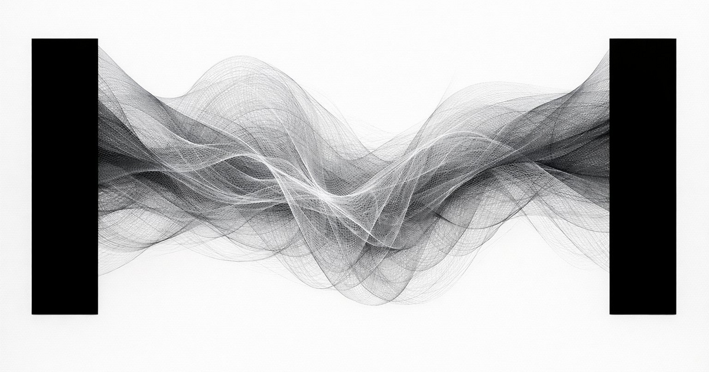
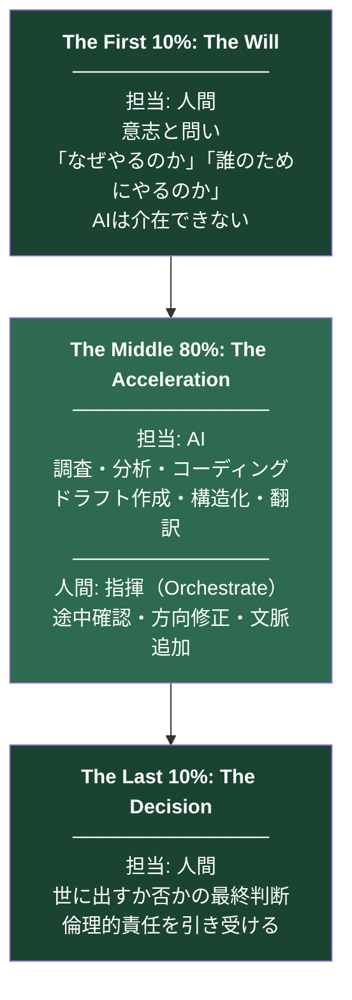
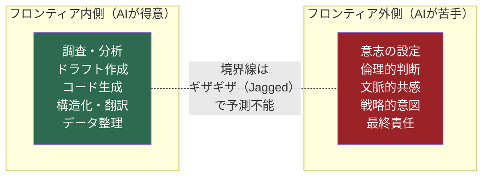
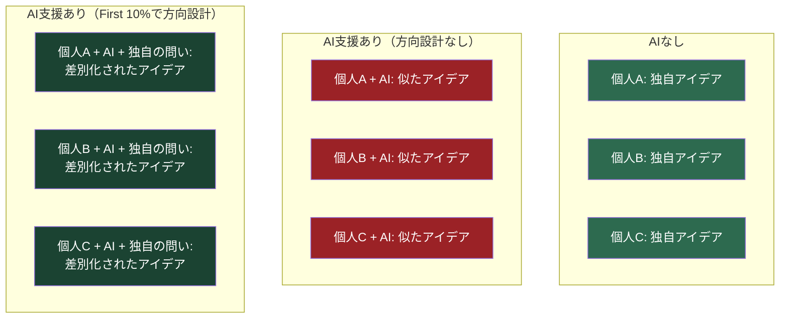
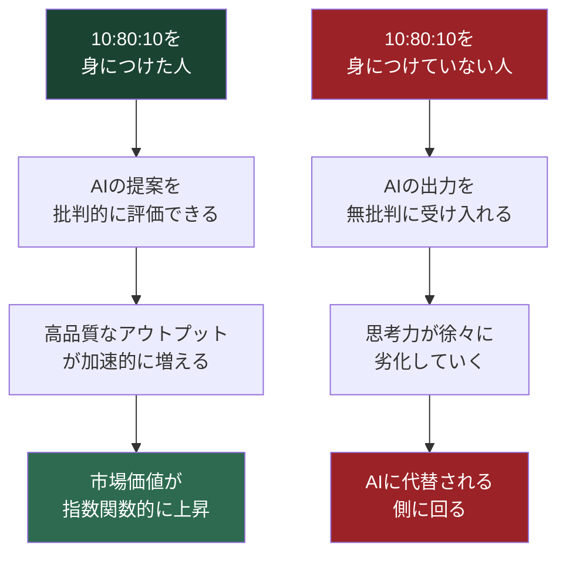
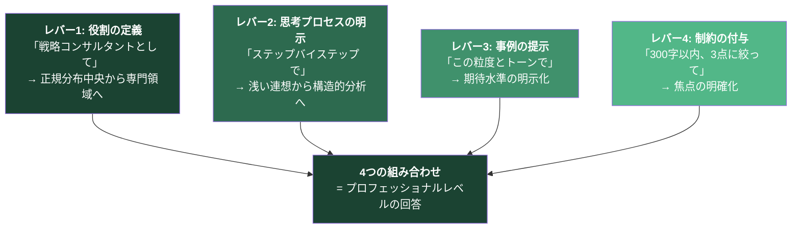
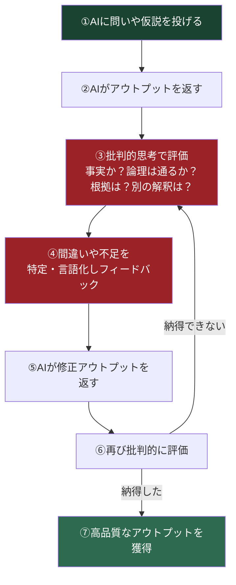
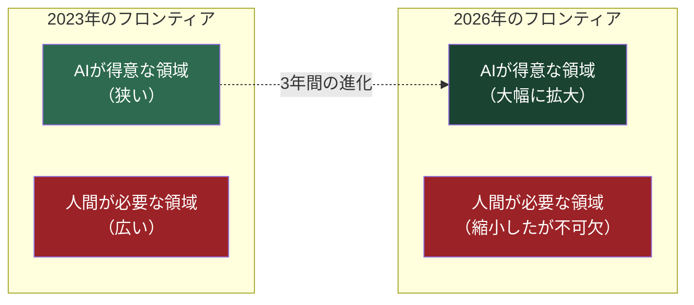

# The 10-80-10 Principle: 人とAIの共創黄金比

> **"The question is not whether AI will change your work. The question is whether you will design how."**
> （問いは、AIがあなたの仕事を変えるかどうかではない。あなたがその変え方を設計するかどうかだ）

  

---

# 序章: あなたは今、AIに使われている

## 「使っている」と「使いこなしている」の構造的ギャップ

2024年、**知識労働者の75%**が生成AIを業務に採用した。ただし開始から6ヶ月以内に始めた割合が約半数を占め、多くが試行段階にとどまっている。

この数字だけを見れば、AIの普及は順調に進んでいるように見える。しかし、その内実を掘り下げると、全く異なる風景が見えてくる。

Gallupが22,368名の米国就業者を対象に実施した経時追跡調査（2025年Q4）によると、AIを職場で使用している労働者は全体の**46%**だ。だが、**毎日使う層はわずか12%**にとどまる。週数回以上の頻繁な使用は26%だ。残りの20%は「使ったことはあるが、日常的には使っていない」層であり、一度試して放置したか、月に数回触れる程度にすぎない。

さらに深刻なデータがある。SurveyMonkeyの調査では、**29%が上司に告げずにAIを使用**し、23%が顧客に明示しないまま使用しているという実態が浮かび上がった。「AIを使わざるを得ない空気」の中で、使い方の設計が置き去りになっている。隠れて使っているということは、使い方に確信が持てていないということだ。確信が持てない状態でAIを使うことは、AIの出力を無批判に受け入れるか、あるいは表面的な作業代行に留まるか、どちらかを意味する。

多くの人がAIを検索エンジンの延長として使っている。「〇〇について教えて」と聞き、返ってきた回答をコピー&ペーストする。あるいは、文章の要約や翻訳、議事録の整理に使う。これらは確かにAIの「機能」を利用しているが、AIの「価値」を引き出しているとは言えない。

それは、**年収5,000万円の戦略コンサルタントを雇っておきながら、「今日の天気を調べて」と頼んでいるようなものだ。**

## AI市場は爆発的に成長している——使い方は追いついていない

この構造的ギャップの深刻さは、AI市場の成長速度と対比すると際立つ。

生成AIのグローバル市場規模は**2025年で約713億〜1,036億ドル**と試算される。2032〜2034年には**8,900億〜1兆2,600億ドル**規模まで成長する見込みで、年平均成長率（CAGR）は**36〜43%**に達する。McKinseyは、生成AIが年間**2.6兆〜4.4兆ドル**の経済価値を63のユースケース全体で生み出す可能性があると推計している。さらに新しい試算では、AIエージェント・ロボットの組み合わせが2030年までに米国単独で年間**2.9兆ドル**の経済価値をアンロックする可能性があるとしている。

McKinseyのレポート「The economic potential of generative AI」によれば、特にカスタマーケア部門で30%から45%、マーケティング部門で5%から15%の生産性向上が既に実証されている。ペンシルベニア大学ウォートン校の研究でも、AIによる自動化リスクに最も曝露されているのは、所得分布の上位80パーセンタイル付近に位置する高度なナレッジワーカーであり、彼らの業務の平均約半分がAIによる自動化の対象となると指摘されている。

つまり、AIは「便利なツール」ではなく「産業の基盤インフラ」になりつつある。しかし、そのインフラを使いこなしている人間は、全体のほんの一握りだ。McKinseyの「The state of AI in early 2024」レポートでは、65%の組織が生成AIを定常利用している一方で、**44%が導入によるネガティブな結果**を経験したと報告している。AIを使ったが故に品質が低下した、誤った情報を顧客に伝えた、知的財産を侵害した——こうした事例が既に発生している。

この現象は、AIの性能の問題ではない。**AIの「使い方の設計」が存在しない**ことの帰結だ。

## 本書が提示するもの

AIの真の価値は、「作業の代行」ではない。**あなたの思考を拡張し、あなた1人では到達できなかった深さと速度を同時に実現すること**にある。

本書では、その拡張の設計図を提示する。

私はこの設計原則を、人とAIの共創黄金比**「10:80:10の法則」**と名付けた。これは私が提唱する新規事業開発方法論「Depth & Velocity（D&V）」の中核として設計したフレームワークだが、日々の実践と検証を通じて確信した。この法則は新規事業開発に閉じるものではない。**AI時代に生きる全てのビジネスパーソンにとって、仕事の価値を最大化するための「思考のOS」になる。**

本書を読み終えたとき、あなたはこのOSをインストールしているだろう。

---

### 参考文献

1. Gallup「Frequent Use of AI in the Workplace Continued to Rise in Q4」（2025）
   https://www.gallup.com/workplace/701195/frequent-workplace-continued-rise.aspx
2. SurveyMonkey「AI in the workplace statistics: Adoption, trust, and readiness」
   https://www.surveymonkey.com/curiosity/ai-workplace-statistics/
3. MarketMagnetix「I Watched 75% of Knowledge Workers Adopt AI in One Year」
   https://insights.marketmagnetix.agency/2025/12/03/i-watched-75-of-knowledge-workers-adopt-ai-in-one-year-here-s-what-the-data-actually-reveals/
4. Fortune Business Insights「Generative AI Market Size, Share & Growth Report, 2034」
   https://www.fortunebusinessinsights.com/generative-ai-market-107837
5. MarketsandMarkets「Generative AI Market Report 2025-2032」
   https://www.marketsandmarkets.com/Market-Reports/generative-ai-market-142870584.html
6. McKinsey「Economic potential of generative AI」
   https://www.mckinsey.com/capabilities/tech-and-ai/our-insights/the-economic-potential-of-generative-ai-the-next-productivity-frontier
7. McKinsey「Agents, robots, and us: Skill partnerships in the age of AI」（2025）
   https://www.mckinsey.com/mgi/our-research/agents-robots-and-us-skill-partnerships-in-the-age-of-ai
8. McKinsey「The state of AI in early 2024」
   https://www.mckinsey.com/capabilities/quantumblack/our-insights/the-state-of-ai-2024
9. Wharton「The Projected Impact of Generative AI on Future Productivity Growth」
   https://budgetmodel.wharton.upenn.edu/p/2025-09-08-the-projected-impact-of-generative-ai-on-future-productivity-growth/

---

# 第1章: 10:80:10の法則とは何か

## 構造は極めてシンプルだ

知的労働のプロセスを100とした場合、この法則は3つのフェーズに分割する。

## The First 10%: 人間が「方向」を決める

最初の10%は、人間にしかできない仕事だ。

「何を問うのか」「なぜこれをやるのか」「誰のためにやるのか」を定義する。ここにAIは介在できない。AIは過去のデータから「確率的に最も妥当な答え」を生成するが、「これをやらなければ気が済まない」という意志を持つことはできない。

企画書を書くなら、「この企画で何を変えたいのか」を決めるのはあなただ。プレゼンを作るなら、「この15分で相手の何を動かしたいのか」を決めるのはあなただ。記事を書くなら、「この記事で読者に何を手渡したいのか」を決めるのはあなただ。

この10%を他人に委ねた瞬間、あるいはAIに委ねた瞬間、そのアウトプットは「誰のものでもない」ものになる。経営層に「で、あなたはなぜこれをやりたいの？」と聞かれた時、AIが生成した回答を読み上げる起案者を、誰が信じるだろうか。

リーンスタートアップは「Build-Measure-Learn」のサイクルを説く。デザインシンキングは「共感」から始まる。だが、そのサイクルを回し始める最初の一歩——「なぜこの問題に取り組むのか」——を定義するのは、フレームワークではない。人間の意志だ。

## The Middle 80%: AIが「加速」する

中間の80%は、AIが圧倒的な速度で処理する。

調査、分析、ドラフト作成、構造化、コーディング、翻訳、データ整理。従来、あなたが数日〜数週間かけていたこのプロセスを、AIは数時間で圧縮する。

ただし、「AIに丸投げする」のではない。あなたはAIを**指揮（Orchestrate）する**のだ。AIの出力を途中で確認し、方向を修正し、追加の文脈を与える。自分で手を動かすのではなく、AIに動かさせる。その違いは決定的だ。

NVIDIAのジェンスン・フアンCEOは2026年3月のGTC後のAll-In Podcastで明言した。

> 「50万ドルのエンジニアが、年末までに25万ドル相当のトークンを消費していなければ、深刻に憂慮する」

さらに彼はNVIDIAが自社エンジニアチームのためにトークンに**20億ドルを投資しようとしている**ことも明かした。この発言の本質は「AIを使い倒せ」ではない。**最初の10%で人間が定義した方向性に沿って、AIに80%を高速実行させることの価値を認識せよ**ということだ。

フアンCEOはこの発言の中で、AIを使わないエンジニアを「紙と鉛筆でチップを設計しようとしているようなもの」と表現した。かつてCADが製図板を置き換えたように、AIは「中間の実行プロセス」を置き換えるものだ。しかし、何を設計するかを決めるのは依然として人間であり、設計が顧客の求めるものかを判断するのも人間だ。

## The Last 10%: 人間が「判断」する

最後の10%は、再び人間の仕事だ。

AIが出したアウトプットを批判的に評価し、「これを世に出すか否か」を最終判断する。倫理的な責任を引き受ける。品質の最終保証をする。

AIは「このプランの成功確率は推定68%です」と言う。だが、68%に賭けるか否かを決めるのは人間だ。そして、その決断の結果に責任を引き受けるのも人間だ。

AIは責任を取れない。責任を取れるのは、最初の10%で「なぜやるのか」を定義したあなただけだ。

## 「固定比率」ではなく「設計原則」

ここで重要な注意がある。10:80:10は**時間配分の黄金比ではない。責任配分の設計原則**だ。

ある仕事では、First 10%に時間の30%を使うかもしれない。別の仕事では、Last 10%に時間の40%を使うかもしれない。数値は比率そのものではなく、**3つのフェーズの構造と、各フェーズにおける責任の所在**を示すものだ。

EU AI Actは高リスクAIに「人による監督（human oversight）」を制度要求として位置づけている。自然人によって効果的に監督できるよう設計されるべきだと規定し、2026年8月2日の一般適用日に向けて段階的に施行されている。NIST AI RMFは、AIリスク管理をGovern/Map/Measure/Manageの4機能に整理し、人がAI出力を覆す頻度・理由のデータを収集・分析することが有用だと述べている。これは「Last 10%をKPI化する」直接的な根拠だ。

日本でも、経済産業省・総務省が「AI事業者ガイドライン（第1.0版）」を策定し、AIリスクの多様化を踏まえ、ライフサイクル全体での自主的実行を後押しする方針を示している。

10:80:10は、これらの国際的な規制・ガバナンスフレームワークと完全に整合する設計原則だ。

| 定義の仕方 | 内容 | 適用場面 |
|---|---|---|
| 責任比 | 「誤り時の説明責任」をFirst/Lastに集約、Middleは生成責任に限定 | 組織のガバナンス設計 |
| 時間比 | 成果物1単位あたりの作業時間をA/B/Cに分ける | 個人のワークフロー設計 |
| コスト比 | 人件費（A/C）＋推論/運用コスト（B）として測る | 高リスク領域（金融・医療） |

## なぜ「10:80:10」なのか

今まで私たちは「量と質はトレードオフの関係にある」と考えてきた。深く考えれば遅くなる。速く動けば浅くなる。これは人間単体で作業する限り、覆せない制約だった。

**AI時代に、人類史上初めて「量と質は両立できる」ことが証明された。**

最初の10%で人間が「質」の方向を定め、中間の80%でAIが「量」を圧縮し、最後の10%で人間が「質」を保証する。結果として、深さ（Depth）と速度（Velocity）が同時に達成される。

ハーバード・ビジネス・スクールの研究チームが発表した論文「Navigating the Jagged Technological Frontier」は、AIの能力の境界線が「ギザギザな形状（Jagged Frontier）」であることを示した。AIが人間より優れている領域と劣っている領域が明確に存在する。

10:80:10の法則は、このジャグドフロンティアを前提に設計されている。

- 最初の10%（意志と問い）= AIのフロンティアの**外側**
- 中間の80%（調査・分析・実行）= AIのフロンティアの**内側**
- 最後の10%（判断と責任）= AIのフロンティアの**外側**

人間とAIが、それぞれの得意領域で最大の力を発揮する。これが「共創」だ。代替ではない。

---

### 参考文献

1. Jensen Huang / NVIDIA GTC 2026 — Business Insider
   https://www.businessinsider.com/jensen-huang-500k-engineers-250k-ai-tokens-nvidia-compute-2026-3
2. Jensen Huang / NVIDIA — Tom's Hardware
   https://www.tomshardware.com/tech-industry/artificial-intelligence/jensen-huang-says-nvidia-engineers-should-use-ai-tokens-worth-half-their-annual-salary-every-year-to-be-fully-productive-compares-not-using-ai-to-using-paper-and-pencil-for-designing-chips
3. EU AI Act Article 14: Human oversight
   https://ai-act-service-desk.ec.europa.eu/en/ai-act/article-14
4. EU AI Act適用タイムライン — 欧州議会調査サービス
   https://www.europarl.europa.eu/RegData/etudes/ATAG/2025/772906/EPRS_ATA%282025%29772906_EN.pdf
5. NIST AI RMF Core
   https://airc.nist.gov/airmf-resources/airmf/5-sec-core/
6. NIST AI RMF Appendix C
   https://airc.nist.gov/airmf-resources/airmf/appendices/app-c-ai-risk-management-and-human-ai-interaction/
7. 経済産業省・総務省「AI事業者ガイドライン（第1.0版）」
   https://www.meti.go.jp/press/2024/04/20240419004/20240419004-1.pdf
8. Dell'Acqua et al.「Navigating the Jagged Technological Frontier」HBS×BCG（2023）
   https://papers.ssrn.com/sol3/papers.cfm?abstract_id=4573321

---

# 第2章: Middle 80%の科学 — ジャグドフロンティア

## HBS×BCGの決定的研究

「どこをAIに任せ、どこを人間がやるべきか」——この問いに初めて定量的な答えを与えたのが、Harvard Business SchoolとBoston Consulting Groupによる共同研究「**Navigating the Jagged Technological Frontier**」（2023年）だ。

この研究は758名のBCGコンサルタントを対象に、AI（GPT-4）を使用するグループと使用しないグループにランダムに割り当て、18の異なる現実的なコンサルティングタスクを実施させた大規模フィールド実験だ。対象者は世界のトップクラスのエリートコンサルタントであり、彼ら自身が既に高い知的生産性を持つ人材だ。

### フロンティア「内側」——AIが得意な領域の結果

AIの現在の能力の境界線（フロンティア）の「内側」にあるクリエイティブなタスクや製品イノベーションのタスクにおいて、AIを使用したグループは以下の圧倒的な成果を記録した。

| 指標 | AI使用者 vs 非使用者 |
|---|---|
| タスク完了数 | **+12.2%**多い |
| タスク完了速度 | **+25.1%**速い |
| アウトプット品質 | **+40%以上**高い（独立した人間の評価者による） |
| 低スキル層の改善幅 | **+43%** |
| 高スキル層の改善幅 | +17% |

重要な発見は、**AIが「スキルの民主化装置」として機能する**という点だ。平均以下のスキルを持つコンサルタントが43%の改善を見せた一方、平均以上でも17%の改善があった。AIは全てのスキルレベルの人間を底上げする。ただし底上げ幅は、元のスキルレベルが低いほど大きい。

さらに、プロンプト教育の効果も検証された。GPT+Overview（AIの使い方の教育を受けた上でAIを使う）グループは、GPT Only（教育なしでAIを使う）グループより効果が大きい傾向が示された。GPT+Overviewは作業時間を30%短縮（平均より11分超）、GPT Onlyは18%短縮（6分超）だった。**最初の10%（問いの設計・使い方の設計）への投資が、Middle 80%の出力を増幅する**ことの実証だ。

### フロンティアの「外側」——AIが人間を劣化させる領域

同研究が最も重要な洞察として提示したのが、フロンティアの外側の発見だ。

AIのフロンティア外に設定されたタスク——例えば、複数の定量的データを基にした複雑な企業の根本原因分析——では、AI使用者はAI不使用者より**19%多く誤答を出した**。

世界最高峰のエリートコンサルタントたちのパフォーマンスが、AIを使うことでかえって低下したのだ。

なぜか。LLMが生成する文章が「極めて流暢で、論理的に見え、自信に満ちている」ため、人間がその出力を無批判に盲信し、必要な検証作業を怠ったからだ。研究者たちはこの心理的陥穽を「自動化バイアス（Automation Bias）」、あるいは「ハンドルの前で眠りにつく（Falling asleep at the wheel）」現象と名付けている。

### Centaurs と Cyborgs——2つの協働パターン

同研究は、AIとの協働パターンが大きく2つに分かれることも発見した。

**Centaurs（ケンタウロス型）**は、タスクを明確に分割し、「この部分はAI、この部分は人間」と分業する。10:80:10はこのパターンに近い。

**Cyborgs（サイボーグ型）**は、常時AIと対話しながら反復し、人間とAIの境界を曖昧にする。創発的な成果を得やすいが、評価が弱いと誤りも連鎖する。

どちらのパターンが優れているかは、タスクの性質に依存する。だが、いずれのパターンでも、**フロンティアの外側にAIを適用した場合はパフォーマンスが低下する**という事実は変わらない。

## 他の研究が裏付ける「Middle 80%」の効果

### NBER コールセンター研究（Brynjolfsson, Li, Raymond）

5,179名のカスタマーサポート担当者を対象に、AIアシスタントの段階導入（準実験）を行った大規模研究。

- 生産性（1時間あたり解決件数）: **平均+14%**
- 初心者/低スキル層: **+34%**
- 熟練者: 影響は小さい（速度は微改善、品質は微悪化の傾向）
- 学習効果: AIを使った初心者が、後にAIなしでも高いパフォーマンスを維持

低スキル層が+34%という数字は、AIが「経験の蓄積を加速する装置」として機能することを示唆している。AIが提示する回答例を通じて、初心者が熟練者のパターンを学習するメカニズムが働いている。

ただし、熟練者で品質が微悪化した点は注意が必要だ。**Last 10%（品質保証）が不在だと、AIに頼ることで自分の専門的判断を放棄する**リスクがある。

### GitHub Copilot

ソフトウェア開発領域の代表的データ。

- ユーザーが記述する全コードの平均**46%**がAIにより生成（Java開発者では61%）
- 統制された実験でのタスク完了速度: **+55%**
- 提案されたコードの30%が採用、そのうち**88%**がプロダクション環境まで到達

AccentureとのエンタープライズRCTでは、PR数が**+8.69%**、PRマージ率が**+15%**、成功ビルド率が**+84%**という結果も報告されている。

### 材料科学R&D（Toner-Rodgers, 2025）

1,018名の材料科学者を対象とした段階導入の因果推定研究。

- 新材料発見: **+44%**
- 特許出願: **+39%**
- 試作: **+17%**
- R&D効率: **+13〜15%**

だが、重要な反面がある。AIが「アイデア生成」タスクの**57%を自動化**した結果、科学者の役割は「アイデアを出す」から「アイデアを評価する」に移行した。そして**82%が仕事満足度の低下**を報告した。

この研究は、Middle 80%をAIに委ねることの巨大な効果と、それに伴う人間側の課題を同時に示している。AIが80%を担うほど、人間の役割は「評価・判断（Last 10%）」へシフトする。その時、最初の10%（意志と問い）を失った人間は、「AIに使われる側」になる。

## Middle 80%の時間圧縮効果

| 研究 | 対象 | 効果 |
|---|---|---|
| St. Louis Fed（2025） | 米国就業者全体 | 週5.4%の労働時間節約（週2.2時間）。使用時間は非使用時比33%高い生産性 |
| Freshworks（2024） | ナレッジワーカー | 週平均3時間47分の業務時間削減 |
| Stanford SCALE（Noy & Zhang） | 453名ライティング | 平均時間**-40%**、品質**+18%** |
| PwC（2025） | AI多露出産業 | 生産性成長が2022年以降に**4倍**（7%→27%） |
| メタ分析（Coupé & Wu） | 既存研究の統合 | 平均**+17%**の生産性向上（異質性大） |
| Microsoft Copilot for Security | セキュリティ149名RCT | **44%高精度、26%高速** |
| Microsoft Dynamics 365 | CS 11,500名 | 解決時間**-12%** |

PwCの研究は、AI多露出産業において従業員一人あたり売上高の成長がAI低露出産業の**3倍（27% vs 9%）**であることも示している。

---

### 参考文献

1. Dell'Acqua et al.「Navigating the Jagged Technological Frontier」HBS×BCG（2023）
   https://papers.ssrn.com/sol3/papers.cfm?abstract_id=4573321
2. D3 Harvard「Navigating the Jagged Technological Frontier」
   https://d3.harvard.edu/navigating-the-jagged-technological-frontier/
3. BCG「How People Create and Destroy Value with Generative AI」
   https://www.bcg.com/publications/2023/how-people-create-and-destroy-value-with-gen-ai
4. Brynjolfsson, Li, Raymond「Generative AI at Work」NBER WP 31161
   https://www.nber.org/papers/w31161
5. Noy & Zhang — Stanford SCALE
   https://scale.stanford.edu/publications/experimental-evidence-productivity-effects-generative-artificial-intelligence
6. GitHub「Research: Quantifying GitHub Copilot's Impact in the Enterprise with Accenture」
   https://github.blog/news-insights/research/research-quantifying-github-copilots-impact-in-the-enterprise-with-accenture/
7. Toner-Rodgers「Artificial Intelligence, Scientific Discovery, and Product Innovation」
   https://arxiv.org/pdf/2412.17866v1
8. Federal Reserve Bank of St. Louis「Impact of Generative AI on Work Productivity」（2025）
   https://www.stlouisfed.org/on-the-economy/2025/feb/impact-generative-ai-work-productivity
9. Freshworks「AI Is Delivering Strong Productivity Gains」
   https://ir.freshworks.com/files/doc_news/2024/06/freshworks_report_reveals_ai_is_delivering_strong_productivity_gains_and_unlocking_higher-value_work_for_employees.pdf
10. PwC「2025 Global AI Jobs Barometer」
    https://www.pwc.com/gx/en/issues/artificial-intelligence/job-barometer.html
11. Coupé & Wu 早期メタ分析
    https://ideas.repec.org/p/cbt/econwp/25-09.html
12. Microsoft Work Trend Index Special Report（2023）
    https://assets-c4akfrf5b4d3f4b7.z01.azurefd.net/assets/2023/11/Microsoft_Work_Trend_Index_Special_Report_2023_Full_Report.pdf
13. MIT Sloan「How Generative AI Can Boost Highly Skilled Workers' Productivity」
    https://mitsloan.mit.edu/ideas-made-to-matter/how-generative-ai-can-boost-highly-skilled-workers-productivity

---

# 第3章: First 10%の科学 — 人間にしかできない「問いの設計」

## AIは「良いアイデアと凡庸なアイデアを区別できない」

HBSとUC Berkeleyによる共同研究は、AIの本質的な限界を明らかにした。

> AIは「良いアイデアと普通のアイデアを信頼性高く区別することができない」——長期的なビジネス戦略を独力で導くことはできない

研究者Rembrand Koningは「AIを使う上で、そのツールを使う人物が十分な判断力を持っているかどうかを慎重に考える必要がある」と述べる。

ロンドン・スクール・オブ・エコノミクスの研究では、ChatGPTが議論の角度として提案したものを評価できたのは、**AIの提案を選別できる判断力を持つ強いディベーターだけ**だった。弱いディベーターは、AIの提案を受け入れてもパフォーマンスが改善しなかった。

この発見は極めて重要だ。AIは「過去のデータからの最頻出パターン」を生成する。しかし「この方向で世界を変えたい」という意志と問いの設計は、過去のデータに存在しない。それは未来を切り拓く人間の固有領域だ。

## 「問いの質」がMiddle 80%の全てを決める

プロンプトエンジニアリングに関する実証研究は、「最初の10%」の設計の質がアウトプット全体を規定することを示している。

研究参加者の**83.7%**が「より明確で具体的なプロンプトがより良いAI結果につながる」と回答した。プロンプトエンジニアリングは「技術的スキル」だけでなく、**AIと人間のコラボレーションの成否を左右する決定要因**であることが確認されている。

1,500以上の学術論文を包括的に分析した近年の研究は、一般に流布している「プロンプトは詳細で長ければ長いほど良い」という神話を明確に否定している。長すぎるプロンプトは、モデルの注意機構を分散させる「プロンプトの肥大化（Prompt Bloat）」を引き起こす。

実際には、XMLタグや明確な区切り文字を用いた「構造化された短いプロンプト」の方が、出力の品質を高く維持しながらAPIコストを最大**76%**も削減できることが判明している。

### ドメイン特化型知識の決定的重要性

学術的なライティング支援におけるChatGPTのパフォーマンス検証では、一般的なプロンプトの場合エラー検出率はわずか**10%**。しかし、専門文脈と制約を組み込んだ「領域特化型プロンプト」を用いた場合、リコール率は**33%**に上昇し、適合率は**98%**に達した。

さらに、プロンプトを「継続的なプロセス」として最適化し続ける企業は、静的なプロンプトを放置する企業と比較して、12ヶ月間で**156%**ものパフォーマンス向上を達成している。最初の10%に対する人間の知的投資が、Middle 80%で巨大なレバレッジを生む。

## 創造性のパラドックス——AIが多様性を殺す

UCLとエクセター大学の研究（Science Advances, 2024年）は、AI支援と創造性に関する重要なパラドックスを発見した。

- AI支援を受けた**個人の創造性は26.6%向上**し、新規性は10.7%向上した
- しかし一方で、**集合的な多様性は低下**した——全員が同じようなアウトプットに収束した

2025年の別の研究では、ChatGPT-4oはアイデアの流暢性（数）では人間を上回ったが、**独創的なアイデアと通常アイデアの区別は人間より劣っていた**。

つまり、AIは「量を増やす」ことに卓越しているが、「どの方向に何のために量を増やすか」というFirst 10%の問いは、人間が設計しなければならない。方向を設計しなければ、全員が同じ平凡な答えに収束する。

---

### 参考文献

1. HBS「AI won't make the call: Why human judgment still drives innovation」
   https://www.hbs.edu/bigs/artificial-intelligence-human-jugment-drives-innovation
2. 「Prompt Engineering and the Effectiveness of Large Language Models」
   https://arxiv.org/html/2507.18638v1
3. Aakash Gupta「I Studied 1500 Academic Papers on Prompt Engineering」
   https://aakashgupta.medium.com/i-studied-1-500-academic-papers-on-prompt-engineering-heres-why-everything-you-know-is-wrong-391838b33468
4. Cambridge「Impact of prompt sophistication on ChatGPT's output」
   https://www.cambridge.org/core/journals/recall/article/impact-of-prompt-sophistication-on-chatgpts-output-for-automated-written-corrective-feedback/E15580A5BC9C13988936CC699761DED2
5. UCL×Exeter「AI Creativity vs Human Creativity」（Science Advances, 2024）
   https://www.dynadot.com/blog/ai-creativity-vs-human-creativity
6. Frontiers in Psychology「The paradox of creativity in generative AI」（2025）
   https://www.frontiersin.org/journals/psychology/articles/10.3389/fpsyg.2025.1628486/full

---

# 第4章: Last 10%の科学 — 判断と責任の不可譲渡性

## クリティカルシンキングは「AI時代の最重要スキル」

| 調査 | 結果 |
|---|---|
| Korn Ferry TA Trends 2026 | **73%**のタレントリーダーが2026年最重要スキルは「クリティカルシンキングと問題解決」と回答 |
| AAC&U（2024） | **93%**の雇用主が批判的思考を大学学位より重視 |
| WEF Future of Jobs 2025 | クリティカルシンキングが世界TOP3スキル |
| NTUC LearningHub（2024） | **90%超**のビジネスリーダーが思考スキルを採用最重要要素と認定 |
| AI活用職場調査 | 最重要スキルとして「批判的思考・ファクトチェック」を挙げる雇用主: **61%** |

ワシントン大学の研究は「人間の専門家がAIの提案を批判的に評価するコラボラティブアプローチから最良の成果が生まれる」と結論づけている。

## オートメーションバイアス：Last 10%を放棄することのコスト

| 研究 | 発見 |
|---|---|
| Wang et al.（2024） | AIレビュー者は自作者より**27%多く**問題を見落とした |
| 医療画像診断 | AIの誤った説明でX線診断精度が**92.8%→23.6%**に急落 |
| 一般調査 | **78%**のユーザーが批判的検証なしにAI出力を信頼 |
| Microsoft Research（2025） | 知識労働者はAIで「認知的に楽になった」と感じつつ、問題解決専門性をAIに委譲 |

## ハルシネーション：批判的検証が必須な理由

LLMのハルシネーション問題は解決されておらず、現在のアーキテクチャでは原理的に解決できない。

| 領域 | ハルシネーション率 |
|---|---|
| 一般知識 | 0.8% |
| 法的情報 | **6.4%**（一般知識の8倍） |
| 複雑な推論タスク | **33%以上** |
| 検索タスク（Grok-3 Search） | **94%** |
| 医療・臨床AI | **8%〜20%** |

2025年の数学的証明により、**現在のLLMアーキテクチャではハルシネーションの完全排除は不可能**であることが示されている。2024年の統計では、ハルシネーションによる企業損失は**670億ドル**を超える。

## ヒューマン・イン・ザ・ループの実証効果

先進企業の**76%**がHITLプロセスをワークフローに組み込んでいる。

| 領域 | AI単独 | HITL導入後 | 改善 |
|---|---|---|---|
| 文書抽出 | 精度92% | **精度99.9%** | +7.9pt |
| 医療画像診断 | — | — | エラー**-37%** |
| 金融審査 | — | — | バイアス**-28%** |

## 事故が証明する「Last 10%」の不在

**Mata v. Avianca（米国、2023年）:** ChatGPT生成の架空判例を裁判所に提出。弁護士に制裁。

**Air Canada（カナダ、2024年）:** チャットボットが誤った返金ポリシーを案内。顧客への補償命令。

**Samsung（韓国、2023年）:** 従業員が機密コードをChatGPTに入力。情報漏洩。

これらは全て、Last 10%が欠けたときに起こる損失だ。技術の問題ではない。**人間の責任設計の問題**だ。

---

### 参考文献

1. Korn Ferry「73% of Hiring Managers' Most Wanted Skill for 2026」
   https://hakia.com/news/critical-thinking-top-skill-2026/
2. All About AI「AI Hallucination Report 2026」
   https://www.allaboutai.com/resources/ai-statistics/ai-hallucinations/
3. Visual Capitalist「AI Hallucination Rates by Model」
   https://www.visualcapitalist.com/sp/ter02-ranked-ai-hallucination-rates-by-model/
4. Synvestable「Human-in-the-Loop AI Guide (2026)」
   https://www.synvestable.com/human-in-the-loop.html
5. Pangeanic「Human-in-the-Loop: The Key to High-Quality Data in Modern AI」
   https://blog.pangeanic.com/the-key-to-high-quality-data-in-modern-ai
6. UX UI Principles「Automation Bias Prevention」
   https://uxuiprinciples.com/en/principles/automation-bias-prevention
7. Mata v. Avianca裁判文書
   https://law.justia.com/cases/federal/district-courts/new-york/nysdce/1:2022cv01461/575368/54/
8. Moffatt v. Air Canada（2024 BCCRT 149）
   https://s3.amazonaws.com/IGG/AI%2BPart%2B1%2B-%2BMaterials/Moffatt%2Bv.%2BAir%2BCanada.pdf
9. CIO Dive「Samsung Electronics ChatGPT leak」
   https://www.ciodive.com/news/Samsung-Electronics-ChatGPT-leak-data-privacy/647137/

---

# 第5章: 「AIに使われる人」が生まれる構造

## 雇用の地殻変動

WEF「Future of Jobs Report 2025」（1,000社・55カ国）のデータ:

- 2030年までに**9,200万の職が消滅**、1億7,000万の新職が創出（純増7,800万）
- **40%以上**の雇用主が5年以内の人員削減を計画
- Stanford大学: AI多露出職種の22〜25歳雇用が**-13%〜-16%**
- 米国エントリーレベル求人: 2023年1月比**-35%**
- **66%**の企業がAIによりエントリーレベル採用を削減

ILOは完全自動化より「タスク補完（augmentation）」が中心と整理している。10:80:10は「職業丸ごとの置換」ではなく**職業内タスク再配分**として語る方が妥当だ。

## 「強者がより強くなる」構造

Vaccaro et al.のメタ分析（Nature Human Behaviour、100超実験）では、平均して人間+AIは**人間またはAI単独より劣る**結果。ただしコンテンツ生成タスクでは向上。

LSE研究では、AIから恩恵を受けられたのは**「強者」だけ**だった。

---

### 参考文献

1. WEF「Future of Jobs Report 2025」
   https://reports.weforum.org/docs/WEF_Future_of_Jobs_Report_2025.pdf
2. ILO Working Paper 96
   https://www.ilo.org/sites/default/files/2024-07/WP96_web.pdf
3. Vaccaro et al. メタ分析
   https://arxiv.org/abs/2405.06087
4. HBS「AI won't make the call」
   https://www.hbs.edu/bigs/artificial-intelligence-human-jugment-drives-innovation

---

# 第6章: 10:80:10を身につけた人への報酬

## AIスキルプレミアムの爆発

PwC「2025 Global AI Jobs Barometer」（約10億件求人分析）:

| 指標 | 数値 |
|---|---|
| AIスキル保有者の賃金プレミアム | 平均**56%**（前年25%から倍増） |
| AIスキル関連求人の成長 | 全求人-11.3%減の中、**+7.5%** |
| AI多露出産業の売上成長 | 低露出の**3倍**（27% vs 9%） |
| AIスキルによる年収増 | 平均**$18,000以上** |
| AI流暢性の需要 | 2年で**7倍**に急増 |

## 企業事例

| 企業 | Middle 80%の内容 | 効果 |
|---|---|---|
| パナソニック コネクト | 社内AIアシスタント（12,400人） | 1年で18.6万時間削減 |
| GMO | 全社生成AI活用（6,312人回答） | 月13.2万時間削減、活用率83.9% |
| Morgan Stanley | 社内ナレッジ検索 | アドバイザー98%以上が利用 |
| Klarna | CSチャットの2/3をAI対応 | 700 FTE相当、解決11分→2分未満 |

## 心理的解放

GitHub Copilotの調査: **87%**が「反復タスクの精神的消耗を防げた」、**90%**が「仕事がより楽しくなった」と回答。

---

### 参考文献

1. PwC「2025 Global AI Jobs Barometer」
   https://www.pwc.com/gx/en/issues/artificial-intelligence/job-barometer.html
2. Panasonic Connect「ConnectAI」
   https://news.panasonic.com/jp/press/jn240625-1
3. GMOインターネットグループ
   https://group.gmo/news/article/9051/
4. OpenAI × Morgan Stanley
   https://openai.com/ja-JP/index/morgan-stanley/
5. Klarna AI Assistant
   https://www.prnewswire.com/news-releases/klarna-ai-assistant-handles-two-thirds-of-customer-service-chats-in-its-first-month-302072740.html
6. GitHub Copilot developer happiness
   https://github.blog/news-insights/research/research-quantifying-github-copilots-impact-on-developer-productivity-and-happiness/

---

# 第7章: あなたの仕事に、今日から適用する

## 適用シナリオ

### 企画書を書くとき

| フェーズ | あなたがやること |
|---|---|
| First 10% | 「何を変えたいのか」「誰の課題を解決するのか」を定義 |
| Middle 80% | AIに構成案、競合調査、ドラフト、図表を生成させる |
| Last 10% | 「この一文は相手に響くか？」を批判的に判断し最終版へ |

### プレゼンを準備するとき

| フェーズ | あなたがやること |
|---|---|
| First 10% | 「この15分で相手の意思決定をどう変えたいか」を定義 |
| Middle 80% | AIにスライド構成、データ可視化、想定質問を生成させる |
| Last 10% | 聴衆の顔を思い浮かべ、ストーリーラインを最終調整 |

### 就職活動をするとき

| フェーズ | あなたがやること |
|---|---|
| First 10% | 「自分は何者で、何を成し遂げたいのか」を言語化 |
| Middle 80% | AIに業界研究、企業分析、ES構造化を生成させる |
| Last 10% | 「これは本当に自分の言葉か？」を批判的に確認 |

## 4つのプロンプト・レバー

## 「疑い、導く」対話サイクル

---

### 参考文献

1. Wei et al.「Chain-of-Thought Prompting」（2022）
   https://arxiv.org/abs/2201.11903
2. Brown et al.「Language Models are Few-Shot Learners」（2020）
   https://arxiv.org/abs/2005.14165
3. Depth & Velocity — Leading-AI-IO
   https://github.com/Leading-AI-IO/depth-and-velocity

---

# 第8章: 日本への緊急メッセージ

## 数字が語る「周回遅れ」の現実

日本のAI活用状況を、米国・中国と並べてみよう。

| 指標 | 日本 | 米国 | 中国 |
|---|---|---|---|
| 生成AI職場利用率 | **8.4%** | 43〜46% | 81% |
| AI採用率（企業全体） | 27% | 69% | 81% |
| AI活用方針策定率 | 42.7% | 78.7% | 95.1% |

総務省の令和6年版情報通信白書によれば、日本の生成AI職場利用率はわずか**8.4%**だ。米国の43〜46%、中国の81%と比較すると、周回遅れどころではない。**5倍から10倍の差が開いている。**

しかし、この数字の裏側にはもう一つの構造がある。AI活用方針を策定している日本企業は**42.7%**。方針すら決まっていない企業が過半数を占めているということだ。「AIを使うかどうか」以前に、「AIをどう使うか」の設計が存在しない。これは、本書が述べてきた「First 10%の不在」が国家レベルで発生していることを意味する。

## 日本企業が陥っている構造的トラップ

日本企業のAI導入パターンを観察すると、10:80:10の法則が示す3つの失敗パターンが、そのまま組織レベルで再現されている。

**トラップ1: 「AI活用推進」の方向が定まっていない**

多くの日本企業が「AI活用推進室」や「DX推進部」を設置した。しかし、「AIで何を変えたいのか」——First 10%に相当する意志と方向の定義——が曖昧なまま、ツール導入が先行している。ChatGPTの法人契約を締結し、社員に「使ってみてください」と通達する。これは10:80:10のMiddle 80%だけを投入して、First 10%とLast 10%を省略した構造だ。

経済産業省・総務省が2024年4月に策定した「AI事業者ガイドライン（第1.0版）」は、AIリスクの多様化を踏まえ、開発者・提供者・利用者がライフサイクル全体で自主的にリスク管理を実行すべきと述べている。しかし、「何のためにAIを使うのか」という問いの設計は、ガイドラインでは埋まらない。それは各企業の経営者が担うべきFirst 10%だ。

**トラップ2: Middle 80%を解放できていない**

日本のAI利用の実態を見ると、最も多い用途は「文章の要約」「翻訳」「議事録整理」だ。これらはMiddle 80%のうち、ほんの表層——せいぜい5〜10%程度——しか活用していない。構造化、仮説生成、代替案の探索、データの交差検証、ドラフトの反復的改善、コーディング支援、プロトタイプ作成といったMiddle 80%の本領は、ほぼ手つかずのまま眠っている。

NVIDIAのジェンスン・フアンCEOが「50万ドルのエンジニアが25万ドル相当のトークンを消費すべき」と言ったとき、彼が示したのはMiddle 80%の完全解放だ。日本企業の現状は、「50万ドルのエンジニアが500ドル分のトークンしか使っていない」状態に等しい。

**トラップ3: Last 10%を組織として設計していない**

日本企業には「稟議」という意思決定プロセスが存在する。これは本来、Last 10%——最終判断と責任の引き受け——を組織的に実装する仕組みとして機能し得るものだ。しかし現実には、稟議はAIの出力を批判的に検証するプロセスとしては設計されていない。AIが生成したドラフトがそのまま稟議書に載り、承認者はAI出力かどうかを識別すらしていないケースが既に発生している。

## 日本の「Last 10%」の伝統——そして可能性

しかし、悲観だけが正しいわけではない。

キリンホールディングスCEOの磯崎功典氏は、AI活用について「最終的な決定は人間が下す」と明言した。この発言は、10:80:10のLast 10%の本質を正確に言い当てている。

日本のものづくりは「最後の1%の品質にこだわる」文化を持っている。トヨタ生産方式の「自働化（にんべんのついた自動化）」——異常が発生したら機械を止め、人間が判断する——は、Last 10%の設計原則そのものだ。日本企業は歴史的に、「判断と責任を人間に残す」仕組みを世界で最も高度に実装してきた国だ。

問題は、この伝統がAI時代に正しくアップデートされていないことにある。Middle 80%をAIに解放すること——これが、日本企業にとっての最大の構造的課題だ。

## 数字が示す巨大な機会

慶應義塾大学の研究チームは、AIを適切に実装した場合、日本のTFP（全要素生産性）成長率が**0.5%から1.1%**に倍増する可能性を示した。

2030年における日本のAI経済機会は**49.9兆円**と試算されている。これは日本のGDP（約560兆円）の約9%に相当する。

生産年齢人口が年間約50万人ペースで減少し続ける日本において、AIによるMiddle 80%の解放は「効率化」ではなく「生存戦略」だ。人手不足倒産は2024年に**309件**（前年比1.3倍）を記録し、経産省が警告する「2025年の崖」——レガシーシステム放置による最大**年間12兆円**の経済損失——は目前に迫っている。

10:80:10の法則は、この国家的課題に対する個人レベルの解だ。政策が動くのを待つ必要はない。**あなた自身が、今日からMiddle 80%を解放し、First 10%とLast 10%に集中する。** それだけで、あなたの生産性は5倍になる。その5倍が組織に伝播し、組織の5倍が産業に伝播する。

---

### 参考文献

1. 総務省「令和6年版 情報通信白書」
   https://www.soumu.go.jp/johotsusintokei/whitepaper/ja/r06/pdf/n1510000.pdf
2. 経済産業省・総務省「AI事業者ガイドライン（第1.0版）」（2024年4月）
   https://www.meti.go.jp/press/2024/04/20240419004/20240419004-1.pdf
3. 経済産業省「DXレポート」——2025年の崖
   https://www.meti.go.jp/shingikai/mono_info_service/digital_transformation/pdf/20180907_01.pdf
4. 帝国データバンク「人手不足倒産の動向調査（2024年）」
   https://www.tdb.co.jp/report/watching/press/p250110.html
5. キリンHD CEO磯崎功典氏 AI活用発言
6. 慶應義塾大学 AI×TFP成長率研究

---

# 第9章: 共創の未来 — 代替ではなく増幅

## 「AIが人間を代替する」という問いは、間違っている

AI時代の議論は、しばしば「AIが人間の仕事を奪うか否か」という二項対立に陥る。しかし、本書を通じて見てきたエビデンスが示すのは、全く異なる構造だ。

**AIは人間を代替するのではなく、増幅する。ただし、増幅される条件を満たした人間に限る。**

McKinseyが2025年に発表した「Agents, robots, and us: Skill partnerships in the age of AI」は、この構造を「スーパーエージェンシー」と呼んだ。AIエージェントとロボットが普及した世界では、人間の一人あたりの影響力——Agency——が飛躍的に拡大する。ただしそれは、人間がAIとの「スキルパートナーシップ」を設計できた場合に限る。

McKinseyはこの報告書の中で、2030年までに米国単独で年間**2.9兆ドル**の経済価値がAIエージェント×ロボットの組み合わせによってアンロックされる可能性を示した。この数字は、AIを「代替」として捉えている限り実現しない。AIを「増幅装置」として設計したときにのみ、この規模の価値が解放される。

## ジャグドフロンティアは動き続ける

HBS×BCGの「Navigating the Jagged Technological Frontier」研究は2023年の実験だ。しかしAIの能力の境界線——ジャグドフロンティア——は静止していない。

Ethan Mollick教授（ペンシルベニア大学ウォートン校）らによる2026年の追跡研究は、驚くべき発見を報告している。**AIアクセスを持つ1人の個人が、AIなしの人間チームと同等のパフォーマンスを発揮した。** フロンティアの「内側」が急速に拡大しているのだ。

この動きは、10:80:10の法則にとって何を意味するか。

**Middle 80%はさらに厚くなる。** AIが処理できる領域が拡大すればするほど、Middle 80%に投入できるタスクの範囲が広がる。今日、人間がMiddle 80%の中で手動で行っている作業の一部が、明日にはAIに委ねられるようになる。

**しかし、First 10%とLast 10%の重要性は変わらない——むしろ高まる。** AIの能力が上がれば上がるほど、「何のためにAIを使うか」という方向の設定と、「AIの出力を信頼するか否か」という最終判断の価値は増大する。なぜなら、AIの出力がより説得力を持つようになるほど、人間が騙されるリスクも増大するからだ。

## 人間固有スキルの価値は上がり続ける

WEF「Future of Jobs Report 2025」は、2030年に向けて需要が急騰するスキルを調査した。その上位を占めるのは、全て人間固有のスキルだ。

| 順位 | スキル | 10:80:10との対応 |
|---|---|---|
| 1 | 分析的思考 | First 10% + Last 10% |
| 2 | レジリエンス・柔軟性 | First 10%（方向の再設定） |
| 3 | リーダーシップ・社会的影響力 | First 10%（意志の伝播） |
| 4 | 創造的思考 | First 10%（問いの設計） |
| 5 | テクノロジーリテラシー | Middle 80%（AIの指揮能力） |
| 6 | 好奇心・生涯学習 | 全フェーズ |
| 7 | 共感・傾聴 | First 10% + Last 10% |

**83%**の従業員が「AIは人間固有スキルの重要性を高める」と信じているというWEFの調査結果は、直感的にも正しい。AIがMiddle 80%を処理するほど、人間はFirst 10%とLast 10%に集中する。その結果、「問いを立てる力」「判断する力」「責任を引き受ける力」の市場価値は構造的に上昇し続ける。

## 「1人が1,000人分の価値を生む」時代

本書の序章で述べた「年収5,000万円の戦略コンサルタントに天気を聞く」比喩を裏返してみよう。

10:80:10を完全に身につけた1人の人間は、AIをMiddle 80%のエンジンとして使い、自分のFirst 10%とLast 10%にのみ集中する。その結果として、**従来10人のチームが数週間かけていたアウトプットを、1人が数日で生み出す**ことが可能になる。

これは誇張ではない。本書が引用したエビデンスを組み合わせれば、この構造は既に実現している。

- GitHub Copilotでコード生産性+55%、提案コードの88%がプロダクション到達
- BCGコンサルタントでタスク完了速度+25.1%、品質+40%
- カスタマーサポートで生産性+14%（初心者は+34%）
- 材料科学で新材料発見+44%、特許出願+39%

これらの倍率が複合的に作用する領域——企画立案、戦略設計、プロダクト開発——では、10:80:10を実践する1人の人間が、従来の組織の数倍から数十倍の価値を生み出す。

## 共創の設計は、あなたの手の中にある

AIの進化は止まらない。GPT-5が出る。Claude 5が出る。来年、まだ名前すら知らないAIが登場する。

だが、どれほどAIが進化しても、**人間とAIの共創の構造は変わらない。** 方向を決めるのは人間であり、最終的に「これでいい」と判断するのも人間だ。AIはその間の80%を、より速く、より正確に、より広範に処理できるようになる。

その構造を設計するのは、政府でも企業でもAIでもない。

**あなた自身だ。**

10:80:10の法則は、その設計の出発点であり、永続的な原則だ。

---

### 参考文献

1. McKinsey「Agents, robots, and us: Skill partnerships in the age of AI」（2025）
   https://www.mckinsey.com/mgi/our-research/agents-robots-and-us-skill-partnerships-in-the-age-of-ai
2. WEF「Future of Jobs Report 2025」
   https://reports.weforum.org/docs/WEF_Future_of_Jobs_Report_2025.pdf
3. Ethan Mollick「Discovering AI's jagged frontier」
   https://professorkl.substack.com/p/discovering-ais-jagged-frontier-and
4. Dell'Acqua et al.「Navigating the Jagged Technological Frontier」HBS×BCG（2023）
   https://papers.ssrn.com/sol3/papers.cfm?abstract_id=4573321
5. GitHub Copilot Enterprise — Accenture RCT
   https://github.blog/news-insights/research/research-quantifying-github-copilots-impact-in-the-enterprise-with-accenture/
6. Toner-Rodgers「Artificial Intelligence, Scientific Discovery, and Product Innovation」
   https://arxiv.org/pdf/2412.17866v1

---

# 終章: 10:80:10は「思考のOS」である

アプリケーションは、OSの上で動く。

企画書作成、プレゼン準備、市場調査、コーディング、就職活動——全て「アプリケーション」だ。だが、その下で動いているOSは同じだ。

**最初の10%で方向を決め、中間の80%をAIに任せ、最後の10%で判断する。**

このOSをインストールした人間は、どんなツールが出てきても、どんな業界にいても、AIの力を最大限に引き出せる。ツールは変わる。AIモデルは進化する。だが、人間とAIの共創の構造は変わらない。

Elon Musk氏はNeuralinkを通じて「AIを脳の追加レイヤーとして統合する」ビジョンを描く。10:80:10は、ハードウェアなしで「AIを脳の拡張機能として統合する」設計図だ。

---

**最初と最後の10%を絶対に手放さない。**

**それがAI時代に人間であることの意味だ。**

---

*本書は「Depth & Velocity」の中核概念を個人のエンパワーメント文脈に拡張したものです。D&V方法論の全体像は以下で全文無料公開しています。*

*Depth & Velocity: 生成AI時代の新規事業開発論*
https://github.com/Leading-AI-IO/depth-and-velocity

---

## 全引用文献一覧

### 学術・実証研究
1. Dell'Acqua et al.「Navigating the Jagged Technological Frontier」HBS×BCG（2023） — https://papers.ssrn.com/sol3/papers.cfm?abstract_id=4573321
2. Brynjolfsson, Li, Raymond「Generative AI at Work」NBER WP 31161 — https://www.nber.org/papers/w31161
3. Toner-Rodgers「Artificial Intelligence, Scientific Discovery, and Product Innovation」 — https://arxiv.org/pdf/2412.17866v1
4. Vaccaro et al. メタ分析 — https://arxiv.org/abs/2405.06087
5. Noy & Zhang — Stanford SCALE — https://scale.stanford.edu/publications/experimental-evidence-productivity-effects-generative-artificial-intelligence
6. Coupé & Wu メタ分析 — https://ideas.repec.org/p/cbt/econwp/25-09.html
7. Wei et al.「Chain-of-Thought Prompting」（2022） — https://arxiv.org/abs/2201.11903
8. Brown et al.「Language Models are Few-Shot Learners」（2020） — https://arxiv.org/abs/2005.14165
9. UCL×Exeter AI Creativity研究（2024） — https://www.dynadot.com/blog/ai-creativity-vs-human-creativity
10. Frontiers「The paradox of creativity in generative AI」（2025） — https://www.frontiersin.org/journals/psychology/articles/10.3389/fpsyg.2025.1628486/full

### 国際機関・規制
11. WEF「Future of Jobs Report 2025」 — https://reports.weforum.org/docs/WEF_Future_of_Jobs_Report_2025.pdf
12. ILO Working Paper 96 — https://www.ilo.org/sites/default/files/2024-07/WP96_web.pdf
13. IMF SDN 2024/001 — https://www.imf.org/-/media/Files/Publications/SDN/2024/English/SDNEA2024001.ashx
14. EU AI Act Article 14 — https://ai-act-service-desk.ec.europa.eu/en/ai-act/article-14
15. NIST AI RMF Core — https://airc.nist.gov/airmf-resources/airmf/5-sec-core/
16. NIST AI RMF Appendix C — https://airc.nist.gov/airmf-resources/airmf/appendices/app-c-ai-risk-management-and-human-ai-interaction/
17. 経産省「AI事業者ガイドライン」 — https://www.meti.go.jp/press/2024/04/20240419004/20240419004-1.pdf
18. 総務省（2024） — https://www.soumu.go.jp/johotsusintokei/whitepaper/ja/r06/pdf/n1510000.pdf

### 企業・産業レポート
19. McKinsey「Economic potential of generative AI」 — https://www.mckinsey.com/capabilities/tech-and-ai/our-insights/the-economic-potential-of-generative-ai-the-next-productivity-frontier
20. McKinsey「Agents, robots, and us」（2025） — https://www.mckinsey.com/mgi/our-research/agents-robots-and-us-skill-partnerships-in-the-age-of-ai
21. PwC「2025 Global AI Jobs Barometer」 — https://www.pwc.com/gx/en/issues/artificial-intelligence/job-barometer.html
22. Gallup AI Workplace Survey — https://www.gallup.com/workplace/701195/frequent-workplace-continued-rise.aspx
23. St. Louis Fed — https://www.stlouisfed.org/on-the-economy/2025/feb/impact-generative-ai-work-productivity
24. GitHub Copilot Enterprise — https://github.blog/news-insights/research/research-quantifying-github-copilots-impact-in-the-enterprise-with-accenture/
25. Microsoft WTI — https://assets-c4akfrf5b4d3f4b7.z01.azurefd.net/assets/2023/11/Microsoft_Work_Trend_Index_Special_Report_2023_Full_Report.pdf
26. Korn Ferry TA Trends 2026 — https://hakia.com/news/critical-thinking-top-skill-2026/
27. All About AI Hallucination Report — https://www.allaboutai.com/resources/ai-statistics/ai-hallucinations/
28. Jensen Huang NVIDIA — https://www.businessinsider.com/jensen-huang-500k-engineers-250k-ai-tokens-nvidia-compute-2026-3

### 企業事例
29. Panasonic ConnectAI — https://news.panasonic.com/jp/press/jn240625-1
30. GMO — https://group.gmo/news/article/9051/
31. Morgan Stanley — https://openai.com/ja-JP/index/morgan-stanley/
32. Klarna — https://www.prnewswire.com/news-releases/klarna-ai-assistant-handles-two-thirds-of-customer-service-chats-in-its-first-month-302072740.html

### 事故・法的事例
33. Mata v. Avianca — https://law.justia.com/cases/federal/district-courts/new-york/nysdce/1:2022cv01461/575368/54/
34. Air Canada — https://s3.amazonaws.com/IGG/AI%2BPart%2B1%2B-%2BMaterials/Moffatt%2Bv.%2BAir%2BCanada.pdf
35. Samsung — https://www.ciodive.com/news/Samsung-Electronics-ChatGPT-leak-data-privacy/647137/

### 市場規模
36. Fortune Business Insights — https://www.fortunebusinessinsights.com/generative-ai-market-107837
37. MarketsandMarkets — https://www.marketsandmarkets.com/Market-Reports/generative-ai-market-142870584.html
