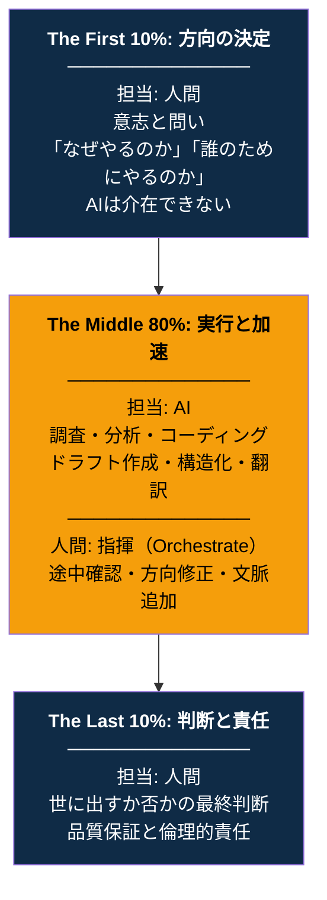
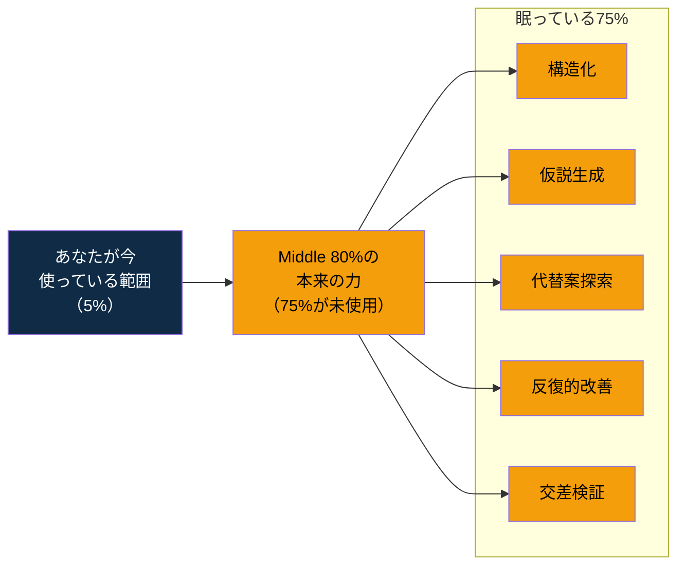
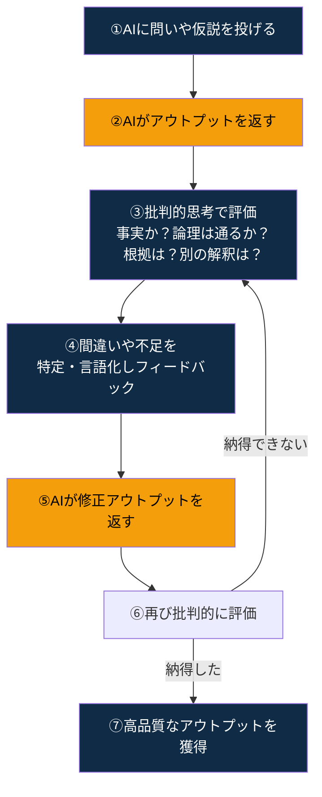
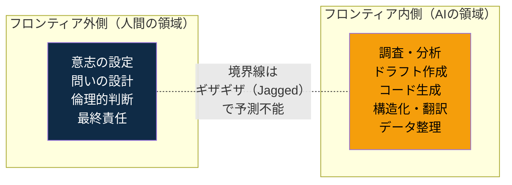
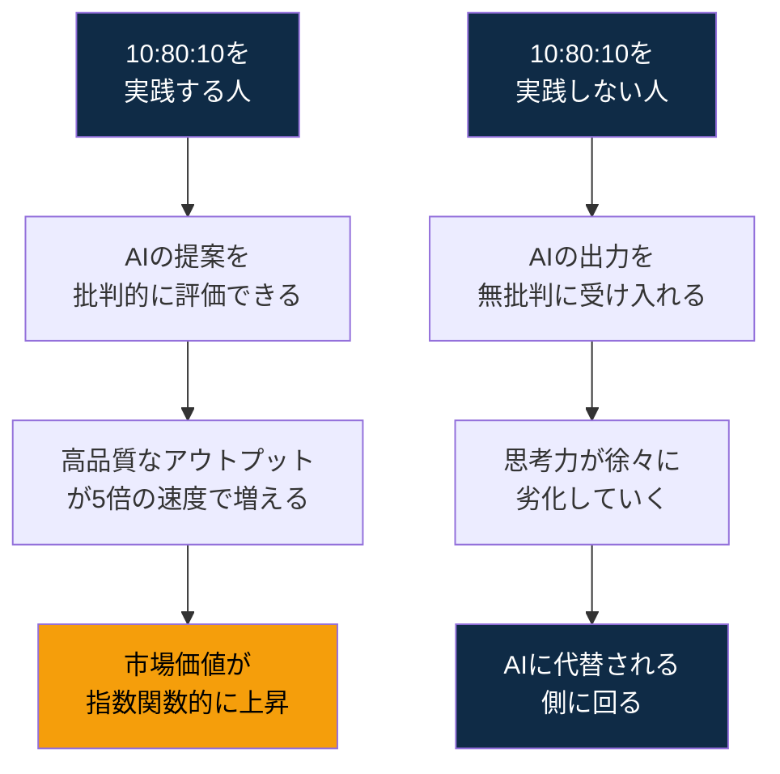
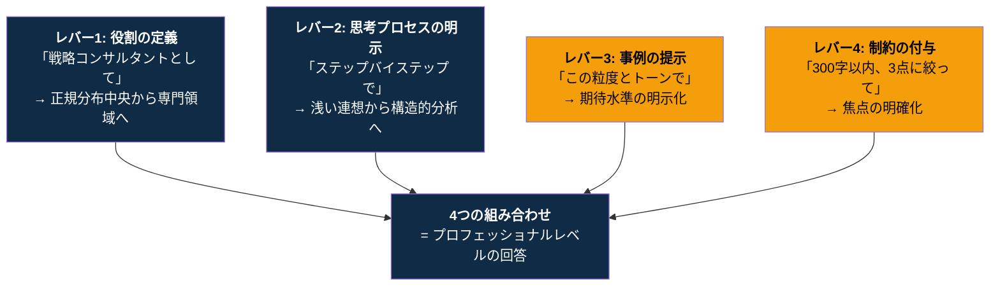
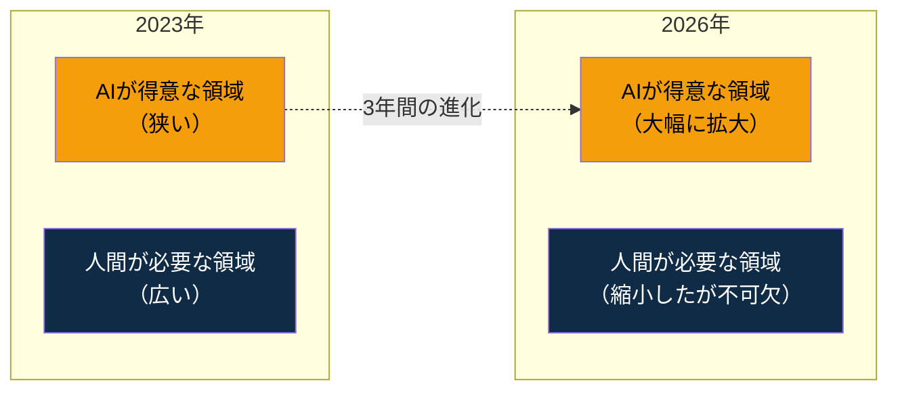

# The 10-80-10 Principle: 人とAIの共創黄金比

> **"The question is not whether AI will change your work. The question is whether you will design how."** 
> （問いは、AIがあなたの仕事を変えるかどうかではない。あなたがその変え方を設計するかどうかだ）

  

 

---

# 序章: あなたのアウトプットを5倍にする「思考のOS」

## あなたはAIをどう使っているか？

AIを使っている人は、もう珍しくない。 
ChatGPTに質問する。Claudeに要約を頼む。Geminiに翻訳させる。 
議事録を整理させる。メールの下書きを書かせる。

ビジネスパーソンであれば、生成AIツールはもはやインフラであり、無くてはならない存在だ。

しかし、ここで一つ、残酷な事実がある。

**AIを毎日使っている人の大半は、その人自身の仕事を、AIがなかった時代と"ほとんど同じ方法"で進めている。**

AIに「何を聞くか」を考え、返ってきた回答をコピー&ペーストし、手直しして、提出する。 
一見、効率化されているように見える。 
だがその実態は、「検索エンジンが少し賢くなっただけ」の使い方にとどまっている。

**年収5,000万円の戦略コンサルタントを雇っておきながら、「今日の天気を調べてくれ」と頼んでいる人が、現時点で大多数だ。**

📊 データで見るAI活用の現実

Gallupが22,368名の米国就業者を対象に実施した経時追跡調査（2025年Q4）によると、AIを職場で使用している労働者は全体の**46%**。だが、**毎日使う層はわずか12%**にとどまる。McKinseyの調査では、65%の組織が生成AIを定常利用している一方で、**44%が導入によるネガティブな結果**を経験している。

**参考文献:**
1. Gallup「Frequent Use of AI in the Workplace Continued to Rise in Q4」（2025）
2. McKinsey「The state of AI in early 2024」

## 私が持っている「答え」

私は日々のAIの使い方について、明確な答えを持っている。

人とAIの最適な役割分担は「10:80:10」だということ。 
**『人とAIの共創黄金比「10:80:10」の法則』である。**

> **最初の10%は、人間が「方向」を決める。** 
> **中間の80%は、AIが「加速」する。** 
> **最後の10%は、人間が「判断」する。**

この比率は、15年にわたるコンサルティング・新規事業開発の実務と、生成AIを日々の思考のパートナーとして使い続けた実践から導き出した経験則であり、絶対的な法則だ。

## この法則があなたにもたらすもの

**アウトプットの質を落とさず、量を5倍に引き上げる。**

生成AI登場前は、アウトプットを100%、人の手で作成する必要があった。 
しかし10:80:10の法則を適用すると、アウトプットに必要な80%をAIに任せることができ、人に必要な20%に注力できる。

**つまり、従来の1/5の時間でアウトプットを出すことができる。 
⇒ 5倍の生産性を生む。**

この格差は時間とともに複利で拡大する。 
本書を読み終えたとき、あなたはこの「思考のOS」をインストールしているだろう。

 

---

# 第1章: あなたの仕事は、3つの層でできている

## 全ての仕事は同じ構造を持つ

まず、あなた自身の仕事を観察してほしい。

> 企画書を書く仕事。プレゼンを準備する仕事。市場を調べる仕事。 
> 報告書をまとめる仕事。コードを書く仕事。記事を書く仕事。 
> メールを書く仕事。採用面接の質問を設計する仕事。

種類は違う。だが構造は同じだ。 
**どんな仕事も、例外なく3つの層で構成されている。**

**第１層: 方向の決定** —— 
「何を、なぜ、誰のためにやるのか」を定義する。

**第２層: 実行と処理** —— 
調査し、分析し、構造化し、ドラフトし、コーディングし、整理する。

**第３層: 判断と責任** —— 
「これを世に出すか否か」を最終評価し、品質と結果に対する責任を持ち、最終成果物を仕上げる。

ここで1つ質問をさせてほしい。

**「あなたの1日の労働時間のうち、第１層に何%、第２層に何%、第３層に何%を使っていますか？」** 
**「そして、これら3つの層に対して、生成AIをどこで、どのように使っていますか？」**

この問いの最適解が、10:80:10の法則だ。

10:80:10は**時間配分の黄金比ではない。責任配分の設計原則**だ。 
ある仕事では、First 10%に時間の30%を使うかもしれない。 
別の仕事では、Last 10%に時間の40%を使うかもしれない。 
数値は比率そのものではなく、**3つのフェーズの構造と、各フェーズにおける責任の所在**を示すものだ。

 

---

# 第2章: The First 10% — 人間が「方向」を決める

## AIにできないこと

最初の10%は、人間にしかできない仕事だ。 
現在のAIでは代替不可能だ。

「何を問うのか」を決める。 
「なぜこれをやるのか」を定義する。 
「誰のためにやるのか」を特定する。

現在の生成AIは過去のデータから「確率的に最も妥当な答え」を生成する。 
だが、**「問い」や「仮説」を生み出すことはできない。**

> 企画書を書くなら、「この企画で何を変えたいのか？」を決めるのはあなただ。 
> プレゼンを作るなら、「この15分で相手の何を動かしたいのか？」を決めるのはあなただ。 
> 記事を書くなら、「この記事で読者に何を手渡したいのか？」を決めるのはあなただ。

この10%を手放して、AIに任せた瞬間、アウトプットは「誰のものでもない」ものになる。

## 「問いの質」が全てを決める

最初の10%の設計の質が、残り90%の全てを規定する。

**Bad Pattern:** 
「AIに何を書くか考えてもらおう」→ AIが生成した方向性で書き始める → あなたの意志が不在のアウトプットが量産される

**Good Pattern:** 
「この企画で、クライアントの意思決定をどう変えたいか」を30分考え抜く → その方向性をAIに伝えて実行させる → あなたの意志が全てのページに宿る

リーンスタートアップは「Build-Measure-Learn」のサイクルを説く。 
デザインシンキングは「共感」から始まる。 
だが、そのサイクルを回し始める最初の一歩——「なぜこの問題に取り組むのか」——を定義するのは、フレームワークではない。 
**人間の意志だ。**

📊 研究が証明する「First 10%」の価値

HBSとUC Berkeleyの共同研究では、AIは「良いアイデアと普通のアイデアを信頼性高く区別することができない」と結論づけている。ロンドン・スクール・オブ・エコノミクスの研究では、AIの提案を有効活用できたのは**「元から判断力を持つ強いディベーターだけ」**だった。

UCLとエクセター大学の研究は重要なパラドックスを発見した。AI支援を受けた**個人の創造性は26.6%向上**した一方で、**集合的な多様性は低下**——全員が同じようなアウトプットに収束した。

**参考文献:**
1. HBS「AI won't make the call」 — https://www.hbs.edu/bigs/artificial-intelligence-human-jugment-drives-innovation
2. UCL×Exeter（Science Advances, 2024） — https://www.dynadot.com/blog/ai-creativity-vs-human-creativity

 

---

# 第3章: The Middle 80% — AIが「加速」する

## 検索エンジンの延長ではない

中間の80%は、AIが圧倒的な速度で処理する。 
**調査、分析、ドラフト作成、構造化、コーディング、翻訳、データ整理。** 
従来、あなたが数日から数週間かけていたプロセスを、AIは数時間、数分に圧縮する。

ここで決定的に重要なことがある。

**「AIに丸投げする」のではない。AIを指揮（Orchestrate）するのだ。**

AIの出力を途中で確認し、方向を修正し、追加の文脈を与え、再度走らせる。 
楽器を弾くのではなく、オーケストラを指揮する。 
手を動かすのではなく、頭を動かす。

## ジェンスン・フアンの警告

NVIDIAのジェンスン・フアンCEOは2026年3月のGTC後のAll-In Podcastで明言した。

> 「50万ドルのエンジニアが、年末までに25万ドル相当のトークンを消費していなければ、深刻に憂慮する」

さらに彼はNVIDIAが自社エンジニアチームのためにトークンに**20億ドルを投資しようとしている**ことも明かした。

この発言の本質は「AIを使い倒せ」ではない。 
**最初の10%で人間が定義した方向性に沿って、80%をAIに高速実行させることの経済合理性を認識せよ**、ということだ。

## Middle 80%の正しい使い方

あなたがMiddle 80%でAIにやらせるべきことは、「〇〇について教えて」ではない。

| やらせるべきこと | 具体例 |
|---|---|
| **構造化** | 「この10個の論点を、経営層が5分で理解できる構成に再編成して」 |
| **仮説生成** | 「このデータから考えられる仮説を5つ、それぞれの根拠と共に出して」 |
| **代替案の探索** | 「この戦略の反論を3つ構築して。それぞれに対する再反論も付けて」 |
| **ドラフトの反復** | 「このドラフトをCFO向けに書き直して。数字を前面に出す構成で」 |
| **データの交差検証** | 「AとBのレポートで矛盾する箇所を特定して。どちらが正しいか根拠を示して」 |
| **コーディング** | 「この要件を満たすPythonスクリプトを書いて。エラーハンドリング込みで」 |

「〇〇について教えて」は、Middle 80%のうち**5%**しか使っていない。 
残りの**75%が丸ごと眠っている。**

📊 研究が証明する「Middle 80%」の効果

HBS×BCGの大規模フィールド実験（758名のBCGコンサルタント対象）:
- タスク完了速度: **+25.1%**、品質: **+40%以上**、低スキル層: **+43%**

NBER コールセンター研究（5,179名対象）:
- 生産性: **平均+14%**、初心者は**+34%**

GitHub Copilot:
- タスク完了速度: **+55%**、提案コードの**88%**がプロダクション到達

**参考文献:**
1. Dell'Acqua et al.「Navigating the Jagged Technological Frontier」HBS×BCG（2023）
2. Brynjolfsson, Li, Raymond「Generative AI at Work」NBER WP 31161
3. GitHub Copilot Enterprise — Accenture RCT
4. Jensen Huang / NVIDIA GTC 2026

 

---

# 第4章: The Last 10% — 人間が「判断」する

## AIは責任を取れない

最後の10%は、再び人間の仕事だ。

AIが出したアウトプットを批判的に評価する。 
「これを世に出すか否か」を最終判断する。 
倫理的な責任を引き受ける。品質を最終保証する。

**大規模言語モデル（LLM）は、動作原理上、確率論で言葉を紡ぎ出すマシンに過ぎない。**

あなたが入力したプロンプトやコンテキストに最も合致する言葉を統計と確率論で決めて回答をしている。 
「正しい/間違っている」や「良い/悪い」という概念を持たない。 
そのため、ハルシネーション（もっともらしい嘘）を引き起こす。 
これは大規模言語モデルの動作原理上、**100%防ぐことはできない。**

## Last 10%を省略したときに起きること

**Mata v. Avianca（米国、2023年）:** 
弁護士がChatGPT生成の架空判例を裁判所に提出。制裁処分。

**Air Canada（カナダ、2024年）:** 
チャットボットが誤った返金ポリシーを案内。顧客への補償命令。

**Samsung（韓国、2023年）:** 
従業員が機密コードをChatGPTに入力。情報漏洩。

これらは全て、Last 10%が欠けたときに起こる損失だ。 
技術の問題ではない。**人間の責任設計の問題**だ。

## 「疑い、導く」対話サイクル

Last 10%は「一度確認して終わり」ではない。 
AIとの対話は、連続的な「疑い、導く」サイクルだ。

**あなたが最初の10%で「問い」を立てた"回答"として相応しいか否か？ 
を判断できるのもあなただけだ。 
AIは責任を取れない。 
責任を取れるのは、最初の10%で「なぜやるのか」を定義したあなただけだ。**

 

---

# 第5章: 質と量のトレードオフは崩壊した

## 人類史上初めて「両立」が可能になった

今まで私たちは、アウトプットの「量と質はトレードオフの関係にある」と考えてきた。

> **質を高めるために、深く考えればアウトプットの作成時間は遅くなる。** 
> **量を担保するために、速く動けばアウトプットの品質は低くなる。**

**しかし、生成AIの登場と性能の向上により、このトレードオフは崩壊した。**

最初の10%で人間が「質」の方向を定め、 
中間の80%でAIが「量」を生成し、 
最後の10%で人間が「質」を保証する。

結果として、**アウトプットのDepth（深さ・質）とVelocity（量・速度）が同時に達成される。**

## ジャグドフロンティア — AIの「得意」と「苦手」の地図

ハーバード・ビジネス・スクールの研究「Navigating the Jagged Technological Frontier」は、**AIの能力の境界線は「ギザギザ（Jagged Frontier）」な形状をしている**ことを示した。

AIが得意な領域では、AIを使った人間が圧倒的に高いパフォーマンスを示す。 
しかしAIが苦手な領域では、AIを使った人間がかえってパフォーマンスを落とした。

**10:80:10の法則は、このジャグドフロンティアを前提に設計されている。**

> **最初の10%**（意志と問い）= AIのフロンティアの**外側** 
> **中間の80%**（調査・分析・実行）= AIのフロンティアの**内側** 
> **最後の10%**（判断と責任）= AIのフロンティアの**外側**

人間とAIが、それぞれの得意領域で最大の力を発揮する。 
これが「共創」だ。代替ではない。

 

---

# 第6章: 「AIを使う人」と「AIに使われる人」

## 分岐は既に始まっている

2026年現在、すでに分岐は始まっている。

10:80:10を実践する人間は、AIがない時代の自分と比較して、アウトプットの質を落とさず、量を5倍に引き上げることができる。

**しかし、最も危険なのは「AIを使っているが、使い方を間違えている人」だ。**

### パターン1: AIに最初の10%を明け渡す

> 「何を書けばいいか、AIに聞いてから始める」。 
> これは方向の決定をAIに委ねている。 
> あなたの意志が不在のアウトプットが量産される。

### パターン2: AIの出力をそのまま提出する

> 最後の10%を省略する。 
> AIが生成した文章を批判的に検証せず、上司やクライアントに提出する。 
> 大規模言語モデルは、極めて流暢に、極めて自信たっぷりに、完全な嘘を出力する。

### パターン3: AIを「検索エンジンの延長」としてしか使わない

> 「〇〇について教えて」と聞く。返ってきた答えを読む。要約させる。 
> これはMiddle 80%のうち5%しか使っていない。 
> 80%の本来の力が丸ごと眠っている。

📊 データで見る「格差の構造」

PwC「2025 Global AI Jobs Barometer」（約10億件求人分析）:
- AIスキル保有者の賃金プレミアム: 平均**56%**（前年25%から倍増）
- AIスキルによる年収増: 平均**$18,000以上**
- AI多露出産業の売上成長: 低露出の**3倍**（27% vs 9%）

WEF「Future of Jobs Report 2025」:
- 2030年までに**9,200万の職が消滅**、1億7,000万の新職が創出
- **40%以上**の雇用主が5年以内の人員削減を計画

 

---

# 第7章: あなたの仕事に、今日から適用する

## 10のシナリオ — Before / After

### 1. 企画書を書くとき

| | Bad Pattern（AIに使われる） | Good Pattern（10:80:10） |
|---|---|---|
| First 10% | 「AIに企画のテーマを考えてもらおう」 | **「この企画で、クライアントの何を変えたいか」を30分考え抜く** |
| Middle 80% | AIに全部書かせてコピペ | **方向を与え、構成案→競合調査→ドラフト→図表を段階的に生成させる** |
| Last 10% | そのまま提出 | **「この一文は相手に響くか？」を一行ずつ批判的に確認** |

### 2. プレゼンを準備するとき

| | Bad Pattern | Good Pattern |
|---|---|---|
| First 10% | 「AIにスライドの構成を考えてもらおう」 | **「この15分で、相手の意思決定をどう変えたいか」を定義** |
| Middle 80% | テンプレを当てはめる | **スライド構成、データ可視化、想定質問をAIに生成させる** |
| Last 10% | 誤字だけチェック | **聴衆の顔を思い浮かべ、ストーリーラインを最終調整** |

### 3. 市場調査をするとき

| | Bad Pattern | Good Pattern |
|---|---|---|
| First 10% | 「〇〇市場について教えて」 | **「この市場の、誰の、どんな意思決定に使うデータが必要か」を明確にする** |
| Middle 80% | AIの回答をそのまま使う | **複数ソースを交差検証させ、矛盾点を特定させ、仮説を生成させる** |
| Last 10% | 上司にそのまま報告 | **「この数字は本当か？出典は？サンプルサイズは？」を検証** |

### 4. メールを書くとき

| | Bad Pattern | Good Pattern |
|---|---|---|
| First 10% | 「このメールを書いて」 | **「このメールで相手に何をしてほしいか」を1文で定義** |
| Middle 80% | AIが生成したメールをそのまま送信 | **トーン、文脈、相手との関係性を指定してドラフトさせる** |
| Last 10% | 確認せず送信 | **「この言い回しは相手の文化に合っているか」を最終確認** |

### 5. コードを書くとき

| | Bad Pattern | Good Pattern |
|---|---|---|
| First 10% | 「この機能を実装して」だけ伝える | **要件定義、エッジケース、パフォーマンス要件を明示** |
| Middle 80% | AIが出したコードをコピペ | **段階的にレビュー→修正→テスト→リファクタリングを指揮** |
| Last 10% | テストせずデプロイ | **セキュリティ、エッジケース、本番環境での挙動を検証** |

### 6. 報告書をまとめるとき

| | Bad Pattern | Good Pattern |
|---|---|---|
| First 10% | 「この報告書をまとめて」 | **「誰が読み、何を判断し、どう行動するか」を定義** |
| Middle 80% | データを渡して丸投げ | **章立て→各章ドラフト→図表→要約を段階的に生成** |
| Last 10% | 体裁チェックのみ | **「この結論は、読者の次のアクションに繋がるか」を批判的に検証** |

### 7. 事業計画を作るとき

| | Bad Pattern | Good Pattern |
|---|---|---|
| First 10% | 「AIにビジネスモデルを考えてもらおう」 | **「なぜこの事業をやるのか、誰の課題を解くのか」を言語化** |
| Middle 80% | AIが出した計画をそのまま使う | **市場規模推計→収支モデル→リスク分析→競合マッピングを段階的に生成** |
| Last 10% | 数字を鵜呑み | **「この前提が崩れたら何が起きるか」をストレステスト** |

### 8. 就職活動をするとき

| | Bad Pattern | Good Pattern |
|---|---|---|
| First 10% | 「ESを書いて」 | **「自分は何者で、何を成し遂げたいのか」を言語化** |
| Middle 80% | AIが書いたESをそのまま提出 | **業界研究、企業分析、ES構造化を段階的に生成させる** |
| Last 10% | 確認せず提出 | **「これは本当に自分の言葉か？面接で語れるか？」を批判的に確認** |

### 9. 採用面接の質問を設計するとき

| | Bad Pattern | Good Pattern |
|---|---|---|
| First 10% | 「面接の質問を考えて」 | **「この候補者の何を見極めたいか」を3点に絞る** |
| Middle 80% | 一般的な質問リストを生成 | **見極めポイント別に、行動面接形式の質問＋フォローアップを生成** |
| Last 10% | リストをそのまま使う | **「この質問で、本当にその能力が見えるか」を疑う** |

### 10. 記事を書くとき

| | Bad Pattern | Good Pattern |
|---|---|---|
| First 10% | 「AIに記事のテーマを決めてもらおう」 | **「この記事で読者に何を手渡したいか」を定義** |
| Middle 80% | AIが書いた文章をコピペ | **構成→各セクションドラフト→ファクトチェック→推敲を段階的に指揮** |
| Last 10% | そのまま公開 | **「この一文で読者の行動は変わるか」を一行ずつ検証** |

## AIを「指揮」するための4つのレバー

Middle 80%でAIの出力品質を最大化するための、4つのプロンプト・レバー。

 

---

# 第8章: 日本への緊急メッセージ

## 数字が語る「周回遅れ」の現実

| 指標 | 日本 | 米国 | 中国 |
|---|---|---|---|
| 生成AI職場利用率 | **8.4%** | 43〜46% | 81% |
| AI採用率（企業全体） | 27% | 69% | 81% |
| AI活用方針策定率 | 42.7% | 78.7% | 95.1% |

日本の生成AI職場利用率はわずか**8.4%**。 
米国の43〜46%、中国の81%と比較すると、**5倍から10倍の差が開いている。**

これは、**First 10%の不在が国家レベルで発生している**ことを意味する。

## 日本企業が陥っている3つのトラップ

**トラップ1: 方向が定まっていない** 
「AI活用推進室」を設置し、ChatGPTの法人契約を締結し、「使ってみてください」と通達する。 
Middle 80%だけを投入して、First 10%とLast 10%を省略した構造。

**トラップ2: Middle 80%を解放できていない** 
最も多い用途は「文章の要約」「翻訳」「議事録整理」。 
Middle 80%のうち、せいぜい5〜10%程度しか活用していない。

**トラップ3: Last 10%を組織として設計していない** 
AIが生成したドラフトがそのまま稟議書に載り、承認者はAI出力かどうかを識別すらしていない。

## しかし、日本には「Last 10%」の伝統がある

トヨタ生産方式の「自働化」——異常が発生したら機械を止め、人間が判断する——は、Last 10%の設計原則そのものだ。

問題は、この伝統がAI時代にアップデートされていないこと。 
**Middle 80%をAIに解放すること。それが日本企業の最大の構造的課題だ。**

生産年齢人口が年間約50万人ペースで減少し続ける日本において、 
AIによるMiddle 80%の解放は「効率化」ではなく**「生存戦略」**だ。

**あなた自身が、今日からMiddle 80%を解放し、First 10%とLast 10%に集中する。**

 

---

# 第9章: 共創の未来 — 代替ではなく増幅

## AIは人間を代替しない。増幅する。

AI時代の議論は「AIが人間の仕事を奪うか否か」という二項対立に陥りがちだ。 
しかし、本書を通じて見てきた構造が示すのは全く異なるものだ。

**AIは人間を代替するのではなく、増幅する。 
ただし、増幅される条件を満たした人間に限る。**

AIの能力の境界線——ジャグドフロンティア——は静止していない。 
**Middle 80%はさらに厚くなる。** 
しかし、**First 10%とLast 10%の重要性は変わらない——むしろ高まる。**

## 人間固有スキルの価値は上がり続ける

WEF「Future of Jobs Report 2025」で需要が急騰するスキルの上位は、全て人間固有のものだ。

| 順位 | スキル | 10:80:10との対応 |
|---|---|---|
| 1 | 分析的思考 | First 10% + Last 10% |
| 2 | レジリエンス・柔軟性 | First 10%（方向の再設定） |
| 3 | リーダーシップ | First 10%（意志の伝播） |
| 4 | 創造的思考 | First 10%（問いの設計） |
| 5 | テクノロジーリテラシー | Middle 80%（AIの指揮能力） |

10:80:10を実践する1人の人間は、 
**従来10人のチームが数週間かけていたアウトプットを、1人が数日で生み出す**ことが可能になる。

 

---

# 終章: 10:80:10は「思考のOS」である

アプリケーションは、OSの上で動く。

企画書の作成。市場調査。プレゼン準備。コーディング。記事執筆。就職活動。事業計画。 
——これらは全て「アプリケーション」だ。 
それぞれに最適なAIツールがあり、固有のテクニックがある。 
だが、**どのアプリケーションを実行するときもその下で動いているOSは同じだ。**

**最初の10%で方向を決め、中間の80%をAIに任せ、最後の10%で判断する。**

このOSをインストールした人間は、どんなツールが出てきても、どんな業界にいても、どんな職種でも、AIの力を最大限に引き出せる。

ChatGPTがGPT-5になっても。ClaudeがClaude 5になっても。 
来年、まだ名前すら知らないAIツールが登場しても。 
**人間とAIの共創の構造は変わらない。**

ツールは入れ替わる。モデルは進化する。 
だが、10:80:10——人間が方向と判断を握り、AIが実行を加速する——という構造原則は、AI時代が続く限り不変だ。

---

**最初と最後の10%を絶対に手放さない。**

**それがAI時代に人間であることの意味だ。**

---

*本書は「Depth & Velocity」の中核概念を個人のエンパワーメント文脈に拡張したものです。 
D&V方法論の全体像は以下で全文無料公開しています。*

*Depth & Velocity: 生成AI時代の新規事業開発論* 
https://github.com/Leading-AI-IO/depth-and-velocity

---

## 全引用文献一覧

### 学術・実証研究
1. Dell'Acqua et al.「Navigating the Jagged Technological Frontier」HBS×BCG（2023） — https://papers.ssrn.com/sol3/papers.cfm?abstract_id=4573321
2. Brynjolfsson, Li, Raymond「Generative AI at Work」NBER WP 31161 — https://www.nber.org/papers/w31161
3. UCL×Exeter AI Creativity研究（2024） — https://www.dynadot.com/blog/ai-creativity-vs-human-creativity
4. Frontiers「The paradox of creativity in generative AI」（2025） — https://www.frontiersin.org/journals/psychology/articles/10.3389/fpsyg.2025.1628486/full

### 国際機関・規制
5. WEF「Future of Jobs Report 2025」 — https://reports.weforum.org/docs/WEF_Future_of_Jobs_Report_2025.pdf
6. ILO Working Paper 96 — https://www.ilo.org/sites/default/files/2024-07/WP96_web.pdf
7. 経産省「AI事業者ガイドライン」 — https://www.meti.go.jp/press/2024/04/20240419004/20240419004-1.pdf
8. 総務省（2024） — https://www.soumu.go.jp/johotsusintokei/whitepaper/ja/r06/pdf/n1510000.pdf
9. 経産省「DXレポート」 — https://www.meti.go.jp/shingikai/mono_info_service/digital_transformation/pdf/20180907_01.pdf

### 企業・産業レポート
10. McKinsey「Economic potential of generative AI」 — https://www.mckinsey.com/capabilities/tech-and-ai/our-insights/the-economic-potential-of-generative-ai-the-next-productivity-frontier
11. McKinsey「Agents, robots, and us」（2025） — https://www.mckinsey.com/mgi/our-research/agents-robots-and-us-skill-partnerships-in-the-age-of-ai
12. McKinsey「The state of AI in early 2024」 — https://www.mckinsey.com/capabilities/quantumblack/our-insights/the-state-of-ai-2024
13. PwC「2025 Global AI Jobs Barometer」 — https://www.pwc.com/gx/en/issues/artificial-intelligence/job-barometer.html
14. Gallup AI Workplace Survey — https://www.gallup.com/workplace/701195/frequent-workplace-continued-rise.aspx
15. GitHub Copilot Enterprise — https://github.blog/news-insights/research/research-quantifying-github-copilots-impact-in-the-enterprise-with-accenture/
16. Korn Ferry TA Trends 2026 — https://hakia.com/news/critical-thinking-top-skill-2026/
17. All About AI Hallucination Report — https://www.allaboutai.com/resources/ai-statistics/ai-hallucinations/
18. Jensen Huang NVIDIA — https://www.businessinsider.com/jensen-huang-500k-engineers-250k-ai-tokens-nvidia-compute-2026-3

### 企業事例
19. Mata v. Avianca — https://law.justia.com/cases/federal/district-courts/new-york/nysdce/1:2022cv01461/575368/54/
20. Air Canada — https://s3.amazonaws.com/IGG/AI%2BPart%2B1%2B-%2BMaterials/Moffatt%2Bv.%2BAir%2BCanada.pdf
21. Samsung — https://www.ciodive.com/news/Samsung-Electronics-ChatGPT-leak-data-privacy/647137/

### その他
22. HBS「AI won't make the call」 — https://www.hbs.edu/bigs/artificial-intelligence-human-jugment-drives-innovation
23. Ethan Mollick「Discovering AI's jagged frontier」 — https://professorkl.substack.com/p/discovering-ais-jagged-frontier-and
